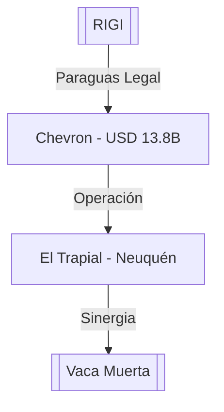

# Chevron (Vaca Muerta - El Trapial)

**Ubicación:** Área El Trapial, Neuquén, Argentina.
**Operadora:** Chevron Argentina.

## Descripción
Megaproyecto de desarrollo de hidrocarburos no convencionales (shale) en el área El Trapial, una de las joyas históricas de la Cuenca Neuquina reconvertida al no convencional.

## Hitos Recientes (2026)
- **Adhesión al RIGI (03/06/2026):** Chevron presentó formalmente su solicitud de ingreso al [[RIGI]] con una inversión estimada de **USD 13.800 millones**.
- **Magnitud de la Inversión:** Se trata de la segunda inversión más grande en la historia de [[Vaca Muerta]], solo superada por el plan de 15 años de YPF (USD 25.000M).
- **Impacto Estratégico:** El respaldo de la firma estadounidense consolida el marco regulatorio del RIGI y la previsibilidad regulatoria en el sector energético argentino. La empresa pasó de una "espera estratégica" a una ejecución acelerada de capitales.
- **Producción:** El desembolso busca posicionar a Chevron como uno de los mayores productores de la Cuenca Neuquina, apalancando la infraestructura existente y el potencial del shale oil.

## Conexiones
- [[Vaca Muerta]]
- [[RIGI]]
- [[Neuquén]]
- [[Energia]]

