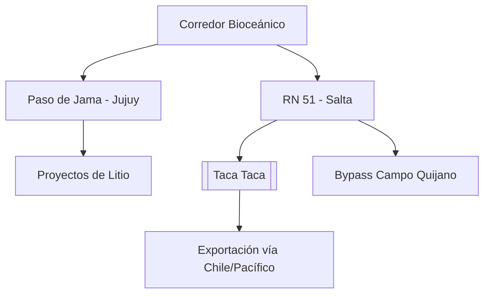

# Corredor Bioceánico de Capricornio (CBC)

**Extensión:** ~2.400 kilómetros que conectan el Océano Atlántico (Brasil) con el Océano Pacífico (Chile) a través de Paraguay y Argentina.

## Estado de la Traza (Julio 2026)
- **Brasil - Paraguay:**
    - **Puente de la Bioceánica:** Se mantiene el avance crítico para la conexión Porto Murtinho - Carmelo Peralta.
    - **Puente sobre el Río Apa (27/04/2026):** Ratificación oficial de la construcción del puente que conectará Porto Murtinho con Concepción (Paraguay).
    - **Convenio TIR (Abril 2026):** Brasil ratificó la Convención TIR, lo que simplificará drásticamente los trámites de tránsito aduanero internacional a lo largo del corredor.
- **Paraguay:** El BID ratificó el financiamiento de **US$ 200 millones** para el tramo clave de la PY15 (Ruta Bioceánica).
- **Argentina:**
    - **ATACALAR (04/07/2026):** El encuentro regional reforzó la agenda de infraestructura y comercio, impulsando la integración de Catamarca y La Rioja al corredor minero.
    - **Paso de Jama (Jujuy):** Nodo logístico estratégico con crecimiento exponencial de carga.
- **Salta (Julio 2026):**
    - **Paso de Sico (06/07/2026):** Finalización de la modernización tecnológica (generadores, fibra óptica y equipamiento) con una inversión de **$1.000 millones**, eliminando restricciones operativas para carga pesada.
    - **Relevancia del Cobre (20/04/2026):** La ratificación de la inversión en [[Taca Taca]] (US$ 4.200M) posiciona al proyecto como el principal usuario proyectado.
    - La obra del **bypass de Campo Quijano** (enlace RN51 y RP24) alcanza el **70% de avance**, permitiendo desviar el tránsito pesado minero de las zonas urbanas de la provincia.
    - La minería se convierte en el principal complejo exportador de la provincia, traccionando la necesidad de acelerar la infraestructura del Corredor.

## Ventajas Comparativas del Paso de Jama:
- **Alta operatividad anual:** Cierra solo 35 días al año por factores climáticos (vs. 120 días de Cristo Redentor).
- **Conectividad estratégica:** Acceso directo a los puertos del norte de Chile (Antofagasta, Iquique).

## Infraestructura Energética Estratégica:
- **Interconexión Puna (YPF Luz & Central Puerto):** Acuerdo para desarrollar una línea de extra alta tensión (US$ 250M - US$ 400M) que conectará los salares de Pastos Grandes y Hombre Muerto al sistema nacional, fundamental para la sostenibilidad de los proyectos de [[Litio]].

## Desafíos Logísticos y de Infraestructura:
- **Conectividad Digital (18/04/2026):** Se reportó un "apagón" de conectividad (internet y telefonía) en los 130 km de territorio chileno posteriores al Paso de Jama, lo que impide el uso de documentos electrónicos (Certificado de Origen Digital, MIC/DTA) y afecta la seguridad logística.
- **Unificación Normativa:** Necesidad de estandarizar pesos y dimensiones de camiones.
- **Tecnología en Fronteras:** Requerimiento de escáneres y digitalización total de procesos.

## Conexiones
- [[Mineria]] (Salta/Jujuy/Catamarca).
- [[Taca Taca]]
- [[Litio]]

## Diagrama de Conectividad Estratégica (Extracto)

