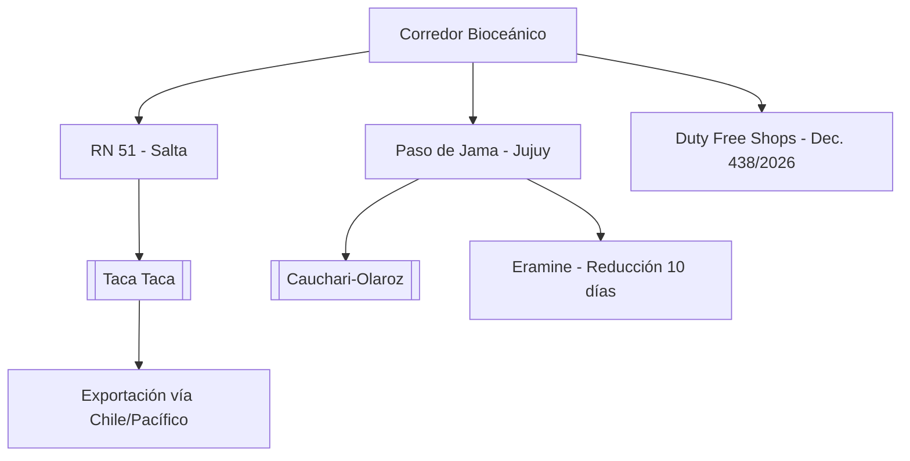

# Corredor Bioceánico de Capricornio (CBC)

**Extensión:** ~2.400 kilómetros que conectan el Océano Atlántico (Brasil) con el Océano Pacífico (Chile) a través de Paraguay y Argentina.

## Estado de la Traza (Junio 2026)
- **Puente Bioceánica:** El puente Porto Murtinho - Carmelo Peralta alcanzó el **83% de avance** (01/06/2026).
- **Hito Logístico (03/06/2026):** Eramine (proyecto Centenario-Ratones) exportó su primera carga de litio hacia Asia vía Paso de Jama, reduciendo el tiempo de tránsito en 10 días comparado con la ruta del Atlántico.
- **Decreto 438/2026 (10/06/2026):** Autoriza la instalación de Duty Free Shops en pasos fronterizos terrestres para mejorar la competitividad y el atractivo turístico del corredor.
- **RN 51 (Salta):** Aceleración de obras (02/06/2026) para facilitar la logística de 18 proyectos mineros en la Puna.

## Ventajas del Paso de Jama:
- **Operatividad:** Alta disponibilidad anual (>330 días).
- **Nodo Minero:** Punto de salida crítico para el litio de Jujuy y Salta, y futuro concentrado de cobre de [[Taca Taca]].

## Desafíos:
- **Conectividad:** Brechas de cobertura digital en tramos de alta montaña (Chile-Argentina).
- **Trámites:** Necesidad de plena implementación del Convenio TIR para agilizar aduanas.

## Conexiones
- [[Mineria]]
- [[Taca Taca]]
- [[Litio]]
- [[Cauchari-Olaroz]]
- [[Rincón]]

## Diagrama de Conectividad Estratégica

