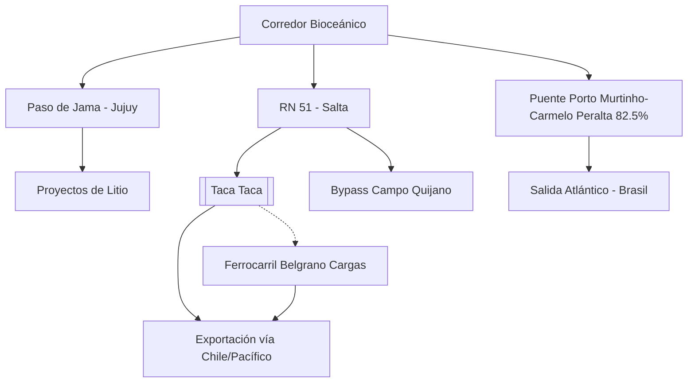

# Corredor Bioceánico de Capricornio (CBC)

**Extensión:** ~2.400 kilómetros que conectan el Océano Atlántico (Brasil) con el Océano Pacífico (Chile) a través de Paraguay y Argentina.

## Estado de la Traza (Mayo 2026)
- **Brasil - Paraguay:**
    - El Puente de la Bioceánica (Porto Murtinho - Carmelo Peralta) alcanzó un **82,5% de avance** físico (confirmado al 08/05/2026). La meta de inauguración técnica se mantiene para junio de 2026.
    - **Puente sobre el Río Apa (27/04/2026):** Ratificación oficial de la construcción del puente que conectará Porto Murtinho con Concepción (Paraguay) y avances en la pavimentación del Chaco paraguayo.
    - **Convenio TIR (Abril 2026):** Brasil ratificó la Convención TIR, lo que simplificará drásticamente los trámites de tránsito aduanero internacional a lo largo del corredor.
- **Paraguay:** El BID ratificó el financiamiento de **US$ 200 millones** para el tramo clave de la PY15 (Ruta Bioceánica).
- **Argentina:**
    - **Paso de Jama (Jujuy):** Nodo logístico estratégico con un crecimiento exponencial de carga (**7.000 camiones adicionales** entre 2024 y 2025). Cierra solo 35 días al año por factores climáticos (frente a los 120 días de Cristo Redentor).
    - **Salta (Mayo 2026):**
        - **Redefinición Logística (26/05/2026):** Las mineras del NOA han comenzado a priorizar la salida por puertos de Chile (Antofagasta, Iquique y Mejillones) para reducir costos y acelerar los tiempos de despacho hacia Asia, traccionando exponencialmente el uso del Corredor.
        - **Aceleración en RN 51 (08/05/2026):** La provincia aceleró obras en la Ruta Nacional 51 para dar soporte logístico a **18 proyectos mineros** en fase de construcción y expansión en la Puna.
        - **Bypass Campo Quijano:** La obra (enlace RN51-RP24) alcanza el **70% de avance**, permitiendo desviar el tránsito pesado minero de las zonas urbanas de la provincia.
        - **Tracción del Cobre:** La ratificación de la inversión en **[[Taca Taca]]** (**US$ 5.250M**) posiciona al proyecto como el principal usuario del corredor para exportar por el Pacífico.
        - **Complejo Exportador:** La minería se convierte en el principal complejo exportador de la provincia.

## Ventajas Comparativas
- **Alta operatividad:** Acceso directo a los puertos del norte de Chile (Antofagasta, Iquique).
- **Interconexión Energética (Interconexión Puna):** Acuerdo YPF Luz / Central Puerto para desarrollar una línea de extra alta tensión (US$ 250M-400M) que conectará los salares de Pastos Grandes y Hombre Muerto al sistema nacional, fundamental para la sostenibilidad y descarbonización de los proyectos de [[Litio]].

## Desafíos Logísticos y de Infraestructura
- **Articulación Jujuy-Brasil (21/05/2026):** Jujuy afianza su rol transfronterizo a través de la Agencia Provincial del CBC, coordinando logística pesada y facilitación aduanera con las autoridades de Brasil.
- **Conectividad Digital (18/04/2026):** Se reportó un "apagón" de conectividad (sin internet ni telefonía móvil) en 130 km de territorio chileno tras Jama, lo que impide el uso de documentos electrónicos (Certificado de Origen Digital, MIC/DTA) y afecta la seguridad del transporte.
- **Unificación Normativa:** Necesidad de estandarizar pesos y dimensiones de camiones.
- **Tecnología en Fronteras:** Requerimiento de escáneres e infraestructura de digitalización total para agilizar aduanas.

## Conexiones
- [[Mineria]]
- [[Taca Taca]]
- [[Litio]]
- [[Salta]]
- [[RIGI]]

## Diagrama de Conectividad Estratégica

