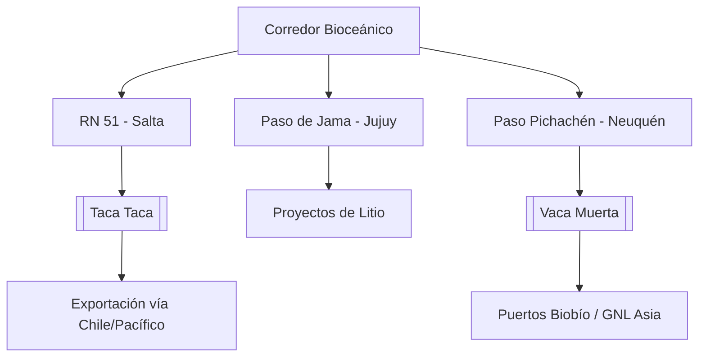

# Corredor Bioceánico (CBC)

**Extensión:** Conecta el Océano Atlántico con el Océano Pacífico a través de múltiples ejes estratégicos en el Cono Sur.

## Estado de la Traza (Junio 2026)
- **Eje Pichachén (Neuquén - Biobío):**
    - Firma de la **Declaración Conjunta del Corredor de Integración Pichachén** (15/06/2026).
    - Objetivo: Potenciar infraestructuras de oleoductos y gasoductos desde [[Vaca Muerta]] hacia los puertos del Biobío (Chile).
    - Proyección: Instalación de una plataforma de licuefacción para exportar GNL argentino hacia Asia por el Pacífico.
- **Brasil - Paraguay - Argentina (Eje Capricornio):**
    - El Puente de la Bioceánica (Porto Murtinho - Carmelo Peralta) alcanzó un **82,5% de avance** físico a fines de abril 2026. Se mantiene la meta de inauguración para junio de 2026.
    - **Puente sobre el Río Apa (27/04/2026):** Ratificación oficial de la construcción del puente que conectará Porto Murtinho con Concepción (Paraguay).
    - **Convenio TIR (Abril 2026):** Brasil ratificó la Convención TIR, simplificando trámites aduaneros internacionales.
- **Argentina (Norte):** El Paso de Jama (Jujuy) se consolida como el nodo logístico estratégico con un crecimiento exponencial de carga.
- **Salta (Abril 2026):**
    - **Relevancia del Cobre (20/04/2026):** La ratificación de la inversión en [[Taca Taca]] (US$ 4.200M) posiciona al proyecto como el principal usuario proyectado del Corredor para exportar concentrado de cobre por el Pacífico.
    - La obra del **bypass de Campo Quijano** alcanza el **70% de avance**.

## Ventajas Comparativas del Paso de Jama:
- **Alta operatividad anual:** Cierra solo 35 días al año por factores climáticos (vs. 120 días de Cristo Redentor).
- **Conectividad estratégica:** Acceso directo a los puertos del norte de Chile (Antofagasta, Iquique).

## Infraestructura Energética Estratégica:
- **Interconexión Puna (YPF Luz & Central Puerto):** Acuerdo para desarrollar una línea de extra alta tensión (US$ 250M - US$ 400M) para proyectos de [[Litio]].

## Desafíos Logísticos y de Infraestructura:
- **Conectividad Digital (18/04/2026):** Se reportó un "apagón" de conectividad en los 130 km de territorio chileno posteriores al Paso de Jama.

## Conexiones
- [[Mineria]] (Salta/Jujuy/Catamarca).
- [[Taca Taca]]
- [[Litio]]
- [[Vaca Muerta]]

## Diagrama de Conectividad Estratégica (Extracto)

