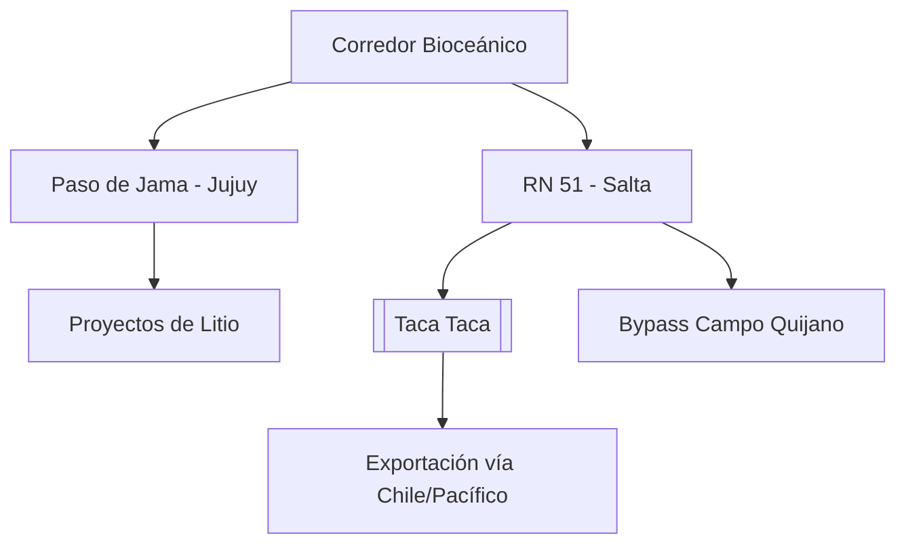

# Corredor Bioceánico de Capricornio (CBC)

**Extensión:** ~2.400 kilómetros que conectan el Océano Atlántico (Brasil) con el Océano Pacífico (Chile) a través de Paraguay y Argentina.

## Estado de la Traza (Abril 2026)
- **Brasil - Paraguay:**
    - El Puente de la Bioceánica (Porto Murtinho - Carmelo Peralta) alcanzó un **82,5% de avance** físico a fines de abril 2026. Se mantiene la meta de inauguración para junio de 2026.
    - **Puente sobre el Río Apa (27/04/2026):** Ratificación oficial de la construcción del puente que conectará Porto Murtinho con Concepción (Paraguay) y avances en la pavimentación del Chaco paraguayo.
    - **Convenio TIR (Abril 2026):** Brasil ratificó la Convención TIR, lo que simplificará drásticamente los trámites de tránsito aduanero internacional a lo largo del corredor.
- **Paraguay:** El BID ratificó el financiamiento de **US$ 200 millones** para el tramo clave de la PY15 (Ruta Bioceánica).
- **Argentina:** El Paso de Jama (Jujuy) se consolida como el nodo logístico estratégico con un crecimiento exponencial de carga (**7.000 camiones adicionales** entre 2024 y 2025).
## Salta (Junio 2026)
- **Caso de Éxito Eramine (03/06/2026):** La empresa consolidó su logística de exportación de carbonato de litio vía Paso de Jama hacia el puerto chileno de Angamos. El uso del Corredor permitió **reducir 10 días** el tiempo de navegación hacia China en comparación con la ruta atlántica.
- **Cuello de Botella RN 51:** A pesar del avance en el bypass de Campo Quijano (70%), persisten **91 km sin asfaltar** en la Ruta Nacional 51, lo que representa el principal obstáculo físico para la escala industrial del Corredor en territorio argentino.
    - **Relevancia del Cobre (20/04/2026):** La ratificación de la inversión en [[Taca Taca]] (US$ 4.200M) posiciona al proyecto como el principal usuario proyectado del Corredor para exportar concentrado de cobre por el Pacífico.

## Ventajas Comparativas del Paso de Jama:
- **Alta operatividad anual:** Cierra solo 35 días al año por factores climáticos (vs. 120 días de Cristo Redentor).
- **Conectividad estratégica:** Acceso directo a los puertos del norte de Chile (Antofagasta, Iquique).

## Infraestructura Energética Estratégica:
- **Interconexión Puna (YPF Luz & Central Puerto):** Acuerdo para desarrollar una línea de extra alta tensión (US$ 250M - US$ 400M) que conectará los salares de Pastos Grandes y Hombre Muerto al sistema nacional, fundamental para la sostenibilidad de los proyectos de [[Litio]].

## Desafíos Logísticos y de Infraestructura:
- **Conectividad Digital (18/04/2026):** Se reportó un "apagón" de conectividad (internet y telefonía) en los 130 km de territorio chileno posteriores al Paso de Jama, lo que impide el uso de documentos electrónicos (Certificado de Origen Digital, MIC/DTA) y afecta la seguridad logística.
- **Unificación Normativa:** Necesidad de estandarizar pesos y dimensiones de camiones.
- **Tecnología en Fronteras:** Requerimiento de escáneres y digitalización total de procesos.

## Conexiones
- [[Mineria]] (Salta/Jujuy/Catamarca).
- [[Taca Taca]]
- [[Litio]]

## Diagrama de Conectividad Estratégica (Extracto)

