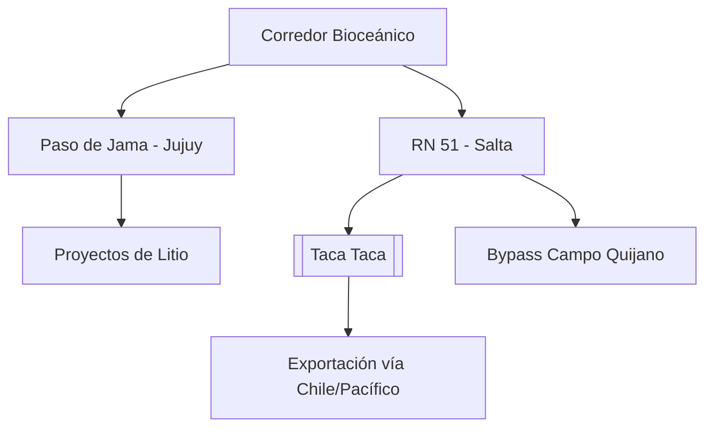

# Corredor Bioceánico de Capricornio (CBC)

**Extensión:** ~2.400 kilómetros que conectan el Océano Atlántico (Brasil) con el Océano Pacífico (Chile) a través de Paraguay y Argentina.

## Estado de la Traza (Mayo 2026)
- **Brasil - Paraguay:**
    - El Puente de la Bioceánica (Porto Murtinho - Carmelo Peralta) alcanzó un **82,5% de avance** físico (ratificado el 08/05/2026). Se mantiene la meta de inauguración para junio de 2026.
    - **Puente sobre el Río Apa (27/04/2026):** Ratificación oficial de la construcción del puente que conectará Porto Murtinho con Concepción (Paraguay) y avances en la pavimentación del Chaco paraguayo.
    - **Convenio TIR (Abril 2026):** Brasil ratificó la Convención TIR, lo que simplificará drásticamente los trámites de tránsito aduanero internacional a lo largo del corredor.
- **Paraguay:** El BID ratificó el financiamiento de **US$ 200 millones** para el tramo clave de la PY15 (Ruta Bioceánica).
- **Argentina:**
    - **Paso de Jama (Jujuy):** Nodo logístico estratégico con un crecimiento exponencial de carga (**7.000 camiones adicionales** entre 2024 y 2025). Cierra solo 35 días al año por factores climáticos.
    - **Salta (Mayo 2026):**
        - **Aceleración en RN 51 (08/05/2026):** La provincia aceleró obras en la Ruta Nacional 51 para dar soporte logístico a **18 proyectos mineros** en fase de construcción y expansión en la Puna.
        - **Bypass Campo Quijano:** La obra (enlace RN51-RP24) alcanza el **70% de avance**, permitiendo desviar el tráfico pesado minero de las zonas urbanas.
        - **Tracción del Cobre:** La ratificación de la inversión en **[[Taca Taca]]** (**US$ 5.250M**) posiciona al proyecto como el principal usuario del corredor para exportar por el Pacífico.
        - **Propuesta CAME:** Creación de un corredor dual (vial/ferroviario) en el Trópico de Capricornio.

## Ventajas Comparativas
- **Alta operatividad:** Acceso directo a los puertos del norte de Chile (Antofagasta, Iquique).
- **Interconexión Energética:** Acuerdo YPF Luz / Central Puerto para la **Interconexión Puna** (US$ 250M-400M), fundamental para la sostenibilidad de los proyectos de [[Litio]] en Pastos Grandes y Hombre Muerto.

## Desafíos Logísticos
- **Conectividad Digital (18/04/2026):** Falta de conectividad (internet/telefonía) en 130 km de territorio chileno tras Jama, lo que impide el uso de documentos electrónicos (MIC/DTA) y afecta la seguridad.
- **Unificación Normativa:** Necesidad de estandarizar pesos y dimensiones de camiones y digitalización total (escáneres).

## Conexiones
- [[Mineria]]
- [[Taca Taca]]
- [[Litio]]
- [[Salta]]
- [[RIGI]]

## Diagrama de Conectividad Estratégica

