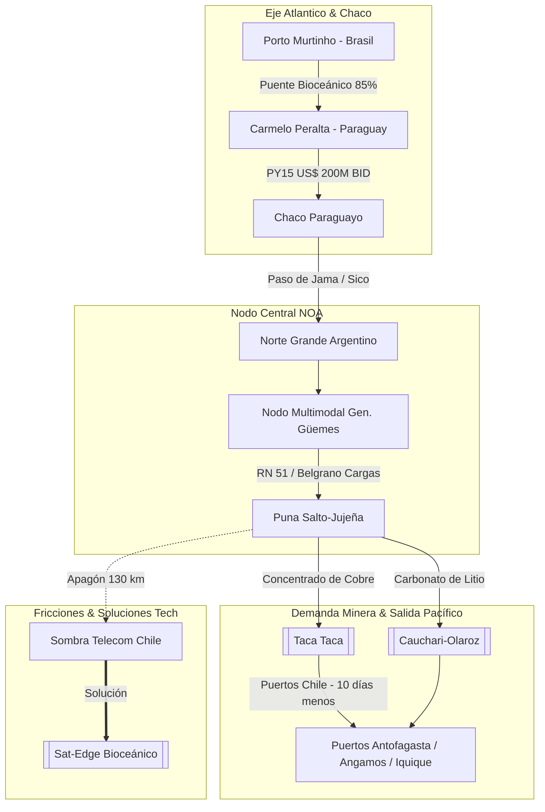

# Corredor Bioceánico de Capricornio (CBC)

**Extensión:** ~2.400 kilómetros de eje multimodal que conectan el Océano Atlántico (Puertos de Santos y Paranaguá en Brasil) con el Océano Pacífico (Puertos de Antofagasta, Angamos e Iquique en Chile) a través del Chaco paraguayo y el Norte Grande argentino (Jujuy, Salta, Catamarca, Tucumán).

---

## 🏗️ Estado de la Traza y Obras Críticas (2026)

### 1. Brasil - Paraguay (Eje Chaco)
- **Puente de la Bioceánica (Porto Murtinho - Carmelo Peralta):** Superó el **85% de avance físico** a mediados de 2026. Es la obra emblemática de hormigón que elimina el cruce en balsa por el Río Paraguay.
- **Puente Internacional Río Apa (2026):** Ratificada la construcción del segundo enlace vial entre Porto Murtinho y Concepción (Paraguay).
- **Ruta PY15 (Chaco Paraguayo):** El BID ratificó el desembolso de **US$ 200 millones** para pavimentar los tramos faltantes de la Ruta Bioceánica en territorio paraguayo.

### 2. Argentina - Chile (Eje Puna Andina)
- **Ruta Nacional 51 (Salta) & Paso de Sico:** 
  - El BID aprobó un financiamiento directo de **US$ 100 millones** para pavimentar e integrar 91 km críticos entre Campo Amarillo y el Paso de Sico, garantizando un corredor transcontinental libre de ripio.
  - El **Bypass de Campo Quijano** (interconexión RN 51 y RP 24) alcanzó un **70% de avance**, desviando el tránsito pesado minero fuera de los cascos urbanos del Valle de Lerma.
- **Paso de Jama (Jujuy):**
  - Consolidado como el paso terrestre de mayor confiabilidad operativa (abierto ~330 días/año frente al cierre frecuente de Cristo Redentor).
  - Crecimiento proyectado de transporte pesado: +7.000 camiones/año impulsados por el auge del litio y suministros industriales.

---

## ⚡ Megaproyectos Traccionadores (Demanda Minera)

La minería de litio y cobre en el NOA actúa como el principal motor financiero y logístico del Corredor Bioceánico:

1. **Megaproyecto de Cobre [[Taca Taca]] (First Quantum, Salta):**
   - Inversión total de **US$ 5.250 millones** (compromiso RIGI de US$ 4.200M).
   - Proyecta exportar sus concentrados de cobre a través del Ramal C14 del Ferrocarril Belgrano Cargas y el Paso de Sico hacia los puertos del norte de Chile (Antofagasta/Angamos).
2. **Triángulo del Litio (Jujuy, Salta, Catamarca):**
   - **[[Cauchari-Olaroz]] (Minera Exar / Eramine):** Caso de éxito validado. Eramine logró **reducir en 10 días el tiempo de navegación** hacia Asia despachando carbonato de litio por camión vía Paso de Jama directo al Puerto de Angamos (Mejillones), evitando el flete marítimo por el Océano Atlántico/Canal de Panamá.
   - **[[Rincón]] (Rio Tinto, US$ 3.000M):** Exportaciones iniciales y transporte masivo de soda ash e insumos pesados a través de la RN 51.
   - **[[Tres Quebradas]] (Zijin Mining, US$ 709M):** Demanda creciente de logística transfronteriza en Catamarca.
3. **Nodo Logístico Multimodal General Güemes (Salta):**
   - Punto nodal donde convergen la RN 34, la RN 51 y la Zona Franca / Nodo Logístico de General Güemes, articulando el flete ferroviario del Belgrano Cargas con el transporte carretero bioceánico.

---

## 📜 Marco Normativo y Aduanero

- **Ratificación Brasil del Convenio TIR:** Brasil formalizó su adhesión a la Convención TIR (Tránsito Internacional por Carretera), permitiendo el precintado aduanero único en origen para todo el convoy bioceánico.
- **Shadow API Aduanera ([[Aduana Paso de Jama]] / [[Convencion TIR Logistica Bioceanica]]):** Especificaciones de interoperabilidad para la transmisión de Documentos de Tránsito Aduanero (MIC/DTA y Certificado de Origen Digital VUCE).

---

## ⚠️ Diagnóstico Escéptico y Vulnerabilidades (Red Team & Pre-Mortem)

Los análisis de resiliencia y Pre-Mortem de la bóveda han identificado 3 fallas estructurales que limitan el potencial del corredor:

1. **El "Apagón Digital" Andino (Ver [[Sat-Edge_Bioceanico]]):**
   - Existe una zona de sombra de **130 km en territorio chileno** tras cruzar la frontera por Jama/Sico sin cobertura celular ni fibra óptica. Esto impide la validación online de los manifiestos de carga digitales (MIC/DTA).
   - *Mitigación:* Despliegue de nodos Edge Computing con almacenamiento *Store-and-Forward* asíncrono y transmisión de tokens criptográficos offline.
2. **Conflicto Social y Ley de Datos Personales (Ver [[AndesLogistics_Puna_Logistica]] & [[Esceptico_Middleware_eTIR_Bioceanico]]):**
   - Intento de implementar telemetría pasiva y seguimiento continuo en flotas pesadas sobre la RN 51 generó rechazo por parte del Sindicato de Camioneros (CCT 40/89), que lo catalogó como control algorítmico laboral abusivo.
   - *Mitigación:* Rediseño del software a "Asistente de Seguridad Vial" enfocado en la prevención de fatiga del chofer y monitoreo del ripio sin penalizaciones de productividad.
3. **Fricción de Compre Local vs. RIGI:**
   - La superposición entre exigencias provinciales (ej. Catamarca 70% compre local) y el RIGI (20% nacional) genera embotellamiento en los servicios de flete y proveedores de alta montaña.

---

## 🔗 Conexiones Relacionadas
- [[Taca Taca]]
- [[Litio]]
- [[Paso de Jama]]
- [[Minera Exar]]
- [[General Güemes]]
- [[Sat-Edge_Bioceanico]]
- [[AndesLogistics_Puna_Logistica]]
- [[Aduana Paso de Jama]]

---

## 🗺️ Diagrama de Conectividad e Integración Multimodal

```mermaid
graph TD
    subgraph Eje Atlantico & Chaco
        PortoMurtinho[Porto Murtinho - Brasil] -->|Puente Bioceánico 85%| CarmeloPeralta[Carmelo Peralta - Paraguay]
        CarmeloPeralta -->|PY15 US$ 200M BID| Chaco[Chaco Paraguayo]
    end

    subgraph Nodo Central NOA
        Chaco -->|Paso de Jama / Sico| NOA[Norte Grande Argentino]
        NOA --> Güemes[Nodo Multimodal Gen. Güemes]
        Güemes -->|RN 51 / Belgrano Cargas| Puna[Puna Salto-Jujeña]
    end

    subgraph Demanda Minera & Salida Pacífico
        Puna -->|Concentrado de Cobre| TacaTaca[[Taca Taca]]
        Puna -->|Carbonato de Litio| Exar[[Cauchari-Olaroz]]
        TacaTaca -->|Puertos Chile - 10 días menos| PuertosPacifico[Puertos Antofagasta / Angamos / Iquique]
        Exar --> PuertosPacifico
    end

    subgraph Fricciones & Soluciones Tech
        Puna -.->|Apagón 130 km| Sombra[Sombra Telecom Chile]
        Sombra ==>|Solución| SatEdge[[Sat-Edge Bioceánico]]
    end
```
