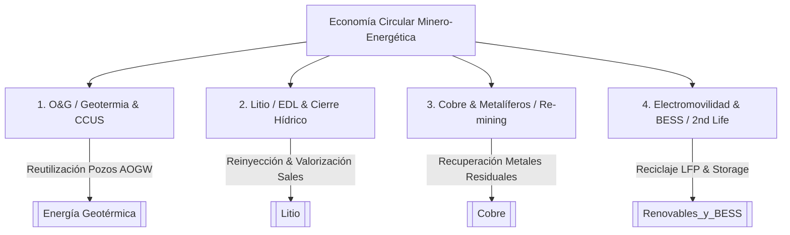

# Economía Circular en Minería y Energía

La **Economía Circular** en el sector extractivo e industrial de Argentina trasciende la retórica ambiental: es un **modelo de eficiencia de activos, mitigación del latigazo regulatorio y extensión de vida útil de yacimientos**. Frente a esquemas lineales (extraer, procesar, descartar), este framework busca desacoplar el crecimiento minero-energético de la extracción sésil de recursos primarios y la acumulación de pasivos ambientales.

---

## 1. Los 4 Pilares Operativos en Argentina

### Pilar 1: Reconversión de Activos O&G a Geotermia y CCUS
* **Concepto:** Transformar pasivos ambientales (pozos de petróleo y gas abandonados o de alto water-cut, AOGW) en activos de generación eléctrica continua de base mediante ciclos orgánicos Rankine (ORC) o almacenamiento geotérmico.
* **Proyectos clave:** Pozos maduros en [[Vaca Muerta]] y Cuenca Golfo San Jorge.
* **Referencia estratégica:** Ver [[Energía Geotérmica]] y [[Reconversión Pozos Petroleros a Geotermia.md]].
* **Fricción económica:** LCOE elevado en sistemas monopozo (R-GEO_single: ~461.7 €-ct/kWh) respecto a plantas convencionales (12.6 €-ct/kWh), requiriendo incentivos de descarbonización o subsidios por remediación de pasivos.

### Pilar 2: Cierre Hídrico y Valorización de Sales/Salmueras en Litio
* **Concepto:** Migración de evaporación solar masiva a Extracción Directa de Litio (EDL / DLE) acoplada a circuitos cerrados de reinyección de salmuera agotada y reciclaje de agua industrial.
* **Valorización de subproductos:** Aprovechamiento comercial de montañas de descartes en salares:
  * Halita (NaCl) para industria química/clorososa.
  * Sulfato de sodio ($Na_2SO_4$) y Sales de Potasio ($KCl$).
  * Boro y Sales de Magnesio ($MgCl_2$).
* **Proyectos clave:** [[Cauchari-Olaroz]], [[Rincón]], [[Sal de Vida]], [[Tres Quebradas]], [[Posco]].
* **Integración tecnológica:** Ver [[HydroTrust_Puna_Hidrico.md]].

### Pilar 3: Re-mining y Valorización de Relaves en Cobre y Oro
* **Concepto:** Re-procesamiento de escorias, relaves y rocas de descarte (waste rock) para extraer metales secundarios estratégicos que antes no eran viables (cobalto, molibdeno, renio, tierras raras) y convertir la ganga inerte en agregados para construcción e infraestructura vial.
* **Impacto Ambiental:** Reducción del volumen de diques de colas, disminución del riesgo de drenaje ácido de roca (DAR) y liberación de áreas impactadas.
* **Proyectos clave:** [[MARA]], [[Veladero]], [[Josemaría]], [[Taca Taca]], [[El Pachón]].

### Pilar 4: Segunda Vida de Baterías (Second Life BESS) y Reciclaje Urbano
* **Concepto:** Recuperación de packs de baterías LFP (Litio-Ferro-Fosfato) y NMC provenientes de la electromovilidad para reacondicionarlas como almacenamiento estacionario (BESS) en microredes solares mineras de la Puna.
* **Cierre de Ciclo ("Urban Mining"):** Plantas hidrometalúrgicas y pirometalúrgicas regionales para procesar "black mass" y recuperar carbonato de litio, cobalto y níquel de grado batería.
* **Conexión:** Ver [[Renovables_y_BESS.md]] y [[Electromovilidad.md]].

---

## 2. Red Team / Análisis Escéptico: La Fricción Logística de la Puna

> [!WARNING]
> **El cuello de botella geográfico:** El costo del flete por camión en la Puna (USD $100-$150/tonelada hacia puertos del Pacífico o Rosario) destruye los márgenes comerciales de subproductos minerales de bajo valor unitario (ej. sal masiva, agregados de relaves). La economía circular en minería aislada solo es viable bajo dos condiciones:
> 1. **Valorización e integración in-situ:** Utilizar el subproducto como insumo directo del mismo complejo o de proyectos colindantes.
> 2. **Infraestructura ferroviaria de gran escala:** Operatividad plena del [[Corredor Bioceanico]] y del Tren C14 hacia los puertos de Chile (Antofagasta/Mejillones).

---

## 3. Marcos Regulatorios y Financieros

* **[[RIGI]]:** El Régimen de Incentivos para Grandes Inversiones ofrece exenciones arancelarias para la importación de bienes de capital destinados al tratamiento de efluentes y plantas DLE/MVR, pero carece de un capítulo específico de crédito fiscal por remediación de pasivos.
* **Estándares Internacionales:** 
  * *EU Battery Passport (2027):* Exige trazabilidad digital de huella de carbono y porcentaje obligatorio de material reciclado.
  * *CBAM (Mecanismo de Ajuste en Frontera por Carbono):* Penaliza exportaciones de minerales sin certificación de descarbonización.

---

## 4. Grafo de Conexiones en la Wiki

- **Proyectos:** [[Litio]], [[Cobre]], [[Vaca Muerta]], [[Cauchari-Olaroz]], [[Veladero]], [[MARA]], [[Posco]], [[Rincón]].
- **Frameworks:** [[Energía Geotérmica]], [[Ley de Glaciares]], [[RIGI]], [[Renovables_y_BESS]], [[Corredor Bioceanico]].
- **Análisis:** [[Circularidad y Valorización de Pasivos Minero-Energéticos]], [[Mapa_de_Puntos_de_Dolor_2026]], [[HydroTrust_Puna_Hidrico]].
- **Oportunidades Tech:** [[Marketplace_y_Trazabilidad_de_Pasivos_Circulares]], [[Reconversión Pozos Petroleros a Geotermia]].
