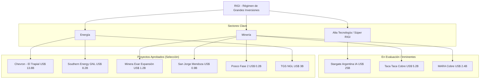

# RIGI (Régimen de Incentivo para Grandes Inversiones)

**Vigencia:** 2024 - Julio 2027 (Prorrogado formalmente).
**Objetivo:** Atraer proyectos de inversión mayores a **US$ 200 millones** mediante beneficios impositivos, cambiarios y estabilidad jurídica por 30 años.

## Tablero de Control (Junio 2026)
Al 26 de junio de 2026, el RIGI se ha consolidado como la piedra angular de la macroeconomía argentina:

- **Inversión Total Comprometida:** **US$ 140.929 millones** (repartidos en 41 iniciativas).
- **Proyectos Aprobados:** 16 proyectos con aprobación formal por un total de **US$ 29.892 millones**.
- **Proyectos en Evaluación:** 25 iniciativas por **US$ 111.037 millones**.
- **Concentración Sectorial:** El 98% de las solicitudes se concentran en Minería y Energía.

## Mapa Estratégico de Proyectos

## Categorías y Evolución Normativa
### 1. PEELP (Proyectos de Exportación Estratégica de Largo Plazo)
- Inversión mínima: **US$ 2.000 millones**.
- Casos: **Argentina LNG**, **Southern Energy**.

### 2. Súper RIGI (Junio 2026)
- **Estado:** Media sanción en Diputados (24/06/2026).
- **Alcance:** Inversiones > **US$ 1.000 millones** en sectores de alta tecnología (IA, semiconductores, hidrógeno verde).
- **Proyecto Faro:** [[Stargate Argentina]] (OpenAI/Sur Energy - US$ 25.000M).

### 3. Unidad de Coordinación RIGI (Res. 873/2026)
- Formaliza una unidad centralizada dentro del Ministerio de Economía para acelerar la evaluación técnica y administrativa de los VPU (Vehículos de Proyecto Único).

## Listado de Adhesiones Destacadas (Actualizado)
1.  **[[Chevron]]** (El Trapial, Neuquén) - **US$ 13.800M**.
2.  **[[Southern Energy]]** (GNL, Río Negro) - **US$ 8.178M**.
3.  **[[TGS]]** (NGL, Vaca Muerta) - **US$ 3.000M**.
4.  **[[Minera Exar]]** (Litio, Jujuy) - Expansión US$ 1.241M.
5.  **[[Posco]]** (Litio, Salta) - Fase 2 US$ 208M.
6.  **[[San Jorge]]** (Cobre, Mendoza) - US$ 891M.
7.  **[[Rincón]]** (Rio Tinto, Salta) - US$ 2.500M.
8.  **[[Veladero]]** (Barrick, San Juan) - US$ 380M.

## Impacto Macroeconómico
El régimen ha generado una "economía a dos velocidades", donde los sectores adheridos crecen por encima del 15% interanual, traccionando la balanza comercial y las reservas del BCRA (con liquidaciones netas superiores a los US$ 700 millones en el primer cuatrimestre).

## Conexiones
- [[Mineria]]
- [[Energia]]
- [[Cobre]]
- [[Litio]]
- [[Vaca Muerta]]
- [[Stargate Argentina]]
