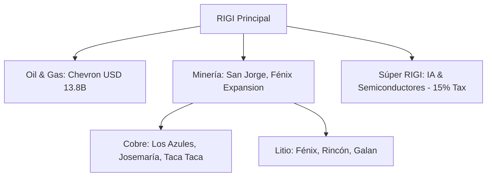

# RIGI (Régimen de Incentivo para Grandes Inversiones)

**Vigencia:** 2024 - Julio 2027 (Prorrogado formalmente el 11/04/2026 para capturar la ventana de inversión minera/energética).
**Objetivo:** Atraer proyectos de inversión mayores a **US$ 200 millones** mediante beneficios impositivos, cambiarios y estabilidad jurídica por 30 años.

## Tablero de Control (Junio 2026)
- **Súper RIGI (01/06/2026):** El Poder Ejecutivo envió al Congreso un proyecto de ley para extender los beneficios del RIGI a sectores de alta tecnología (IA, semiconductores, centros de datos).
    - **Inversión mínima:** USD 1.000 millones.
    - **Beneficio principal:** Alícuota reducida de Ganancias al **15%**.
- **Adhesión Récord - Chevron (03/06/2026):** Presentación del megaproyecto El Trapial por **USD 13.800 millones**, consolidando el flujo de inversión en Oil & Gas.
- **Aprobación San Jorge (03/06/2026):** Formalización vía Resolución 801/2026 (USD 891M), marcando el regreso de Mendoza a la minería de gran escala.
- **Aprobación Expansión Fénix (03/06/2026):** Resolución 431/2026 aprueba la Fase 1B de Arcadium (USD 530M).

## Tablero de Control (Abril 2026)
En el primer cuatrimestre de 2026, el RIGI se ha consolidado como el motor principal de la reactivación económica en sectores estratégicos:

- **Argentina Week (13/04/2026):** Fuerte recepción del régimen en la comunidad financiera de Nueva York, con compromisos ratificados por TGS (US$ 3.000M) y Pampa Energía (US$ 4.500M).
- **Liquidación de Divisas (22/04/2026):** El BCRA informó que los proyectos RIGI ya liquidaron **US$ 762 millones netos** (US$ 1.205 millones brutos), validando el impacto inmediato en las reservas.
- **Proyectos Aprobados/En Evaluación:** +35 proyectos bajo evaluación formal (con hitos como las 11 presentaciones confirmadas el 16/04/2026).
- **Inversión Total Comprometida:** > **US$ 52.000 millones** (estimación actualizada tras ampliación de upstream, GNL y ratificación de Taca Taca). El 98% de las solicitudes se concentran en Minería y Energía.
- **Sectores Críticos:** GNL (28%), Cobre (35%), Litio (20%), Oil/Gas Upstream (17%).
- **Sinergia Regional (16/04/2026):** Los gobernadores del NOA (Jalil, Sadir, Sáenz) destacan el RIGI como el catalizador principal de la aceleración de inversiones, complementándolo con marcos locales (ej. "mini RIGI" en Jujuy para inversiones >US$ 5M).

### Categorías Especiales
- **PEELP (Proyectos de Exportación Estratégica de Largo Plazo):**
    - Destinado a megaproyectos de exportación (ej. GNL).
    - Inversión mínima: **US$ 2.000 millones**.
    - Desembolsos mínimos por etapa: **US$ 1.000 millones**.
    - Proyectos como **Argentina LNG** y **Southern Energy** se encuadran en esta categoría para maximizar beneficios.

### Listado de Adhesiones y Evaluaciones (Abril 2026):
1.  **[[Rincón]]** (Rio Tinto, Salta, Litio) - Primer proyecto minero en adherir y exportar (200t a Shanghái). Inversión: **US$ 2.500M** (paquete financiamiento US$ 1.175M).
2.  **[[Hombre Muerto Oeste]]** (Galan Lithium, Catamarca, Litio) - Fase 1 operativa. Inversión: **US$ 217M**.
3.  **[[Josemaría]]** (Lundin, San Juan, Cobre) - Clave del [[Distrito Vicuña]].
4.  **[[Los Azules]]** (McEwen, San Juan, Cobre) - Proyecto lixiviación estratégica.
5.  **[[Southern Energy]]** (Río Negro, GNL) - Inversión: **US$ 6.900M**.
6.  **[[TGS]]** (Neuquén, Energía) - Industrialización de líquidos. Inversión: **US$ 3.000M**.
7.  **[[Pampa Energía]]** (Neuquén, Oil) - Upstream no convencional. Inversión: **US$ 4.500M**.
8.  **Proyectos Vaca Muerta** (Phoenix Global, US$ 6.000M; Tecpetrol, US$ 2.400M; GeoPark, US$ 1.000M).
9.  **[[Diablillos]]** (AbraSilver, Salta, Plata/Oro) - Aprobado Feb 2026. Inversión: **US$ 760M**.
10. **[[Veladero]]** (Barrick, San Juan, Oro/Plata) - Aprobado Feb 2026. Inversión: **US$ 380M**.
11. **Proyecto Fénix** (Rio Tinto/Arcadium, Catamarca, Litio) - Expansión Fase 1B aprobada Abr 2026. Inversión: **US$ 251M**.
12. **[[Taca Taca]]** (First Quantum, Salta, Cobre) - Ratificación de inversión: **US$ 4.200M**.
13. **Proyecto San Jorge** (Mendoza, Cobre) - Reactivado gracias al nuevo marco provincial y RIGI.
14. **Galan Lithium** (Catamarca, Litio) - Ampliación de fase aprobada Jul 2025.
15. **[[Posco]]** (Hombre Muerto Norte, Salta) - Inversión inicial tras adquisición: US$ 65M. En espera de aprobación final para planta de litio (>18 meses).
16. **Pampa Energía** (Bahía Blanca, Fertilizantes) - Solicitud de adhesión para planta de urea de US$ 2.400M.
17. **[[Chevron]]** (El Trapial, Neuquén) - Solicitud de ingreso por **USD 13.800M**.
18. **[[San Jorge]]** (Mendoza, Cobre) - Aprobado (Res. 801/2026) por **USD 891M**.

## Impacto Macroeconómico (2026)
El RIGI está consolidando una **"economía a dos velocidades"** o crecimiento en forma de "K". Mientras los sectores adheridos (Minería y Energía) muestran un crecimiento del **+15,3%** sobre niveles de 2023, los sectores dependientes del mercado interno (Construcción, Comercio e Industria) enfrentan un estancamiento con una caída del **-4,9%**.

## Hitos Normativos (2026)
- **Ajuste de Rentabilidad (27/04/2026):** La Resolución 484/2026 elevó el umbral de rentabilidad del 30% al 35% para adaptar el régimen a la curva de declino de proyectos de shale oil e infraestructura eléctrica.
- **Nuevas Adhesiones (24/04/2026):** Aprobación de **Veladero** (Res. 413/2026) y **Minera del Altiplano** (Res. 431/2026).
- **Extensión Upstream (18/04/2026):** El Decreto 105/2026 extendió formalmente los beneficios del RIGI a todo el segmento upstream de petróleo y gas.

## Beneficios Clave para Inversores
- **Estabilidad Fiscal:** No se verán afectados por nuevos impuestos nacionales o aumento de tasas provinciales durante 30 años.
- **Libre Disponibilidad de Divisas:** Acceso al mercado de cambios restringido eliminado progresivamente para exportaciones adheridas.
- **Incentivos Aduaneros:** Importación de insumos y bienes de capital con arancel 0%.
- **Seguridad Jurídica:** Jurisdicción en tribunales internacionales (CIADI) para resolución de disputas.

## Conexiones
- [[Mineria]]
- [[Energia]]
- [[Cobre]]
- [[Litio]]
- [[Distrito Vicuña]]
- [[Chevron]]
- [[San Jorge]]

