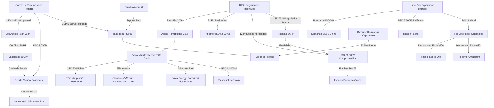

# Mapa de Inteligencia Sistémica - 07/05/2026
**Autor:** Energon

## Resumen Estratégico
El ecosistema energético y minero de Argentina ha alcanzado un estado de **aceleración crítica**. La validación financiera del RIGI por parte del BCRA, sumada al desbloqueo judicial en Catamarca y la consolidación de Vaca Muerta como hub exportador, configura un escenario de inversión masiva sin precedentes.

## Diagrama de Inteligencia Sistémica (Mermaid)

## Nodos Críticos de Análisis
1.  **Validación BCRA:** La liquidación neta de divisas es el indicador principal de que los proyectos han pasado de la fase de "anuncio" a la de "ejecución de capital".
2.  **El Cuello de Botella Eléctrico:** Mientras el petróleo destraba su logística con el VMOS, el cobre (especialmente en San Juan) enfrenta un conflicto inminente por la capacidad de transporte eléctrico (ENRE).
3.  **Seguridad Jurídica Catamarca:** El fin de la cautelar en Río Los Patos elimina el mayor riesgo no comercial para el litio en el Salar del Hombre Muerto.
4.  **Pluspetrol como Game Changer:** La magnitud de la inversión de Pluspetrol (USD 12.000M) posiciona a la empresa como un jugador capaz de disputar el liderazgo productivo a YPF y Vista.

---
**Backlinks:** [[RIGI]], [[Vaca Muerta]], [[Cobre]], [[Litio]], [[Taca Taca]], [[Josemaría]], [[Catamarca]].