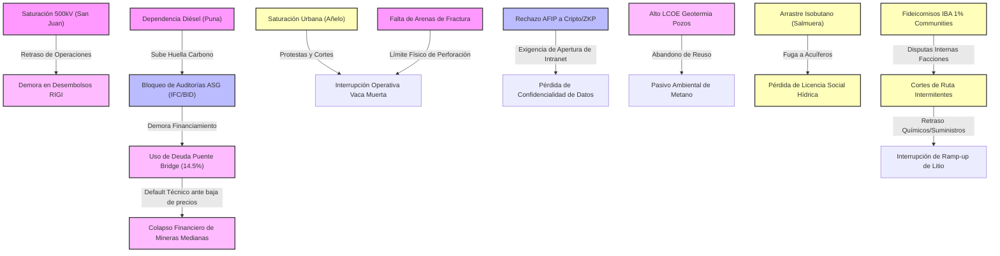

# Mapa de Puntos de Dolor - Minería y Energía (Argentina 2026)

Este documento sintetiza la **Fase 1 (Empatizar)** del proceso de Design Thinking aplicado a nuestra base de conocimiento. Su propósito es estructurar, comprender y "enamorarse" de los problemas reales y sistémicos que enfrentan los proyectos y actores del sector en Argentina, postergando la búsqueda de soluciones a fases posteriores.

---

## 1. Eje: Infraestructura e Insumos

### Ficha de Dolor: Saturación y Asignación de Capacidad en Línea 500kV
* **Categoría:** Infraestructura e Insumos
* **Impacto:** [[Los Azules]], [[Josemaría]], [[Distrito Vicuña]] (Provincia de [[San Juan]]).
* **Evidencia y Citas:** 
  - La disputa judicial por prioridad regulatoria (Res. ENRE 219/2026) entre McEwen Copper y BHP/Lundin ante el [[ENRGE]] (fusionado en junio de 2026).
  - "La línea de 500kV en San Juan no cuenta con capacidad excedente para abastecer la demanda pico de múltiples operaciones de clase mundial simultáneamente" (ver [[Cuello de Botella Electrico San Juan.md]]).
* **Conexión Sistémica (Deducción Lateral):** La falta de un mecanismo claro de mercado para co-financiar o priorizar el acceso a la red física frena las decisiones de inversión privada (*Big Capital*) bajo el [[RIGI]], creando un cuello de botella puramente técnico que el régimen legal no puede resolver de inmediato.

### Ficha de Dolor: Dependencia de Generación Térmica (Diésel) en Yacimientos de la Puna
* **Categoría:** Infraestructura e Insumos
* **Impacto:** Proyectos de [[Litio]] en el Salar de Pastos Grandes y Salar del Hombre Muerto (Provincias de [[Salta]] y [[Catamarca]]).
* **Evidencia y Citas:**
  - El acuerdo de abril de 2026 entre YPF Luz y Central Puerto para construir la **Interconexión Puna** por USD 250M-450M (ver [[Electrificacion Puna.md]] y `raw/2026-06-27_news_mining_energy.md`).
  - La ausencia de una red interconectada estable obliga a operar campamentos con combustibles líquidos de alto costo operativo (OPEX) y alta huella de carbono.
* **Conexión Sistémica (Deducción Lateral):** Esta limitación técnica choca directamente con las auditorías ambientales de la IFC/BID (Estándares ASG) exigidas para el des-riesgo financiero de los proyectos de litio de gran escala (ej. [[Taca Taca]] y [[Rincón]]).

### Ficha de Dolor: Cuello de Botella en Logística de Arena de Fractura
* **Categoría:** Infraestructura e Insumos
* **Impacto:** Operaciones de Shale Oil & Gas en [[Vaca Muerta]] (Provincia de [[Neuquén]]).
* **Evidencia y Citas:**
  - "El crecimiento productivo está tensionando la cadena de abastecimiento de arena de fractura, un insumo crítico para la industria" (`raw/2026-06-24_news_mining_energy.md`).
  - Récord histórico de 2.484 etapas de fractura mensuales y producción de crudo de 634.802 bpd.
* **Conexión Sistémica (Deducción Lateral):** La velocidad de perforación y fractura (*frack crews*) excede la capacidad de procesamiento y transporte de arenas del clúster logístico local, amenazando con aplanar la curva de crecimiento de exportación.

### Ficha de Dolor: Monopolio de Diagnóstico de Puertos J1939 en Maquinaria Amarilla
* **Categoría:** Infraestructura e Insumos
* **Impacto:** Mantenimiento y optimización de flotas en proyectos de tajo abierto (ej. [[Josemaría]], [[Los Azules]], [[Altar]]).
* **Evidencia y Citas:**
  - Las computadoras a bordo de equipos Caterpillar/Komatsu encriptan tramas CAN-bus y su violación anula la garantía minera del fabricante (ver [[Resiliencia_de_los_Pivotes.md]]).
* **Conexión Sistémica (Deducción Lateral):** Los desarrolladores de software locales no pueden integrar sensores predictivos directamente sin el aval de las multinacionales dueñas del hardware, reduciendo la eficiencia operativa y aumentando el OPEX de mantenimiento de manera cautiva.

---

## 2. Eje: Regulación y Legalidad

### Ficha de Dolor: Incompatibilidad entre Fiscalización Administrativa Tributaria (AFIP) y Criptografía
* **Categoría:** Regulación y Legalidad
* **Impacto:** Operadoras petroleras e inversores adheridos al régimen de incentivos [[RIGI]].
* **Evidencia y Citas:**
  - El principio de inversión de la carga de la prueba de la AFIP (Ley 11.683) que interpreta el uso de herramientas como ZKP (Zero-Knowledge Proofs) como ocultación de base tributaria y obstrucción (ver [[Resiliencia_de_los_Pivotes.md]]).
* **Conexión Sistémica (Deducción Lateral):** La burocracia estatal requiere auditoría transparente y legible (esquemas tradicionales de libros contables), lo que impide la automatización de la debida diligencia de cumplimiento fiscal RIGI mediante contratos inteligentes (*Ledgers*), manteniendo altos costos de cumplimiento legal (*HITL*).

### Ficha de Dolor: Disputas Jurisdiccionales de Tránsito Vial Interprovincial
* **Categoría:** Regulación y Legalidad
* **Impacto:** Logística cordillerana del [[Distrito Vicuña]] (Frontera [[San Juan]] y [[La Rioja]]).
* **Evidencia y Citas:**
  - "Resolución de conflictos de acceso vial en La Rioja (Distrito Vicuña) destraba la logística clave" (`raw/2026-05-21_news_mining_energy.md` y `raw/2026-05-20_news_mining_energy.md`).
  - La provincia de La Rioja no adhiere al RIGI y ha judicializado históricamente la explotación minera, afectando el tránsito logístico de proyectos sanjuaninos que requieren cruzar su territorio.
* **Conexión Sistémica (Deducción Lateral):** El federalismo argentino permite que los conflictos de límites o de no-adhesión al RIGI se transformen en barreras viales provinciales, fragmentando la cadena logística andina.

### Ficha de Dolor: Vulnerabilidad por Restricciones y Cautelares Ambientales Hídricas
* **Categoría:** Regulación y Legalidad
* **Impacto:** Proyectos de litio en [[Catamarca]] (Salar del Hombre Muerto: [[Sal de Oro]], [[Arcadium Lithium|Fénix]]).
* **Evidencia y Citas:**
  - La cautelar sobre el Río Los Patos que paralizó temporalmente la cuenca y obligó al levantamiento del Tribunal de Justicia (`raw/2026-05-21_news_mining_energy.md`).
  - Falta de un monitoreo hídrico unificado, público y en tiempo real que genere confianza con los regantes locales y comunidades.
* **Conexión Sistémica (Deducción Lateral):** La judicialización de los permisos hídricos por parte de defensores del agua se ve amplificada por la fragmentación de los datos ambientales provinciales, poniendo en riesgo la continuidad de producción ya autorizada bajo el RIGI.

### Ficha de Dolor: Fricción por Soberanía Feudal frente a Auditorías Multilaterales
* **Categoría:** Regulación y Legalidad
* **Impacto:** Financiación por deuda (*Project Finance*) de proyectos mineros de gran escala.
* **Evidencia y Citas:**
  - El rechazo de gobernadores locales del norte a la intervención de observadores de la ONU (ACNUDH) en consultas previas por considerarlo un ataque a su soberanía sobre recursos naturales (ver [[Resiliencia_de_los_Pivotes.md]]).
* **Conexión Sistémica (Deducción Lateral):** La exigencia de organismos multilaterales (IFC/BID) de cumplir estándares globales de consulta comunitaria choca con las estructuras feudales de gobernanza local, dilatando las aprobaciones financieras de manera indefinida.

---

## 3. Eje: Macroeconomía y Acceso a Capital

### Ficha de Dolor: Capacidad Ociosa PyME por Cuellos de Botella Financieros
* **Categoría:** Macroeconomía y Acceso a Capital
* **Impacto:** Proveedores de servicios locales (PyMEs Tier 2 y Tier 3) en Vaca Muerta.
* **Evidencia y Citas:**
  - "El 55% de las PyMEs energéticas opera con capacidad ociosa a pesar del récord de actividad, evidenciando cuellos de botella financieros" (`raw/2026-06-24_news_mining_energy.md`).
  - Dificultades para calificar en el régimen [[RIMI]] (de menores umbrales) y tasas de interés comerciales prohibitivas.
* **Conexión Sistémica (Deducción Lateral):** El boom minero y de shale es monopolizado por operadoras Tier 1 que consiguen financiamiento internacional, mientras que la cadena de valor local se descapitaliza, imposibilitada de comprar repuestos o actualizar maquinaria para cumplir con los estándares de seguridad requeridos.

### Ficha de Dolor: Inviabilidad del Reuso Geotérmico en Pozos Abandonados
* **Categoría:** Macroeconomía y Acceso a Capital
* **Impacto:** Transición energética y calor/potencia industrial en yacimientos maduros.
* **Evidencia y Citas:**
  - "Repurposed systems' LCOEs are 14–65 times higher than conventional geothermal plants" (ver `Full environmental life cycle costing analysis...html`).
  - Bajos niveles de eficiencia térmica, vidas útiles acotadas (15 años) y altos costos iniciales de reconversión mecánica de pozos de petróleo antiguos.
* **Conexión Sistémica (Deducción Lateral):** La falta de incentivos regulatorios específicos para el tratamiento de pasivos ambientales (pozos mal sellados con fugas de metano) bloquea una alternativa renovable óptima para la Puna o la Cuenca del Golfo San Jorge, al carecer de viabilidad económica de mercado pura.

### Ficha de Dolor: Trampa de Tasa de Interés en Crédito Puente (*Bridge Debt*)
* **Categoría:** Macroeconomía y Acceso a Capital
* **Impacto:** Ingeniería financiera y flujo de caja de desarrolladores mineros medianos.
* **Evidencia y Citas:**
  - La dependencia de crédito privado a corto plazo con tasas del 14.5% anual debido a la demora de más de 30 meses de los comités ambientales de la IFC/BID (ver [[Resiliencia_de_los_Pivotes.md]]).
* **Conexión Sistémica (Deducción Lateral):** La fluctuación internacional del precio de los commodities (ej. litio) erosiona rápidamente la rentabilidad si el proyecto carga con deuda puente privada sobrevaluada debido a demoras de compliance en Washington.

### Ficha de Dolor: Trampas de Liquidez en Contratos de Compra (*Offtake*) con Penalidades Bajas
* **Categoría:** Macroeconomía y Acceso a Capital
* **Impacto:** Proyectos de valor agregado local, industrialización y petroquímica.
* **Evidencia y Citas:**
  - La vulnerabilidad de contratos de suministro fijos (*Take-or-Pay*) ante caídas bruscas de precios internacionales donde los compradores prefieren pagar penalidades bajas y comprar en el exterior (ver [[Resiliencia_de_los_Pivotes.md]]).
* **Conexión Sistémica (Deducción Lateral):** Las industrias locales de valor agregado (ej. urea, litio procesado) carecen de blindaje real si las penalidades de salida de contratos con grandes distribuidores no cubren el costo marginal de producción bajo altos costos argentinos (OPEX).

---

## 4. Eje: Licencia Social e Impacto Ambiental

### Ficha de Dolor: Colapso Urbano, Sanitario y Educativo en Añelo
* **Categoría:** Licencia Social e Impacto Ambiental
* **Impacto:** Población local y campamentos logísticos de [[Vaca Muerta]] (Añelo).
* **Evidencia y Citas:**
  - "El intendente Fernando Banderet pidió frenar la llegada de familias sin empleo seguro debido a la saturación total de la infraestructura urbana, escolar y de salud" (`raw/2026-06-24_news_mining_energy.md`).
* **Conexión Sistémica (Deducción Lateral):** La desconexión entre la velocidad del CAPEX corporativo en el yacimiento y la inversión pública en servicios básicos municipales crea un ambiente de alta conflictividad social, paros y tomas que pueden interrumpir la continuidad operativa de los oleoductos/gasoductos.

### Ficha de Dolor: Contaminación Hidrológica Secundaria por Solventes Geotérmicos
* **Categoría:** Licencia Social e Impacto Ambiental
* **Impacto:** Acuíferos superficiales y comunidades rurales patagónicas.
* **Evidencia y Citas:**
  - El arrastre y disolución de isobutano supercrítico en la salmuera reinyectada (tasa de 450 mg/litro) bajo sistemas de intercambiadores de contacto directo (ver [[Resiliencia_de_los_Pivotes.md]]).
* **Conexión Sistémica (Deducción Lateral):** El "antídoto" para evitar la corrosión de las placas de titanio (contacto directo) genera un impacto ecológico destructivo aguas arriba, destruyendo la licencia social en comunidades agrícolas que dependen de pozos de agua dulce.

### Ficha de Dolor: Conflicto Comunitario Interno por Fideicomisos IBA (Litio)
* **Categoría:** Licencia Social e Impacto Ambiental
* **Impacto:** Comunidades originarias de las Salinas en la Puna.
* **Evidencia y Citas:**
  - La división social y disputas familiares intracomunitarias por el reparto y gobernanza del 1% del fideicomiso de regalías mineras (IBA) acordado con multinacionales (ver [[Resiliencia_de_los_Pivotes.md]]).
* **Conexión Sistémica (Deducción Lateral):** Los aportes económicos destinados a mitigar el impacto social actúan en ocasiones como factor de desintegración y litigio interno de los pueblos, derivando en cortes de ruta intermitentes que bloquean el tránsito de insumos químicos al salar.

---

## 5. Visualización de la Red de Dolores Sistémicos (Mermaid)

El siguiente diagrama de relaciones sistémicas demuestra cómo los dolores de diferentes ejes no ocurren de forma aislada, sino que se retroalimentan y multiplican de manera silenciosa:

---
Este mapa de empatía constituye nuestro marco diagnóstico de base. En las fases siguientes (Definir e Idear), cada una de estas fichas de dolor servirá como punto de partida para formular preguntas del tipo **"¿Cómo podríamos...?" (How Might We)** y evaluar la resiliencia de cualquier innovación tecnológica aplicada al sector.
