# Oportunidades de Negocio y Conexiones Ocultas - Julio 2026

## Oportunidades de Negocio Identificadas
1. **Infraestructura de Exportación VMOS**:
   - Con el financiamiento de US$ 2.000M asegurado y un 60% de avance, el oleoducto VMOS es la oportunidad logística de la década. Proveedores de servicios para la terminal de Punta Colorada y mantenimiento de ductos tienen un horizonte claro de demanda para fines de 2026.
2. **Tierras Raras y Minería Tecnológica**:
   - La iniciativa para incluir tierras raras en el [[RIGI]] abre un nicho virgen en Argentina. Oportunidades en exploración geofísica especializada y plantas de separación química de tierras raras.
3. **BESS AlmaGBA y Estabilidad del SADI**:
   - La adjudicación de 700 MW de almacenamiento en baterías (BESS) en el AMBA señala una tendencia irreversible. Empresas de integración de sistemas, software de gestión de energía (EMS) y fabricantes de baterías (con potencial integración con el litio local) tienen un mercado en expansión para estabilizar la red eléctrica.
4. **Extensión Geológica de Vaca Muerta hacia el Este**:
   - El pozo récord de Phoenix en Río Negro revaloriza áreas consideradas marginales. Oportunidad para adquisición de bloques y servicios de perforación en zonas de menor densidad actual pero alto potencial de shale oil.
5. **Cluster Minero Mendoza-Chile**:
   - Los acuerdos de integración binacional posicionan a Mendoza como un centro de servicios para proyectos chilenos y viceversa. Oportunidad en logística transfronteriza y servicios de ingeniería para el cluster de cobre de los Andes.
6. **Súper RIGI e Industria Pesada**:
   - El esquema de US$ 1.000 millones para industrias que "aún no existen" apunta a siderurgia verde, plantas de hidrógeno de gran escala e infraestructura de GNL masiva.
7. **Rechazo Mariana y Rigor de "Inversión Nueva"**:
   - El rechazo al proyecto Mariana por parte del Comité Evaluador del RIGI es una advertencia para inversores: el régimen no es un salvataje para inversiones hundidas, sino un incentivo para capital fresco. Consultoría en estructuración de proyectos RIGI para cumplir con la regla de "nueva inversión" es ahora crítica.

## Conexiones Estratégicas y Ocultas
Argentina está logrando desacoplar el riesgo soberano del riesgo de proyecto en los sectores de Energía y Minería mediante el blindaje del RIGI. La sinergia entre el superávit energético récord y la expansión minera genera un "escudo de divisas" que sostiene la macroeconomía mientras el mercado interno se ajusta.

### Visualización de Conexiones (Mermaid)

```mermaid
graph TD
    RIGI[RIGI: Motor de Inversión] --> |Aprobado US$ 9.700M| Vicuña[Distrito Vicuña Cobre]
    RIGI --> |Aprobado US$ 4.521M| RinconAranda[Rincón de Aranda Oil]
    RIGI --> |Aprobado US$ 1.300M| SanMatias[Gasoducto San Matías GNL]
    RIGI --> |Aprobado US$ 1.241M| Exar[Minera Exar Litio]
    RIGI --> |Iniciativa| TierrasRaras[Tierras Raras]
    RIGI --> |Rechazo| Mariana[Proyecto Mariana - Inversión Vieja]
    RIGI --> |Defensa| SuperRIGI[Súper RIGI > US$ 1.000M]

    VM[Vaca Muerta] --> |Récord Junio| Fracturas[Etapas de Fractura]
    VM --> |Financiamiento US$ 2.000M| VMOS[Oleoducto Vaca Muerta Sur]
    VM --> |Expansión Este| RioNegro[Río Negro Shale]
    VM --> |Superávit Récord| Balanza[Balanza Energética]

    Energia --> |DNU 585/2026| Emergencia[Prórroga Emergencia Eléctrica]
    Energia --> |700 MW Adjudicados| BESS[BESS AlmaGBA Storage]
    BESS -.-> |Sinergia| Litio[Litio Argentina]

    Mendoza --> |Acuerdos| Chile[Integración Binacional]
    Mendoza --> |Cobre| SanJorge[Proyecto San Jorge]

    Mineria --> |Crecimiento 9.5%| INDEC
    Mineria --> |Proyección US$ 9.000M| CAEM[Exportaciones 2026]
    
    Vicuña --> |Josemaría/Filo| Cobre
```

## Conclusiones
La consolidación de Vaca Muerta como exportador neto y el ingreso masivo de proyectos cupríferos al RIGI están cambiando la matriz productiva. El principal riesgo a monitorear es el cuello de botella en la red eléctrica (prórroga de la emergencia), lo que refuerza la oportunidad para soluciones de autogeneración y almacenamiento (BESS) en sitios mineros y centros de demanda industrial.
