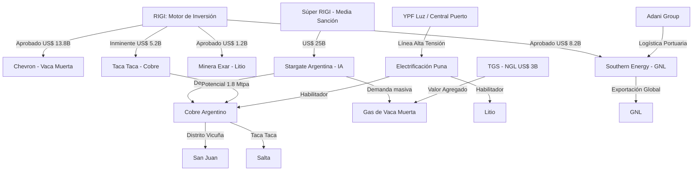

# Oportunidades de Negocio y Conexiones Estratégicas - Junio 2026

## Oportunidades de Negocio Identificadas
1. **La Tríada del Futuro: Cobre + Energía + IA**:
   - La presentación de **[[Stargate Argentina]]** (US$ 25.000M) revela una conexión crítica. Los data centers de IA requieren cantidades masivas de **Cobre** (para redes y potencia) y **Energía** estable (Vaca Muerta). Argentina es uno de los pocos países que puede ofrecer ambos recursos bajo un marco de incentivos como el **Súper RIGI**.
2. **Cobre: La "Nueva Vaca Muerta"**:
   - El informe de Bain & Company (1.8 Mtpa para 2035) y la actualización de **[[Taca Taca]]** (60 Mtpa de procesamiento) confirman que el cobre es el próximo gran motor de divisas. Se abre un mercado masivo para **proveedores de infraestructura pesada, logística transfronteriza y gestión hídrica**.
3. **Infraestructura Eléctrica en la Puna**:
   - El acuerdo entre **[[YPF]] Luz** y **Central Puerto** (US$ 250M-450M) para la línea de alta tensión en la Puna es el primer paso para desbloquear decenas de proyectos de litio y cobre que hoy dependen de generación diesel costosa.
4. **Midstream de Valor Agregado**:
   - Las decisiones finales de inversión de **[[TGS]]** (US$ 3.000M en NGL) y **[[Southern Energy]]** (US$ 8.200M en GNL) abren oportunidades para servicios de ingeniería de procesos, mantenimiento industrial y logística portuaria (Adani/Meridian).
5. **Upstream RIGI y la Eficiencia Técnica**:
   - La aprobación de **[[Chevron]]** (US$ 13.800M) y el récord de profundidad de **[[Tecpetrol]]** indican una carrera por la eficiencia. Hay demanda creciente por tecnologías de perforación MDF, ramas horizontales extendidas y servicios de fractura de alta intensidad.
6. **Desarrollo de Proveedores Locales (Unidad de Coordinación)**:
   - La **Res. 873/2026** busca centralizar y agilizar el RIGI. Esto facilitará que empresas Tier 2 y Tier 3 se integren más rápido a la cadena de valor de los VPU aprobados.

## Conexiones Estratégicas y Ocultas
Argentina está integrando sus recursos naturales con la infraestructura tecnológica de avanzada. El RIGI ya no solo atrae "commodities", sino que está apalancando la **Inteligencia Artificial** como un nuevo sector exportador.

### Visualización de Conexiones (Mermaid)

## Conclusiones
El ecosistema de inversión en Argentina ha alcanzado una masa crítica (US$ 140B en pipeline). La sinergia entre el sector extractivo (Minería/Energía) y el tecnológico (IA) crea un blindaje estratégico: el mundo necesita el cobre y la energía de Argentina para alimentar la revolución de la Inteligencia Artificial. El principal desafío migra de lo regulatorio (ya resuelto con el RIGI) hacia la **ejecución física de la infraestructura** de transporte y energía.
