# Oportunidades de Negocio y Conexiones Ocultas - Abril 2026

## Oportunidades de Negocio Identificadas
1. **Infraestructura Eléctrica y Arbitraje de Despacho (ENRE)**:
   - La **Resolución ENRE 079/2026** otorgó a **[[Distrito Vicuña]]** una prioridad del 90% sobre la capacidad remanente de la línea de 500 kV en San Juan. Esto genera un bloqueo sistémico para **[[Los Azules]]** y otros proyectos. La oportunidad se desplaza de la infraestructura pública hacia la **Orquestación de Microgrids Off-Grid** (Solar + Baterías + LNG) para independizar el Capex de la discrecionalidad regulatoria.
2. **Litio: Eficiencia vs. Escala (Efecto McDermitt)**:
   - El hallazgo en **McDermitt (EE.UU.)** presiona los precios. La oportunidad en Argentina es la **eficiencia operativa** mediante tecnologías DLE avanzadas y servicios de purificación in-situ para mantener competitividad en la curva de costos global.
3. **Cluster de Servicios Mendoza (Tier 2/3)**:
   - La incorporación de **[[Mendoza]]** a la Mesa del Cobre y la reforma de la **[[Ley de Glaciares]]** habilitan un nuevo mercado de servicios. Existe una demanda insatisfecha por la reconversión de proveedores petroleros hacia la minería (drilling de altura, logística pesada, servicios ambientales) para dar soporte a proyectos como San Jorge y futuras exploraciones.
4. **Optimización en Vaca Muerta**:
   - La consolidación de áreas de Pluspetrol en **YPF** (Aguada Villanueva, Meseta Buena Esperanza, Las Tacanas) tracciona contratos de servicios de perforación y completación unificados, buscando economías de escala en la operación.

## Conexiones Estratégicas y Ocultas
Argentina ha pasado de ser un actor regional a una **potencia exportadora global de litio**, superando a Chile en 2026. La tríada **Cobre + Litio + Federalismo Ambiental (Ley de Glaciares)** configura un ecosistema de inversión blindado que trasciende la volatilidad del mercado interno.

### Visualización de Conexiones (Mermaid)

```mermaid
graph TD
    RIGI[RIGI & Marcos Regulatorios] --> |Incentivos Fiscales| TacaTaca[Taca Taca - Salta]
    RIGI --> |Aprobado US$ 2700M| LosAzules[Los Azules - San Juan]
    RIGI --> |Inversión US$ 18000M| Vicuña[Distrito Vicuña]
    RIGI --> |Primer Proyecto| Rincon[Rincón - Salta]

    LG[Sanción Ley de Glaciares 2026] --> |Desbloqueo US$ 30.000M| Cobre[Cobre de Clase Mundial]
    LG --> |Seguridad Jurídica| Mendoza[Mendoza - San Jorge]
    LG --> |Reconversión Tier 2/3| ProvMZ[Proveedores Mendoza]

    LitioGlobal[McDermitt discovery USA] --> |Presión de Precios| Eficiencia[Tecnologías DLE Argentina]
    Arg2nd[Argentina 2do Exportador Litio] --> |Supera a Chile| Geopolitica[Hub Regional de Baterías]

    ENRE[Res. 079/2026 Prioridad 90%] --> |Bloqueo Sistémico| LosAzules
    ENRE --> |Dominancia| Vicu[Distrito Vicuña]
    
    OffGrid[Orquestación Microgrids Off-Grid] --> |Bypass Regulatorio| LosAzules
    OffGrid --> |Independencia Energética| ProyectosPuna[Proyectos en Puna]

    YPF[Consolidación YPF] --> |Cesión Pluspetrol| Tacanas[Las Tacanas/Neuquén]
    YPF --> |Optimización| VacaMuerta[Vaca Muerta]

    Rincon --> |10/04: 200t a Shanghái| ExportLithium[Inicio Fase Comercial]
    TacaTaca --> |Presión RIGI Jul-2026| SenadoSalta[Avance Institucional Salta]
```

## Conclusiones
La "economía a dos velocidades" se profundiza con la seguridad jurídica aportada por la reforma de la Ley de Glaciares. Mientras el mundo observa el hallazgo en EE.UU., Argentina acelera su fase comercial (Rio Tinto/Rincón) y expande su frontera minera con la incorporación de Mendoza a la Mesa del Cobre. El principal riesgo identificado es la **infraestructura eléctrica**, donde la competencia por la capacidad instalada (ENRE) puede ralentizar proyectos críticos si no se atraen inversiones específicas en transporte de energía.
