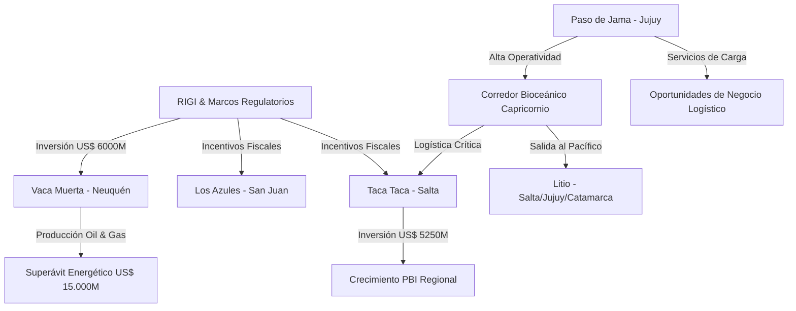

# Oportunidades de Negocio y Conexiones Ocultas - Abril 2026

## Oportunidades de Negocio Identificadas
1. **Infraestructura Logística del [[Corredor Bioceanico]]**:
   - El aumento exponencial de carga por el Paso de Jama (7.000 camiones adicionales en un año) abre oportunidades para servicios de apoyo logístico, hotelería para transportistas, digitalización de trámites y mantenimiento vial en Jujuy.
2. **Servicios para la Fase de Puesta en Marcha de Litio**:
   - Con proyectos como **[[Hombre Muerto Oeste]]** iniciando producción en el 2do semestre 2026, hay demanda creciente de servicios de transporte de químicos, gestión de residuos mineros y mantenimiento de plantas de nanofiltración.
3. **Proveeduría Industrial para Cobre**:
   - Proyectos de escala masiva como **[[Taca Taca]]** (US$ 5.250M) y **[[Los Azules]]** demandarán infraestructura eléctrica de alta tensión, caminos mineros y servicios de construcción especializada para plantas de procesamiento.
4. **RIGI para Proyectos Medianos**:
   - La extensión del [[RIGI]] hasta 2027 y la creación de "Mini RIGI" en provincias como Jujuy (inversiones desde US$ 5M) abren la puerta a inversores de mediana escala en la cadena de valor minera.

## Conexiones Estratégicas y Ocultas
El análisis revela una conexión crítica entre la infraestructura del [[Corredor Bioceanico]] y la viabilidad de los megaproyectos de [[Cobre]] en el NOA. La saturación de los pasos tradicionales (Mendoza) empuja a las mineras a mirar hacia el norte de Chile a través de Salta y Jujuy.

### Visualización de Conexiones (Mermaid)

## Conclusiones
La "revolución del cobre" en Argentina está impulsada por el [[RIGI]], pero su competitividad logística depende totalmente de la operatividad del [[Corredor Bioceanico]]. Aquellas empresas que logren posicionarse en el nodo logístico de Jujuy/Salta tendrán una ventaja competitiva al exportar hacia el mercado del Asia-Pacífico por los puertos de Chile.
