# Oportunidades de Negocio y Conexiones Ocultas - Mayo 2026

## Oportunidades de Negocio Identificadas

1.  **Súper RIGI e Industrialización de Base (21/05/2026)**:
    - El anuncio ministerial (Luis Caputo) del **"Súper RIGI"** abre incentivos fiscales drásticos para la **industrialización local de recursos naturales** (producción de cátodos/laminado de cobre, baterías de litio, fertilizantes complejos) y **Alta Tecnología** (IA y Datacenters). 
    - *Beneficio disruptivo:* La alícuota de Ganancias para proyectos del Súper RIGI se reduce al **15%** (frente al 25% del RIGI estándar y 35% general), con arancel cero a la exportación, traccionando proyectos de infraestructura conjunta.

2.  **Megaproyectos de "Big Capital" y Saturación de Servicios**:
    - Las solicitudes de YPF **[[Proyecto LLL Oil]]** (US$ 25.000M), **[[Pluspetrol]]** (US$ 12.000M) en Bajo del Choique-La Invernada, **[[Chevron]]** (US$ 10.000M), **[[El Pachón]]** (US$ 11.600M) y **[[Agua Rica]]** (US$ 6.699M) saturan la demanda de servicios especializados. Surge un mercado masivo de proveedores locales calificados y Tier 2/3.

3.  **Infraestructura Eléctrica y Arbitraje de Despacho**:
    - El conflicto de prioridades bajo la **Res. ENRE 219/2026** entre **[[Los Azules]]** y **[[Distrito Vicuña]]** (Josemaría/BHP/Lundin) confirma la saturación de la red de 500kV. Esto representa una oportunidad única para la **Orquestación de Microgrids Off-Grid** (plantas solares y sistemas de almacenamiento BESS financiados como infraestructura compartida bajo el RIGI).

4.  **Cobre de Alta Ley: El Efecto [[Lunahuasi]] y San Jorge**:
    - Resultados exploratorios excepcionales en Lunahuasi (hasta 18.9% Cu) y la aprobación del RIGI para **[[San Jorge]]** (US$ 891M) en Mendoza (bypass a la prohibición de reactivos de la Ley 7722) reconfiguran el mapa de cobre nacional. 

5.  **Federalización del Shale y Transferencia Tecnológica**:
    - El anuncio de YPF en **D-129 (Chubut)** y **[[Palermo Aike]] (Santa Cruz)** abre un mercado para la transferencia de servicios petroleros especializados (frack crews, arenas) hacia la Cuenca Austral y el Golfo San Jorge.

6.  **Sinergia Hídrica en Catamarca (08/05/2026)**:
    - El levantamiento definitivo de la cautelar en Río Los Patos permite una gestión hídrica coordinada entre **Arcadium** y **[[Posco]]**, habilitando expansiones masivas en el Salar del Hombre Muerto.

7.  **Logística, Telecomunicaciones y Hubs Bimodales**:
    - El "apagón" de conectividad digital en el tramo chileno tras Jama (18/04/2026) abre una oportunidad para **servicios satelitales** (Starlink). Asimismo, el lanzamiento de **YPF Diesel 10 Minero** facilita la creación de **hubs logísticos bimodales** (combustible/arenas de ida, concentrados/litio de vuelta).

8.  **Industrialización de Gas (Fertilizantes)**:
    - El proyecto de **[[Pampa Energía]]** en Bahía Blanca (US$ 2.400M) marca el inicio del valor agregado para el gas de Vaca Muerta, traccionando servicios de ingeniería complejos.

9.  **Tokenización de Contenido Local**:
    - Creación de un mercado secundario de créditos para cumplir con el requisito de 20% de inversión en proveedores locales bajo el RIGI, permitiendo a grandes empresas "comprar" cumplimiento de pymes certificadas.

10. **Geotermia en Pozos Maduros (Reuso Energético)**:
    - Reutilización de pozos de petróleo convencional abandonados (en declino del 9.8%) para generación geotérmica (heat-to-power) de baja entalpía, proporcionando energía de base 24/7 para campamentos mineros.

11. **Des-riesgo Multilateral (Patrón IFC/BID)**:
    - Los acuerdos de **[[Taca Taca]]** y **[[Rincón]]** con la IFC/BID consolidan el cumplimiento de estándares ASG como requisito *de facto* para financiamiento bajo el RIGI.

12. **Cluster de Servicios Mendoza (Tier 2/3)**:
    - La incorporación de **[[Mendoza]]** a la Mesa del Cobre y la reforma de la **[[Ley de Glaciares]]** habilitan la reconversión de proveedores petroleros hacia la minería (drilling de altura, logística pesada).

13. **Gobernanza Hídrica Inmutable (HydroTrust - 25/05/2026)**:
    - Oportunidad SaaS de monitoreo hídrico IoT cifrado en origen (Blockchain) para des-riesgo legal y blindaje de licencia social en el NOA tras el fallo de Catamarca. Ver: [[HydroTrust_Puna_Hidrico]].

14. **Escolta Virtual y Telemetría Crítica (RIGI-Shield - 25/05/2026)**:
    - Suite logística híbrida (Starlink/Edge) y Shadow API conectada directamente con la nueva 'Mesa de Seguridad' del Ministerio bajo la Res. 461/2026. Ver: [[RIGI_Shield_Seguridad]].

15. **Alineación de Repuestos para Shale (ShaleFlow Añelo - 25/05/2026)**:
    - SaaS de detección predictiva de fatiga y micro-hubs CNC/3D en Añelo para contrarrestar el desgaste de frack crews ante récords físicos. Ver: [[ShaleFlow_Anelo_Supply]].

## Conexiones Estratégicas y Ocultas

### Visualización de Conexiones (Mermaid)

```mermaid
graph TD
    RIGI[RIGI: Motor de Inversión] --> |US$ 95.000M en Cartera| Eval[36 Proyectos]
    RIGI --> |Súper RIGI| Ind[Industrialización: Baterías/Cobre]
    RIGI --> |Aprobado Mayo 2026| LosAzules[Los Azules - San Juan]
    RIGI --> |Aprobado Mayo 2026| TGS[TGS Expansión Gasoductos]
    RIGI --> |Chevron >US$ 10.000M| Chevron[Chevron El Trapial Este]
    RIGI --> |Pluspetrol US$ 12.000M| Plus[Bajo del Choique]
    RIGI --> |Res. 484/2026| Profit[Rentabilidad 35%]
    RIGI -.-> |Catalizador| MiniRIGI[Mini RIGI Jujuy > US$ 5M]
    RIGI --> |Res. 461/2026| SecurityTable[Mesa de Seguridad Nacional]
    SecurityTable --> |Shadow API Enlace| RS[RIGI-Shield Escolta]
    
    VM[Vaca Muerta] --> |Récord 1700 Etapas| Fractura[Eficiencia Operativa]
    VM --> |Federalización| PA[Palermo Aike / D-129]
    VM --> |Diesel 10 Minero| YPFM[YPF Combustible Minero]
    Fractura --> |Aceleración Física| SF[ShaleFlow Añelo CNC]
    
    LG[Justicia Catamarca] --> |Desbloqueo Río Los Patos| Catamarca[Hombre Muerto]
    Catamarca --> Posco[Posco - Sal de Oro]
    Catamarca --> Arc[Arcadium - Fénix]
    Catamarca -.-> |Monitoreo Hídrico| HT[HydroTrust IoT]
    
    Cobre[Cobre Hub] --> |Leyes Récord| Lunahuasi[Lunahuasi 18.9% Cu]
    Cobre --> |Favorable| Diablillos[Diablillos - Plata/Oro]
    
    ENRE[ENRE / Cuellos de Botella] --> |Conflicto Prioridad| Vicuña[Distrito Vicuña]
    ENRE --> |Desafío Logístico| OffGrid[Microgrids Off-Grid]
    
    Logistics[Logística Inversa] --> |Combustible + Mineral| Bimodal[Hubs Bimodales]
    RIGI --> |Cupo 20% Local| TokenLocal[Créditos Contenido Local]
```

## Conclusiones
La "economía a dos velocidades" se profundiza. Con una cartera RIGI que escaló a **US$ 95.000 millones**, la restricción ya no es el capital sino la **infraestructura física** (líneas de 500kV en San Juan, Ruta 51 en Salta) y la **capacidad de ejecución**. El **Súper RIGI** busca romper el sesgo extractivo mediante la industrialización (baterías, refinamiento), pero el éxito inmediato sigue anclado en la eficiencia de la Puna y Vaca Muerta.

