# Oportunidades de Negocio y Conexiones Ocultas - Julio 2026

## Oportunidades de Negocio Identificadas (Actualización Julio 2026)

### 1. El Nexo Energía-IA-Minería: El Efecto Stargate
La irrupción del proyecto **[[Stargate Argentina]]** (OpenAI/Sur Energy) en la Patagonia por US$ 25.000M introduce una nueva variable de demanda eléctrica masiva.
- **Demanda de Cobre para IA:** Un datacenter de 500MW requiere volúmenes masivos de cobre. Esto refuerza la viabilidad de la demanda interna (o regional) para proyectos como [[Los Azules]] o [[Taca Taca]].
- **Automatización Minera 4.0:** El hub de IA puede acelerar la implementación de "Vaca Muerta 3.0" y la autonomía en minas de cobre en San Juan.

### 2. Estabilización de Red y BESS (AlmaGBA)
La adjudicación de 700 MW de capacidad de almacenamiento en baterías (**[[BESS AlmaGBA]]**) es crítica para equilibrar la demanda intermitente de grandes centros de datos y minas electrificadas en el NOA.

### 3. Mendoza: El Fin del Tabú
La aprobación de **Don Luis** (Litio) rompe el estancamiento de la Ley 7.722. Se abre un mercado de servicios para la reconversión de proveedores petroleros hacia la minería en Malargüe.

---

## Histórico de Oportunidades (Abril 2026)
1. **Des-riesgo Multilateral (Patrón IFC/BID)**: La ratificación del acuerdo entre **[[Taca Taca]]** y la IFC (Abril 2026) consolida el patrón de "escudos multilaterales".
2. **Infraestructura Eléctrica y Arbitraje de Despacho (ENRE)**: La **Resolución ENRE 079/2026** otorgó a **[[Distrito Vicuña]]** una prioridad del 90%. Esto intensifica la urgencia por la **Orquestación de Microgrids Off-Grid**.
3. **Cobre de Alta Ley: El Efecto [[Lunahuasi]]**: Reporte de leyes de hasta 18.9% Cu en Lunahuasi redefine el potencial del [[Distrito Vicuña]].
4. **Federalización del Shale**: Expansión a **D-129 (Chubut)** y **[[Palermo Aike]] (Santa Cruz)**.
5. **Cluster de Servicios Mendoza (Tier 2/3)**: Habilitado por la reforma de la **[[Ley de Glaciares]]**.

## Riesgos Críticos (Julio 2026)
- **Cuello de Botella Eléctrico:** La demanda minera se quintuplicará para 2034 (OLACDE). Si se suma la demanda de IA, el SADI requiere una inversión en transporte que aún no está garantizada bajo el RIGI.
- **Competencia por Talento:** La minería y la tecnología competirán por ingenieros especializados en automatización y sistemas de potencia.

## Conexiones Estratégicas y Ocultas (Mermaid)

```mermaid
graph TD
    RIGI[RIGI: Motor de Inversión] --> |US$ 4.200M Ratificado| TacaTaca[Taca Taca - Salta]
    RIGI --> |Aprobado US$ 2.700M| LosAzules[Los Azules - San Juan]
    RIGI --> |Res. 413/2026| Veladero
    RIGI --> |Pampa US$ 4.521M| RinconAranda[Rincón de Aranda - Neuquén]
    RIGI --> |Aprobado US$ 9.700M| Vicuña[Distrito Vicuña]
    RIGI --> |Financiamiento US$ 1.175M| Rincon[Rincón - Salta]
    RIGI --> |Récord 903k bpd| VM[Vaca Muerta]
    RIGI --> |Decreto 105/2026| PA[Palermo Aike]
    RIGI --> |US$ 25.000M| Stargate[Stargate Argentina - OpenAI]
    RIGI --> |Evaluación: US$ 110B| Pipeline[42 Proyectos Totales]

    Stargate --> |Demanda 500MW| SADI[Infraestructura Eléctrica]
    Stargate --> |Demanda Insumos| Cobre[Cobre de Clase Mundial]
    BESS[BESS AlmaGBA - 700MW] --> |Estabilización| SADI

    SADI -.-> |Cuello de Botella| Cobre
    SADI -.-> |Cuello de Botella| Stargate

    VM --> |Vaca Muerta 3.0| AI[IA y Automatización]
    Stargate --> AI
    AI --> |Eficiencia| Cobre

    LG[Reforma Ley de Glaciares] --> |Desbloqueo| Cobre
    Mendoza --> |Hito Litio| DonLuis[Don Luis - Mendoza]
    Mendoza --> |Aprobado RIGI| SanJorge[San Jorge]

    Litio[Litio Argentina] --> |9.5% Crecimiento| INDEC
    Litio --> |47.5% Prod| ProduccionLi[Producción Litio 2026]
    Litio --> DonLuis
    
    Vicuña --> |Leyes Récord| Lunahuasi[Lunahuasi]

    Chile[Integración con Chile] --> |Tratado Minero Reactivado| Cobre
    Chile --> |Logística Pacífico| Vicuña
```

## Conclusiones
La tríada **Energía (Vaca Muerta) + Cobre/Litio + IA (Stargate)** configura un ecosistema de inversión masiva blindado por el RIGI. El principal riesgo identificado es la **infraestructura eléctrica**, donde la competencia por la capacidad instalada puede ralentizar proyectos si no se atraen inversiones específicas en transporte de energía de alta tensión.
