# Oportunidades de Negocio y Conexiones Ocultas - Mayo 2026

## Oportunidades de Negocio Identificadas
1. **Súper RIGI y Nuevos Sectores**:
   - El anuncio del **"Súper RIGI"** (Mayo 2026) abre una ventana para atraer industrias de alta tecnología, centros de datos o semiconductores que aún no tienen presencia en el país, ofreciendo beneficios incrementales.
2. **Megaproyectos de Cobre y Gas (Oil Majors)**:
   - Las solicitudes de **[[El Pachón]]** (US$ 11.600M) y **[[Agua Rica]]** (US$ 6.699M) se suman al anuncio de **[[Chevron]]** (US$ 10.000M) para Vaca Muerta. El RIGI está logrando atraer el "big capital" que antes era esquivo.
3. **Logística Minera: El Efecto Diesel 10 Minero**:
   - El lanzamiento por parte de **YPF** de un combustible específico para minería en altura reduce riesgos operativos y fallas mecánicas en flotas pesadas en la Puna.
4. **Sinergia Hídrica en el Salar del Hombre Muerto**:
   - El levantamiento definitivo de la cautelar en Catamarca (08/05/2026) permite una gestión hídrica coordinada entre **Arcadium** y **[[Posco]]**, reduciendo costos de cumplimiento ambiental.
5. **Infraestructura Eléctrica y Arbitraje de Despacho (ENRE)**:
   - La **Resolución ENRE 219/2026** y el conflicto entre **[[Los Azules]]** y **[[Distrito Vicuña]]** confirma que el cuello de botella sistémico es la evacuación eléctrica. Oportunidad masiva para orquestación de **Microgrids Off-Grid**.
6. **Industrialización de Gas (Fertilizantes)**:
   - El pedido de RIGI de **[[Pampa Energía]]** para su planta de urea en Bahía Blanca (US$ 2.400M) marca el inicio de la fase de valor agregado para el gas de Vaca Muerta.

## Conexiones Estratégicas y Ocultas

### Visualización de Conexiones (Mermaid)

```mermaid
graph TD
    RIGI[RIGI: Motor de Inversión] --> |US$ 5.250M Ratificado| TacaTaca[Taca Taca - Salta]
    TacaTaca --> |Alianza IFC| IFC[IFC - Banco Mundial]
    RIGI --> |Aprobado Mayo 2026| LosAzules[Los Azules - San Juan]
    RIGI --> |Chevron >US$ 10.000M| Chevron[Chevron El Trapial Este]
    RIGI --> |Súper RIGI| SRIGI[Nuevos Sectores Tech]
    RIGI --> |Evaluación: 33 Proyectos| Eval[Cartera US$ 52.000M]
    RIGI --> |$762M Liquidados| BCRA[Reservas BCRA]
    RIGI --> |Res. 484/2026| Shale[Optimización Shale]
    RIGI --> |Pampa US$ 2.400M| Urea[Planta Urea - Bahía Blanca]
    RIGI --> |Decreto 105/2026| PA[Palermo Aike]
    RIGI -.-> |Catalizador| MiniRIGI[Mini RIGI Jujuy > US$ 5M]

    VM[Vaca Muerta] --> |Récord 1700 Etapas| Fractura[Eficiencia Operativa]
    VM --> |Diesel 10 Minero| YPFM[YPF Combustible Minero]
    VM --> Chevron
    Chevron --> |Hito 08/05| RIGI

    LG[Ley de Glaciares / Justicia] --> |Desbloqueo Agua 08/05| Catamarca[Catamarca - Hombre Muerto]
    Catamarca --> Posco[Posco - Corea del Sur]
    Catamarca --> Arcadium[Arcadium - Expansión]

    Cobre[Cobre de Clase Mundial] --> |Leyes Récord| Lunahuasi[Lunahuasi - 18.9% Cu]
    Cobre --> |Aprobado 08/05| LosAzules
    
    ENRE[ENRE Res. 219/2026] --> |Conflicto Prioridad| Vicuña[Distrito Vicuña]
    ENRE --> |Oposición 08/05| LosAzules
    
    CB[Corredor Bioceánico] --> |Aceleración RN 51| Salta[Hub Minero Salta]
    Salta --> TacaTaca
```

## Conclusiones
La "economía a dos velocidades" se profundiza. El capital ya no es la restricción principal (US$ 52.000M en cartera RIGI), sino la **infraestructura física** (líneas de 500kV en San Juan, Ruta 51 en Salta). El anuncio del **Súper RIGI** busca diversificar la matriz de inversión más allá de lo extractivo, pero el éxito inmediato sigue anclado en la Puna y Vaca Muerta.
