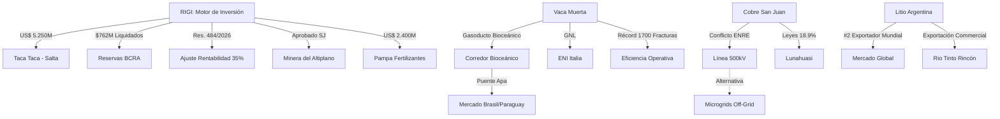

# Oportunidades de Negocio y Conexiones Ocultas - Abril 2026

## Oportunidades de Negocio Identificadas
1. **Sinergia Energética Binacional (Gasoducto Bioceánico)**:
   - La definición de condiciones operativas para el Gasoducto Bioceánico (27/04/2026) abre una oportunidad masiva para el desarrollo de infraestructura de compresión y servicios de mantenimiento en la región del Chaco paraguayo y el norte argentino, conectando Vaca Muerta con los mercados industriales del Capricornio.
2. **Liquidación RIGI y Estabilidad Cambiaria**:
   - Con **US$ 762 millones netos** liquidados por el RIGI (28/04/2026), se valida la efectividad del régimen para fortalecer las reservas del BCRA. Esto reduce el riesgo país y abarata el financiamiento para proveedores locales de la cadena de valor.
3. **Cobre: La "Guerra de la Línea" (ENRE)**:
   - El conflicto formal entre **[[Los Azules]]** y **[[Distrito Vicuña]]** por la línea de 500kV en San Juan (24/04/2026) genera una demanda inmediata por **soluciones de energía distribuida y almacenamiento** de gran escala (BESS) para proyectos mineros que no logren prioridad de despacho.
4. **Des-riesgo Multilateral (Patrón IFC/BID)**:
   - La ratificación del acuerdo entre **[[Taca Taca]]** y la IFC (Abril 2026) consolida el patrón de "escudos multilaterales". El cumplimiento de estándares de desempeño de la IFC se vuelve un requisito *de facto* para los megaproyectos.
5. **Cobre de Alta Ley: El Efecto [[Lunahuasi]]**:
   - El reporte de leyes de hasta 18.9% Cu en Lunahuasi (Abril 2026) redefine el potencial del [[Distrito Vicuña]]. Existe una oportunidad para el desarrollo de **plantas de procesamiento modulares**.
6. **Federalización del Shale y RIGI**:
   - El ajuste de rentabilidad al 35% (Res. 484/2026) y la extensión al upstream (Decreto 105/2026) incentivan la exploración en **[[Palermo Aike]]** y **D-129**, creando un mercado para servicios petroleros en el sur del país.
7. **Hub de Fertilizantes en Bahía Blanca**:
   - La inversión de **US$ 2.400M** de Pampa Energía en fertilizantes posiciona a Argentina como un potencial exportador neto, apalancando el gas barato de Vaca Muerta.
8. **Exportación de Litio y Tecnología DLE**:
   - El primer embarque comercial de **[[Rincón]]** (Rio Tinto) a Shanghái valida el modelo DLE en Argentina. Oportunidad para empresas de servicios químicos y gestión de salmueras.

## Conexiones Estratégicas y Ocultas
La convergencia del **[[Corredor Bioceanico]]**, el **[[RIGI]]** y el **Gasoducto Bioceánico** está creando un eje de exportación transversal que reduce la dependencia de los puertos del Atlántico y conecta directamente la energía de Vaca Muerta con la minería de la Puna.

### Visualización de Conexiones (Mermaid)

## Conclusiones
Abril 2026 cierra con una validación financiera del RIGI y un endurecimiento de la competencia por infraestructura crítica (energía y logística). La federalización de la energía (Vaca Muerta Sur y Bioceánico) es la pieza que faltaba para blindar los proyectos mineros de la Puna.
