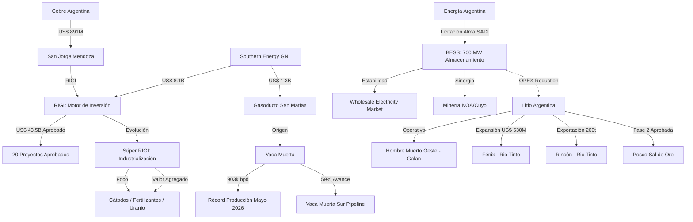

# Oportunidades de Negocio y Conexiones Ocultas - Julio 2026

## Oportunidades de Negocio Identificadas
1. **Sinergia BESS y Minería (Efecto Alma SADI)**:
   - La adjudicación de **700 MW de almacenamiento** (BESS) en nodos críticos (Julio 2026) abre una oportunidad masiva para que proyectos mineros en la Puna (NOA) aseguren estabilidad de red. Los **150 MW adjudicados en el NOA** permitirán una mayor penetración de energías renovables off-grid, reduciendo el OPEX de purificación de litio.
2. **Industrialización y el "Súper RIGI"**:
   - La propuesta del Súper RIGI con foco en la industrialización de Litio, Cobre y Uranio redefine la cadena de valor. Existe una ventana para inversiones en **plantas de cátodos y precursores** que busquen la alícuota del 15% de Ganancias, moviendo a Argentina del extractivismo a la manufactura tecnológica.
3. **Logística GNL y Gasoductos Dedicados**:
   - La confirmación del **Gasoducto San Matías (US$ 1.300M)** para Southern Energy crea un nuevo corredor energético. Proveedores de servicios de compresión, mantenimiento de ductos y logística portuaria tienen un mercado cautivo por los próximos 30 años.
4. **Consolidación Rio Tinto como "Rey de la Puna"**:
   - Con la expansión de Fénix (US$ 530M) y la operación de Rincón (US$ 3.000M), Rio Tinto controla los nodos logísticos más importantes. Se abre una oportunidad para **servicios compartidos de transporte y suministros** a escala megaproyecto.
5. **Vaca Muerta Sur y Terminales de Exportación**:
   - El avance del 59% en el oleoducto VMOS abre oportunidades en la construcción de parques de tanques (Punta Colorada) y servicios de inspección de ductos de última generación.

## Conexiones Estratégicas y Ocultas (Mermaid)

## Conclusiones
La fase de "anuncios" del RIGI ha dado paso a la fase de "operaciones" (Galan, Rio Tinto). El principal factor de apalancamiento ahora es la **infraestructura eléctrica de almacenamiento (BESS)**, que permitirá desacoplar la producción minera de las limitaciones de transmisión del SADI. El riesgo crítico se desplaza hacia la **capacidad de la cadena de valor local** para responder al Súper RIGI sin cuellos de botella en RR.HH. calificados.
