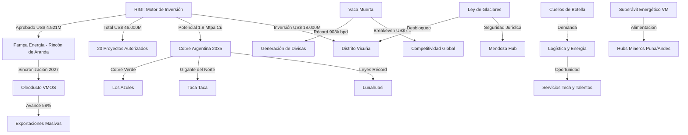

# Oportunidades de Negocio y Conexiones Ocultas

## Oportunidades de Negocio Identificadas

### I. Sinergia Transversal y Energía (Julio 2026)
1. **Sinergia Vaca Muerta - Minería (Superávit Energético)**:
   - El récord de producción en **[[Vaca Muerta]]** (903,7k bpd) asegura un horizonte de abundancia energética. Oportunidad crítica: mitigar cuellos de botella eléctricos mineros mediante plantas **Gas-to-Power** in-situ alimentadas por el excedente de gas.
2. **Potencial del Cobre y Cuellos de Botella Logísticos**:
   - La capacidad proyectada de **1,8 Mtpa de cobre para 2035** (Bain & Co) demanda inversión masiva en logística y talento. Oportunidad para empresas de **logística pesada y servicios de agua industrial**.
3. **Optimización de Costos RIGI (Efecto Breakeven)**:
   - Reducción del breakeven a **US$ 48/bbl** en Vaca Muerta genera resiliencia ante la volatilidad del Brent.

### II. Hitos de Abril 2026 (Consolidados)
4. **Des-riesgo Multilateral**: Patrón de "escudos multilaterales" (Taca Taca/IFC).
5. **Infraestructura Eléctrica y Arbitraje de Despacho**: Conflicto ENRE entre Distrito Vicuña y Los Azules.
6. **Cobre de Alta Ley: El Efecto [[Lunahuasi]]**: Oportunidad en plantas de procesamiento modulares.
7. **Litio: Eficiencia vs. Escala (Efecto McDermitt)**: Foco en tecnologías DLE avanzadas.
8. **Cluster de Servicios Mendoza**: Reconversión de proveedores petroleros hacia la minería.
9. **Federalización del Shale**: Transferencia tecnológica hacia **D-129** y **[[Palermo Aike]]**.
10. **Consolidación Hub Surcoreano**: Dinamismo de **[[Posco]]** en Salta.
11. **RIMI y Cadena de Valor**: Ventana para proyectos de escala media.
12. **Industrialización de Gas**: Planta de urea de **Pampa Energía** (Bahía Blanca).
13. **"Mini RIGI" (Jujuy)**: Incentivos para inversiones desde US$ 5M.
14. **Integración Logística Argentina-Chile**: Servicios de SatCom (Starlink) para camiones mineros.

## Conexiones Estratégicas y Ocultas
Argentina ha pasado de ser un actor regional a una **potencia exportadora global de litio**, superando a Chile en 2026. La energía de Vaca Muerta está subsidiando implícitamente la viabilidad minera mediante la mejora de la competitividad logística y la disponibilidad de divisas.

### Visualización de Conexiones (Mermaid)

## Conclusiones
La aprobación del proyecto nº 20 marca la madurez del régimen. El desafío es ejecucional: construir la infraestructura física ([[VMOS]], líneas eléctricas) al ritmo de las inversiones.
