# Oportunidades de Negocio y Conexiones Ocultas - Mayo 2026

## Oportunidades de Negocio Identificadas

1.  **Súper RIGI e Industrialización de Base (10/05/2026)**:
    - El anuncio del **"Súper RIGI"** abre una ventana sin precedentes para la **industrialización de recursos naturales**. Sectores como el refinamiento de cobre, fabricación de baterías de litio y autos eléctricos ahora cuentan con incentivos superiores. Oportunidad para atraer fabricantes de tecnología renovable y electromovilidad.

2.  **Megaproyectos de "Big Capital"**:
    - Las solicitudes de **[[Pluspetrol]]** (US$ 12.000M), **[[Chevron]]** (US$ 10.000M), **[[El Pachón]]** (US$ 11.600M) y **[[Agua Rica]]** (US$ 6.699M) confirman que el RIGI está logrando atraer capitales de escala global.

3.  **Infraestructura Eléctrica y Arbitraje de Despacho**:
    - El conflicto entre **[[Los Azules]]** y **[[Distrito Vicuña]]** por la prioridad de la línea de 500 kV confirma que el cuello de botella sistémico es la evacuación eléctrica. Oportunidad masiva para la **Orquestación de Microgrids Off-Grid** (Solar + Baterías + GNL).

4.  **Cobre de Alta Ley: El Efecto [[Lunahuasi]]**:
    - Leyes récord de hasta 18.9% Cu redefinen el potencial del Distrito Vicuña. Oportunidad para **plantas de procesamiento modulares** y servicios de exploración de alta precisión.

5.  **Federalización del Shale y Transferencia Tecnológica**:
    - El anuncio de YPF en **D-129 (Chubut)** y **[[Palermo Aike]] (Santa Cruz)** abre un mercado para la transferencia de servicios petroleros especializados (frack crews, arenas) hacia la Cuenca Austral y el Golfo San Jorge.

6.  **Sinergia Hídrica en Catamarca (08/05/2026)**:
    - El levantamiento de la cautelar en Río Los Patos permite una gestión hídrica coordinada entre **Arcadium** y **[[Posco]]**, habilitando expansiones masivas en el Salar del Hombre Muerto.

7.  **Logística y Telecomunicaciones Transfronterizas**:
    - El "apagón" de conectividad digital en el tramo chileno tras el Paso de Jama (18/04/2026) abre una oportunidad para **servicios de telecomunicaciones satelitales** (ej. Starlink) aplicados a la logística minera.

8.  **Industrialización de Gas (Fertilizantes)**:
    - El proyecto de **[[Pampa Energía]]** en Bahía Blanca (US$ 2.400M) marca el inicio del valor agregado para el gas de Vaca Muerta, traccionando servicios de ingeniería complejos.

9.  **Tokenización de Contenido Local**:
    - Oportunidad para crear un mercado secundario de créditos para cumplir con el requisito de 20% de inversión en proveedores locales bajo el RIGI, permitiendo a grandes empresas "comprar" cumplimiento de pymes certificadas.

10. **Geotermia en Pozos Maduros**:
    - Reutilización de pozos de petróleo convencional abandonados para generación geotérmica (heat-to-power) en regiones mineras.

## Conexiones Estratégicas y Ocultas

### Visualización de Conexiones (Mermaid)

```mermaid
graph TD
    RIGI[RIGI: Motor de Inversión] --> |US$ 95.000M en Cartera| Eval[36 Proyectos]
    RIGI --> |Súper RIGI| Ind[Industrialización: Baterías/Cobre]
    RIGI --> |Aprobado Mayo 2026| LosAzules[Los Azules - San Juan]
    RIGI --> |Aprobado Mayo 2026| TGS[TGS Expansión Gasoductos]
    RIGI --> |Chevron >US$ 10.000M| Chevron[Chevron El Trapial Este]
    RIGI --> |Pluspetrol US$ 12.000M| Plus[Bajo del Choique]
    
    VM[Vaca Muerta] --> |Récord 1700 Etapas| Fractura[Eficiencia Operativa]
    VM --> |Federalización| PA[Palermo Aike / D-129]
    VM --> |Diesel 10 Minero| YPFM[YPF Combustible Minero]
    
    LG[Justicia Catamarca] --> |Desbloqueo Río Los Patos| Catamarca[Hombre Muerto]
    Catamarca --> Posco[Posco - Sal de Oro]
    Catamarca --> Arc[Arcadium - Fénix]
    
    Cobre[Cobre Hub] --> |Leyes Récord| Lunahuasi[Lunahuasi 18.9% Cu]
    Cobre --> |Favorable| Diablillos[Diablillos - Plata/Oro]
    
    ENRE[ENRE / Cuellos de Botella] --> |Conflicto Prioridad| Vicuña[Distrito Vicuña]
    ENRE --> |Desafío Logístico| OffGrid[Microgrids Off-Grid]
```

## Conclusiones
La "economía a dos velocidades" se profundiza. Con una cartera RIGI que escaló a **US$ 95.000 millones**, la restricción ya no es el capital sino la **infraestructura y la capacidad de ejecución**. El **Súper RIGI** busca romper el sesgo extractivo, pero el éxito inmediato depende de resolver los cuellos de botella eléctricos en San Juan y viales en Salta.
