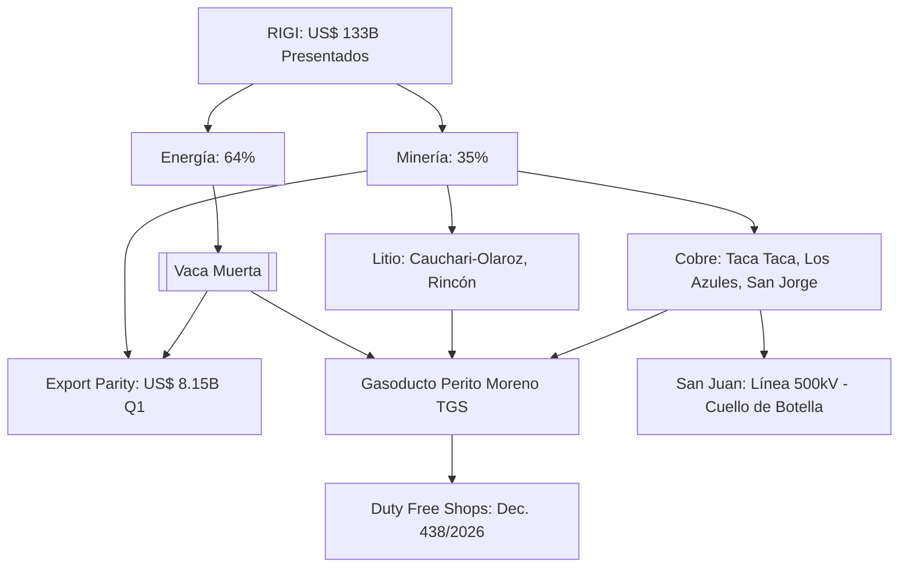

# Oportunidades de Negocio y Conexiones Ocultas - Junio 2026

## Oportunidades de Negocio Identificadas

1. **Financiamiento como Servicio (FaaS)**:
   - Con el "cuello de botella de financiamiento" identificado en Vaca Muerta y el Cobre (11/06/2026), surge una oportunidad para estructuradores financieros que traduzcan el interés de los inversores globales en capital de trabajo real para el escalado de proyectos.

2. **Logística de Concentrados vía Pacífico**:
   - La ratificación de **[[Taca Taca]]** y la expansión de **[[Cauchari-Olaroz]]** aumentan la presión sobre el [[Corredor Bioceanico]]. La oportunidad reside en servicios de transporte intermodal y reactivación de ramales ferroviarios (C-14) bajo el marco de incentivos RIGI.

3. **Retail Transfronterizo (Duty Free)**:
   - El **Decreto 438/2026** abre un nuevo nicho de negocios en los pasos fronterizos (Paso de Jama, Cristo Redentor). No solo para retail, sino para servicios de soporte al transporte internacional que aprovechen estas zonas francas.

4. **Sinergias de Infraestructura Eléctrica**:
   - La competencia por la línea de 500kV en San Juan (Los Azules vs. Distrito Vicuña) crea un mercado para **soluciones de energía distribuida y almacenamiento** a gran escala (BESS) que permitan a los proyectos mineros operar sin depender exclusivamente de la red nacional.

5. **Proveedores Tier 2 en el "Hub Neuquén"**:
   - Con Neuquén concentrando el 47% de las inversiones RIGI, existe una demanda masiva por servicios de soporte industrial, mantenimiento de flotas de fractura y gestión de residuos minero-energéticos.

## Conexiones Estratégicas

- **Export Parity:** La convergencia de energía y minería como motores de divisas (US$ 8.150M en Q1 2026) blinda la macroeconomía ante shocks en el sector agropecuario.
- **Efecto Ripple del Cobre:** El ingreso de **[[San Jorge]]** al RIGI señala el fin del "invierno minero" en Mendoza, abriendo una provincia entera a proveedores de servicios mineros.
- **Argentina vs. Chile:** El ramp-up del litio posiciona a Argentina como el líder regional en crecimiento de capacidad instalada, atrayendo a las *majors* como Rio Tinto y First Quantum.

### Visualización de Sinergias (Mermaid)

