# Oportunidades de Negocio y Conexiones Ocultas - Mayo 2026

## Oportunidades de Negocio Identificadas
1. **Súper RIGI e Industrialización de Base (26/05/2026):** El Ejecutivo envió al Congreso el proyecto de ley "Súper RIGI" de US$ 1.000M+ para IA, semiconductores, baterías de litio, biotecnología avanzada e infraestructura digital. Habilita una tasa de Ganancias del **15%** y amortización acelerada, empujando la industrialización de los recursos mineros.
2. **Megaproyectos de "Big Capital" y Saturación de Servicios:** El Capex combinado de YPF LLL Oil (US$ 25.000M), Pluspetrol (US$ 12.000M), Chevron (US$ 10.000M), El Pachón (US$ 11.600M) e Taca Taca (US$ 5.250M) genera un cuello de botella de proveedores Tier 1/2 en drilling y obras civiles de altura.
3. **Infraestructura Eléctrica y Prioridades de Despacho (ENRE):** La **Res. ENRE 079/2026** otorgó un 90% de prioridad de despacho a Distrito Vicuña en la línea de 500kV, saturando la red en San Juan y bloqueando a Los Azules. Representa un mercado masivo para la orquestación de **Microgrids Off-Grid** híbridas de generación solar y BESS.
4. **Cobre de Alta Ley: El Efecto Lunahuasi y San Jorge:** Récord exploratorio de hasta 18.9% Cu en Lunahuasi y el avance del proyecto San Jorge (Mendoza, US$ 891M) tras bypasses normativos dinamizan la Mesa del Cobre y aceleran el plan para exportar por Chile.
5. **Federalización del Shale y Transferencia de Servicios:** La aceleración exploratoria de YPF en Palermo Aike (Santa Cruz) e D-129 (Chubut) impulsa un mercado para exportar el know-how de Añelo (frack crews, tratamiento de arenas) al sur.
6. **Consolidación del NOA como Hub de Litio y Sinergias (26/05/2026):** El levantamiento definitivo de la cautelar de Río Los Patos y la compra del proyecto Hombre Muerto Norte (HMN) por Posco (US$ 65M) a Lithium South des-riesgan la cuenca y consolidan un hub coordinado de litio en el salar.
7. **Logística, Satélites y Conectividad (Starlink):** La mitigación del "apagón" de conectividad digital en el tramo de 130 km chileno tras Jama (18/04/2026) mediante conectividad Edge-to-Satellite abre un mercado masivo de telemetría logística e intercambio de documentos MIC/DTA en tiempo real.
8. **Industrialización de Gas (Fertilizantes de Pampa):** Solicitud RIGI de Pampa Energía por US$ 2.400 millones para su planta de urea en Bahía Blanca abre el play de valor agregado petroquímico para el gas de Vaca Muerta.
9. **Tokenización de Contenido Local:** Creación de plataformas para comercializar y certificar de forma digital el cumplimiento del cupo obligatorio del 20% en proveedores locales bajo el RIGI, permitiendo a petroleras "comprar" margen a pymes.
10. **Geotermia en Pozos Maduros (Reuso Energético):** Reutilización de pozos convencionales abandonados en el Golfo San Jorge para proyectos de calor geotérmico de baja entalpía (heat-to-power) para campamentos mineros.
11. **Des-riesgo Multilateral (Patrón IFC/BID):** La ratificación de los acuerdos de Taca Taca y Rincón con la IFC y BID Invest consolidan las auditorías ASG como requerimiento *de facto* para la financiación por deuda corporativa.
12. **Cluster de Servicios y Apertura de Mendoza:** La incorporación de Mendoza a la Mesa del Cobre y reformas regulatorias a la Ley de Glaciares habilitan la migración masiva de contratistas petroleros a minería.
13. **Gobernanza Hídrica Inmutable (HydroTrust - 25/05/2026):** Oportunidad SaaS de monitoreo hídrico IoT cifrado en origen (Blockchain) para des-riesgo legal y blindaje de licencia social en el NOA tras el fallo de Catamarca. Ver: [[HydroTrust_Puna_Hidrico]].
14. **SaaS Logístico y Conectividad Andina (AndesLogistics Puna - 26/05/2026):** Software telemático pasivo y despacho bimodal andino con Starlink integrado para coordinar tránsitos en altura sin generar fricción laboral. Ver: [[AndesLogistics_Puna_Logistica]].
15. **Alineación de Repuestos para Shale (ShaleFlow Añelo - 25/05/2026):** SaaS B2B de telemetría de fallas en bombas de fractura y ruteo automatizado con inventarios OEM de Añelo. Ver: [[ShaleFlow_Anelo_Supply]].
16. **Retorno de Austrade y Servicios de Consultoría (26/05/2026):** La reactivación de Austrade en Buenos Aires tras el récord de IED australiana de US$ 970M bajo el RIGI abre una ventana de servicios técnicos y estándares mineros globales.
17. **Efecto Multiplicador del "Mini RIGI" de Jujuy:** El play de incentivos para inversiones a partir de US$ 5M atrae y formaliza pymes de servicios y mantenimiento para Exar y Sales de Jujuy.
18. **RIMI y el Fortalecimiento de la Cadena de Valor:** La reglamentación del régimen RIMI para medianas inversiones brinda beneficios fiscales a proveedores estratégicos de escala media.

## Conexiones Estratégicas y Ocultas

### Visualización de Conexiones (Mermaid)

```mermaid
graph TD
    RIGI[RIGI: Motor de Inversión] --> |US$ 140.000M en Cartera| Eval[36 Proyectos en Pipeline]
    RIGI --> |Súper RIGI US$ 1.000M| Tech[Industrialización: IA/Baterías/Semiconductores]
    RIGI --> |Mesa de Seguridad Res. 461| Safe[Protección Logística y de Activos]
    RIGI -.-> |Catalizador| MiniRIGI[Mini RIGI Jujuy > US$ 5M]
    RIGI -.-> |Pymes Proveedoras| RIMI[RIMI: Medianas Inversiones]
    
    Safe --> |Shadow API| AndesLog[AndesLogistics Puna SaaS]
    Tech --> |SaaS e Integración OEM| Shale[ShaleFlow Añelo SaaS]
    Tech --> |IoT Hídrico Blockchain| HT[HydroTrust Puna IoT]
    
    VM[Vaca Muerta] --> |Modelo Replicado| PA[Palermo Aike / D-129]
    VM --> |YPF LLL Oil US$ 25.000M| YPF[Proyecto LLL Oil]
    VM --> |Pluspetrol US$ 12.000M| Plus[Bajo del Choique]
    VM --> |Chevron US$ 10.000M| Chev[El Trapial Este]
    VM --> |TGS US$ 700M Aprobado| TGS[Gasoducto Perito Moreno]
    VM --> |Barcaza GNL US$ 6.900M| Southern[Southern Energy]
    
    LG[Federalismo Ambiental] --> |Justicia Catamarca Río Los Patos| Catamarca[Hombre Muerto]
    Catamarca --> Posco[Posco: acquisition HMN US$ 65M]
    Catamarca --> RioTinto[Rio Tinto: Rincón US$ 2.500M]
    Catamarca -.-> |Monitoreo Inmutable| HT
    
    Cobre[Cobre Hub] --> |Leyes Récord| Lunahuasi[Lunahuasi 18.9% Cu]
    Cobre --> |Aprobado RIGI US$ 5.250M| TacaTaca[Taca Taca - Salta]
    Cobre --> |Aprobado RIGI US$ 2.672M| LosAzules[Los Azules - San Juan]
    Cobre --> |Aprobado RIGI US$ 891M| SanJorge[San Jorge - Mendoza]
    
    TacaTaca --> |ASG IFC/BID| IFC[Escudo Multilateral]
    RioTinto --> |ASG IFC/BID| IFC
    
    ENRE[ENRE / Restricción Eléctrica] --> |Prioridad 90% Res 079| Vicuña[Distrito Vicuña]
    ENRE --> |Bloqueo de Despacho| LosAzules
    ENRE -.-> |Bypass Energético| Microgrids[Microgrids Off-Grid Solar/BESS]
    
    Logistics[Logística Andina] --> |RN 51 / Paso de Sico| Chile[Salida Pacífico / Chile]
    Logistics --> |Camiones RN 52| PasoJama[Paso de Jama - 120 Camiones/Día]
    PasoJama --> |Apagón Digital 130km| AndesLog
    
    RIGI --> |Cupo 20% Local| TokenLocal[Créditos Contenido Local]
```

## Conclusiones
La "economía a dos velocidades" se profundiza. Con una cartera RIGI que escaló a **US$ 140.000 millones**, la restricción ya no es el capital sino la **infraestructura física** (líneas de 500kV en San Juan, Ruta 51 en Salta) y la **capacidad de ejecución**. El **Súper RIGI** busca romper el sesgo extractivo mediante la industrialización (baterías, celdas, refinamiento), pero el éxito inmediato sigue anclado en la eficiencia logística de la Puna y Vaca Muerta.
