# Oportunidades de Negocio y Conexiones Ocultas - Julio 2026

## Oportunidades de Negocio Identificadas
1. **Des-riesgo Multilateral (Patrón IFC/BID)**:
   - La ratificación del acuerdo entre **[[Taca Taca]]** y la IFC (Abril 2026) consolida el patrón de "escudos multilaterales". El cumplimiento de estándares de desempeño de la IFC se vuelve un requisito *de facto* para los megaproyectos que buscan financiamiento por deuda bajo el RIGI.
2. **Infraestructura Eléctrica y Arbitraje de Despacho (ENRE)**:
   - La **Resolución ENRE 079/2026** otorgó a **[[Distrito Vicuña]]** una prioridad del 90% sobre la capacidad remanente de la línea de 500 kV en San Juan. Esto genera un bloqueo sistémico para **[[Los Azules]]** y otros proyectos. El anuncio de inicio de construcción de Los Azules para fines de 2026 (18/04/2026) intensifica la urgencia por resolver este cuello de botella o migrar hacia la **Orquestación de Microgrids Off-Grid** (Solar + Baterías + LNG).
3. **Cobre de Alta Ley: El Efecto [[Lunahuasi]]**:
   - El reporte de leyes extraordinarias de hasta **25,84% CuEq** en Lunahuasi (pozo DPDH077, Julio 2026) confirma a este yacimiento como la joya de la corona del Distrito Vicuña. Con el fin de la Fase 4 de perforación, se consolida la escala y el potencial comercial del depósito. Esto abre oportunidades estratégicas para JVs de procesamiento y la contratación de servicios de perforación profunda altamente especializados.
4. **Litio: Eficiencia vs. Escala (Efecto McDermitt)**:
   - El hallazgo en **McDermitt (EE.UU.)** presiona los precios. La oportunidad en Argentina es la **eficiencia operativa** mediante tecnologías DLE avanzadas y servicios de purificación in-situ para mantener competitividad en la curva de costos global.
5. **Cluster de Servicios Mendoza (Tier 2/3)**:
   - La incorporación de **[[Mendoza]]** a la Mesa del Cobre y la reforma de la **[[Ley de Glaciares]]** habilitan un nuevo mercado de servicios. Existe una demanda insatisfecha por la reconversión de proveedores petroleros hacia la minería (drilling de altura, logística pesada, servicios ambientales).
6. **Optimización en Vaca Muerta y Federalización del Shale**:
   - La formalización de inversiones bajo el RIGI (Pampa US$ 4.5B, Tecpetrol US$ 2.4B, Phoenix) y el anuncio de YPF en **D-129 (Chubut)** y **[[Palermo Aike]] (Santa Cruz)** abre un mercado masivo para la **transferencia tecnológica y logística de servicios petroleros** hacia la Cuenca Austral y el Golfo San Jorge. Es el inicio de la "federalización del shale".
7. **Aluvión de Inversiones RIGI Petrolero y Decreto 105/2026**:
   - La extensión de beneficios a todo el upstream (Decreto 105/2026) acelera proyectos de exploración en Santa Cruz y Chubut. Esto genera una oportunidad crítica para proveedores de equipos de fractura (frack crews) y logística de arenas.
8. **Consolidación del NOA como Hub Surcoreano**:
   - La adquisición de HMN por parte de **[[Posco]]** (US$ 65M) y la confirmación de que su primera planta ya opera al **70% de capacidad** (Abril 2026) consolidan a la empresa como el jugador más dinámico del litio en Salta. La oportunidad reside en la **logística transfronteriza y servicios compartidos**.
9. **Servicios ESG y Financiamiento Multilateral**:
   - El financiamiento de **US$ 1.175 millones** para **[[Rincón]]** (Rio Tinto) proveniente de CFI y BID Invest impone estándares ESG estrictos. Se abre un mercado de **auditoría ambiental continua, servicios de monitoreo hídrico y consultoría en relaciones comunitarias**.
10. **RIMI y el Fortalecimiento de la Cadena de Valor (Bypass de Red Eléctrica)**:
    - La reglamentación del **[[RIMI]]** (con las excepciones de inversión mínima de julio de 2026 para almacenamiento en baterías/BESS y generación distribuida) abre un mercado sin precedentes. Los proveedores de energía modular off-grid pueden estructurar proyectos medianos de almacenamiento para el NOA y Cuyo, reduciendo la dependencia de las redes de transmisión deficientes y ahorrando el 40% del OPEX logístico en diésel andino.
11. **Transparencia Digital en San Juan**:
    - La implementación obligatoria del **SIM (Sistema Integral Minero)** en San Juan elimina la fricción administrativa del canon minero. Representa una oportunidad para empresas de **software de compliance minero**.
12. **Mendoza: Profesionalización ASG**:
    - El acuerdo Impulsa Mendoza-Kobrea para estándares **ASG** y el envío de la DIA del proyecto de litio **Don Luis** a la Legislatura marcan la pauta de una Mendoza que busca liderar con rigor técnico.
13. **Tendencia a la Autonomía Provincial**:
    - La reforma de la Ley de Glaciares y la dinámica de adhesión al RIGI están configurando un escenario de fragmentación normativa. Esto genera una oportunidad para consultoras de asuntos públicos y legales especializadas en "federalismo de coordinación".
14. **Recuperación del Litio y Ventana BESS (Abril 2026)**:
    - El rebote del precio del litio a **US$ 20.000/t** impulsado por sistemas de almacenamiento (BESS) en China reabre la ventana de rentabilidad para proyectos marginales y acelera la expansión de los existentes (ej. HMW de Galan Lithium).
15. **Integración Logística Argentina-Chile y Telecomunicaciones**:
    - La propuesta de cooperación bilateral (Milei-Kast) apunta a resolver cuellos de botella en la salida al Pacífico. El "apagón" de conectividad digital en el tramo chileno (18/04/2026) abre una oportunidad para **servicios de telecomunicaciones satelitales (Starlink/otros)** aplicados a la logística de camiones mineros.
16. **Efecto Multiplicador del "Mini RIGI" (Jujuy)**:
    - El lanzamiento de incentivos para inversiones desde **US$ 5 millones** en Jujuy abre una ventana masiva para pymes tecnológicas y de servicios mineros, formalizando la cadena de valor de Exar y Sales de Jujuy.
17. **Previsibilidad en el Cobre (Horizonte 2029)**:
    - La definición del año 2029 para la puesta en marcha de **[[Los Azules]]** y **San Jorge** permite a los inversores en infraestructura sincronizar sus desembolsos con el flujo de caja operativo proyectado.
18. **Ajuste Fino del RIGI para Shale e Infraestructura (Resolución 484/2026)**:
    - El aumento del umbral de rentabilidad al 35% es una señal directa para el sector de hidrocarburos y la infraestructura eléctrica. La oportunidad reside en proyectos de **recuperación terciaria, shale oil de ciclo largo y líneas de transmisión** que ahora encuadran mejor en el régimen de incentivos.
19. **Industrialización de Gas (Fertilizantes)**:
    - El pedido de RIGI de **Pampa Energía** para su planta de urea en Bahía Blanca (US$ 2.400M) marca el inicio de la fase de valor agregado para el gas de Vaca Muerta, abriendo oportunidades para proveedores de ingeniería y servicios industriales complejos.
21. **Escudo de Socios en Megaproyectos de Cobre**:
    - La búsqueda de socios por parte de First Quantum para **[[Taca Taca]]** (15/07/2026) y el interés de Rio Tinto en **[[Los Azules]]** (14/07/2026) señalan una tendencia hacia la **sindicación de riesgos de CAPEX**. Esto se consolida con el ingreso formal de **Rio Tinto** en **[[Filo Sur]]** (u$s 15M, Julio 2026) en asociación con Mogotes Metals, lo que confirma que las corporaciones prefieren formar consorcios técnicos y geocientíficos para absorber los costos de exploración y desarrollo de alta cordillera.
22. **Mercado de Capitales para Minería (IPOs)**:
    - El anuncio de IPO de McEwen Copper (09/07/2026) para cotizar en Toronto marca un hito. Argentina comienza a capturar ahorro global directamente para proyectos locales, superando la dependencia exclusiva de balances corporativos de las casas matrices.
23. **Infraestructura Eléctrica: El Gran Cuello de Botella**:
    - Con una demanda minera que se quintuplicará (OLACDE, Julio 2026), los proyectos de **transmisión privada bajo el RIGI** se vuelven la inversión más urgente y crítica. Quien controle la energía, controlará el ritmo del cobre.
24. **Sindicación de Proveedores de "Compre Local" Integrados (JVs Nacional-Provincial)**:
    - La superposición regulatoria entre el 20% nacional exigido por el RIGI y el 70% provincial exigido por el REPEM de Catamarca genera una fricción crítica para operadores como LIEX/Zijin en [[Tres Quebradas]].
    - **Oportunidad:** Creación de consorcios o Joint Ventures de proveedores que combinen la capacidad técnica y financiera de grandes empresas metalúrgicas o logísticas nacionales (Tier 1/2) con la personería jurídica e inscripción local de pymes subcontratistas provinciales (REPEM). Esto permite a las mineras licitar paquetes tecnológicos complejos cumpliendo simultáneamente ambos marcos normativos de compre local, reduciendo el riesgo de paros y sanciones operativas.

## Conclusiones Estratégicas y Ocultas
Argentina ha pasado de ser un actor regional a una **potencia exportadora global de litio**, superando a Chile en 2026. La tríada **Cobre + Litio + Federalismo Ambiental (Ley de Glaciares)** configura un ecosistema de inversión blindado que trasciende la volatilidad del mercado interno.

### Visualización de Conexiones (Mermaid)

```mermaid
graph TD
    RIGI[RIGI: Motor de Inversión] --> |US$ 4.200M Ratificado| TacaTaca[Taca Taca - Salta]
    TacaTaca --> |15/07: JV Search| Partners[Rio Tinto/Mitsui/Mitsubishi]
    TacaTaca --> |Alianza 12/04| IFC[IFC - Banco Mundial]
    RIGI --> |Aprobado US$ 2.700M| LosAzules[Los Azules - San Juan]
    LosAzules --> |09/07: IPO Toronto| Capital[US$ 300M Markets]
    RIGI --> |Hito #21: US$ 709M| TresQuebradas[Tres Quebradas - Catamarca]
    RIGI --> |Aprobado: US$ 1.500M| Gualcamayo[Gualcamayo - San Juan]
    LosAzules --> |Inicio 2026| Const[Construcción]
    RIGI --> |Res. 413/2026| Veladero
    RIGI --> |Res. 431/2026| Altiplano[Minera del Altiplano]
    RIGI --> |Res. 484/2026| O&G[Ajuste Rentabilidad 35%]
    RIGI --> |Pampa US$ 2.400M| Urea[Planta Urea - Bahía Blanca]
    RIGI --> |Inversión US$ 18.000M| Vicuña[Distrito Vicuña]
    RIGI --> |Financiamiento US$ 1.175M| Rincon[Rincón - Salta]
    RIGI --> |Aluvión Petrolero| VM[Vaca Muerta]
    RIGI --> |$762M Liquidados| BCRA[Reservas BCRA]
    RIGI --> |Decreto 105/2026| PA[Palermo Aike]
    RIGI -.-> |Complemento| RIMI[RIMI: Medianas Inversiones]
    RIGI -.-> |Catalizador| MiniRIGI[Mini RIGI Jujuy > US$ 5M]
    RIGI --> |Evaluación: US$ 22.960M| Eval[11 Proyectos en Curso]
    RIGI --> |Res. 801/2026: US$ 891M| SanJorge[San Jorge - Mendoza]
    RIGI --> |20% Min. Nacional| LC[Compre Local Friction]

    VM --> |Modelo Replicado| PA
    VM --> |US$ 4.500M| Pampa[Pampa Energía]
    VM --> |US$ 2.400M| Tecpetrol[Tecpetrol]
    VM --> |US$ 6.000M| Phoenix[Phoenix Resources]
    VM --> |US$ 3.000M| TGS[TGS Industrialización]
    VM --> |Récord 1700 Etapas| Fractura[Eficiencia Operativa]
    VM --> |Acuerdo GNL| ENI[ENI - Italia]
    VM --> |Análisis RIGI| Vista[Vista Energy]
    TGS --> |Ampliación| GPM[Gasoducto Perito Moreno]

    LG[Reforma Ley de Glaciares] --> |Desbloqueo US$ 30.000M| Cobre[Cobre de Clase Mundial]
    LG --> |18/04: Test Río Los Patos| Catamarca[Catamarca - Seguridad Jurídica]
    Cobre --> |Leyes Récord| Lunahuasi[Lunahuasi - 18.9% Cu]
    LG --> |Seguridad Jurídica| Mendoza[Mendoza]
    Mendoza --> |Litio| DonLuis[Don Luis - DIA en Legislatura]
    Mendoza --> |Cobre pórfido| SanJorge

    Litio[Litio Argentina] --> |Catamarca: Río Los Patos| Catamarca
    Litio --> |Exportación 200t| RioTinto[Rio Tinto Rincón]
    Litio --> |Adquisición HMN| Posco[Posco - Corea del Sur]
    Litio --> |18/04: Jujuy Mini-RIGI| PYMES[Desarrollo Proveedores]
    Litio --> |92% Avance| HMW[Hombre Muerto Oeste - Galan]
    Litio --> |Presidencia Mesa| Jujuy[Jujuy]
    Jujuy --> MiniRIGI
    Posco --> |Capacidad| P70[70% Planta Salta]
    Salta[Salta: Complejo Exportador #1] --> Litio
    Catamarca --> |70% REPEM Catamarqueño| LC

    Cobre --> |Descubrimiento Récord| Lunahuasi
    Vicuña --> Lunahuasi
    Vicuña --> |Socio 16/07: Filo Sur| FiloSur[Filo Sur - Rio Tinto/Mogotes]

    PriceLit[Precio Litio > US$ 20k] --> |Impulso| Litio
    BESS[Demanda BESS China] --> |Sostiene| PriceLit

    OLACDE[OLACDE: Demanda x5] --> |Presión| Transmission[Infraestructura Eléctrica]
    Transmission --> |Riesgo| LosAzules
    Transmission --> |Riesgo| Vicuña
    Transmission -.-> |Solución Híbrida| Aggreko[Informe Aggreko: Microredes]
    Aggreko --> |Solar + BESS| OffGrid[Microgrids & Solar]

    Chile[Integración con Chile] --> |Logística Pacífico| Cobre
    Chile --> |18/04: SatCom Starlink| Logistics[Logística Minera]

    Eval --> |Espera desde 2024| Posco

    ENRE[ENRE Res. 079/2026] --> |Prioridad 90%| Vicuña
    ENRE --> |Conflicto| LosAzules
    LosAzules --> |Horizonte 2029| OpCopper[Operación Cobre 2029]
    SanJorge --> OpCopper
    
    OffGrid --> |Bypass Energético| ProyectosPuna[Proyectos en Puna]
    RIMI --> |Exención Almacenamiento| OffGrid

    SIM[San Juan SIM: Canon Online] --> |Transparencia| SJ[San Juan]
    LC -.-> |Cuello de botella| TresQuebradas
    LC -.-> |Riesgo operativo| HMW
```

## Conclusiones
La "economía a dos velocidades" se profundiza con la seguridad jurídica aportada por la reforma de la Ley de Glaciares. Mientras el mundo observa el hallazgo en EE.UU., Argentina acelera su fase comercial (Rio Tinto/Rincón) y expande su frontera minera con la incorporación de Mendoza a la Mesa del Cobre y la conformación de alianzas estratégicas críticas en exploración de alta montaña (Rio Tinto en Filo Sur). El principal riesgo de corto y mediano plazo es la **infraestructura de transporte eléctrico**, donde la carencia de redes estables andinas está siendo activamente puenteada de manera descentralizada mediante **baterías y microredes solares modulares**, apalancadas de forma masiva por el nuevo marco impositivo del RIMI para el almacenamiento. Asimismo, emerge un reto de **capacidad de la cadena de valor local** por la colisión reglamentaria de compre local nacional (RIGI 20%) y provincial (REPEM 70%), abriendo la puerta para estructurar JVs de servicios compartidos y asociatividad de proveedores.
