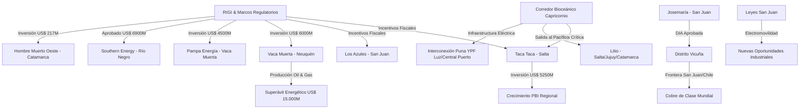

# Oportunidades de Negocio y Conexiones Ocultas - Abril 2026

## Oportunidades de Negocio Identificadas
1. **Infraestructura Logística y Energética**:
   - El proyecto de **electrificación de la Puna** (YPF Luz/Central Puerto) abre una ventana para subcontratistas en montaje de líneas de extra alta tensión y servicios auxiliares en zonas de altura.
2. **Servicios para el Distrito Vicuña**:
   - Con la aprobación de la DIA de **[[Josemaría]]** y el avance de Filo del Sol, se requiere una cadena de proveedores en San Juan especializada en logística de gran tonelaje y campamentos mineros bajo estándares internacionales.
3. **Electromovilidad y Desarrollo Local**:
   - Las nuevas leyes en **San Juan** (Desarrollo Local Minero y Electromovilidad) ofrecen incentivos para empresas que se radiquen en la provincia para proveer componentes de vehículos eléctricos o servicios de valor agregado.
4. **Puesta en Marcha de Litio**:
   - **[[Hombre Muerto Oeste]]** iniciando producción tracciona servicios de transporte de cloruro de litio y gestión logística hacia puertos chilenos por el **[[Corredor Bioceanico]]**.

## Conexiones Estratégicas y Ocultas
La sinergia entre el [[RIGI]] y la infraestructura eléctrica es ahora el factor determinante. Proyectos que antes eran marginales por falta de energía (en la Puna) se vuelven viables con el acuerdo YPF Luz/Central Puerto.

### Visualización de Conexiones (Mermaid)

## Conclusiones
La "revolución del cobre" en Argentina está impulsada por el [[RIGI]], pero su competitividad logística depende totalmente de la operatividad del [[Corredor Bioceanico]]. Aquellas empresas que logren posicionarse en el nodo logístico de Jujuy/Salta tendrán una ventaja competitiva al exportar hacia el mercado del Asia-Pacífico por los puertos de Chile.
