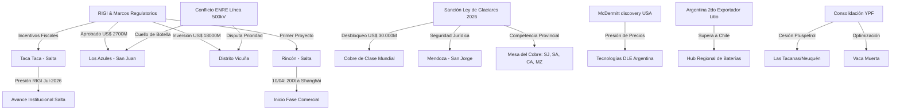

# Oportunidades de Negocio y Conexiones Ocultas - Abril 2026

## Oportunidades de Negocio Identificadas
1. **Infraestructura Eléctrica y Disputas de Capacidad**:
   - El conflicto entre **[[Los Azules]]** y **[[Distrito Vicuña]]** ante el ENRE por la línea de 500 kV revela un cuello de botella crítico en San Juan. Existe una oportunidad masiva para empresas de ingeniería eléctrica y consultoría regulatoria para gestionar soluciones de despacho y ampliación de red.
2. **Litio: Eficiencia vs. Escala**:
   - El hallazgo en **McDermitt (EE.UU.)** con >40 MTn de recursos presiona los precios a la baja a largo plazo. La oportunidad en Argentina se desplaza hacia la **eficiencia operativa** (tecnologías DLE más rápidas) y la purificación local para mantener márgenes competitivos frente a yacimientos de arcilla de mayor volumen.
3. **Servicios de Minería de Alta Montaña**:
   - La sanción de la reforma de la **[[Ley de Glaciares]]** desbloquea proyectos por US$ 30.000M. Se espera una demanda inmediata de servicios de peritaje hídrico y ambiental para validar la "función hídrica" de las geoformas periglaciales y habilitar los Informes de Impacto Ambiental (IIA) frenados.
4. **Optimización en Vaca Muerta**:
   - La consolidación de áreas de Pluspetrol en **YPF** (Aguada Villanueva, Meseta Buena Esperanza, Las Tacanas) tracciona contratos de servicios de perforación y completación unificados, buscando economías de escala en la operación.

## Conexiones Estratégicas y Ocultas
Argentina ha pasado de ser un actor regional a una **potencia exportadora global de litio**, superando a Chile en 2026. La tríada **Cobre + Litio + Federalismo Ambiental (Ley de Glaciares)** configura un ecosistema de inversión blindado que trasciende la volatilidad del mercado interno.

### Visualización de Conexiones (Mermaid)

## Conclusiones
La "economía a dos velocidades" se profundiza con la seguridad jurídica aportada por la reforma de la Ley de Glaciares. Mientras el mundo observa el hallazgo en EE.UU., Argentina acelera su fase comercial (Rio Tinto/Rincón) y expande su frontera minera con la incorporación de Mendoza a la Mesa del Cobre. El principal riesgo identificado es la **infraestructura eléctrica**, donde la competencia por la capacidad instalada (ENRE) puede ralentizar proyectos críticos si no se atraen inversiones específicas en transporte de energía.
