# Oportunidades de Negocio y Conexiones Ocultas - Mayo 2026

## Oportunidades de Negocio Identificadas
1. **Seguridad de Activos Críticos (Res. 461/2026)**:
   - La creación de la 'Mesa de Coordinación para la Seguridad de Inversiones Estratégicas' (Mayo 2026) abre una oportunidad para empresas de **seguridad tecnológica avanzada, ciberseguridad industrial y monitoreo satelital** de ductos y activos mineros. La protección contra el crimen organizado se convierte en un servicio de valor agregado para proyectos RIGI.
2. **Des-riesgo Multilateral (Patrón IFC/BID)**:
   - La ratificación del acuerdo entre **[[Taca Taca]]** y la IFC (Abril 2026) consolida el patrón de "escudos multilaterales". El cumplimiento de estándares de desempeño de la IFC se vuelve un requisito *de facto* para los megaproyectos que buscan financiamiento por deuda bajo el RIGI.
2. **Infraestructura Eléctrica y Arbitraje de Despacho (ENRE)**:
   - La **Resolución ENRE 079/2026** otorgó a **[[Distrito Vicuña]]** una prioridad del 90% sobre la capacidad remanente de la línea de 500 kV en San Juan. Esto genera un bloqueo sistémico para **[[Los Azules]]** y otros proyectos. El anuncio de inicio de construcción de Los Azules para fines de 2026 (18/04/2026) intensifica la urgencia por resolver este cuello de botella o migrar hacia la **Orquestación de Microgrids Off-Grid** (Solar + Baterías + LNG).
3. **Cobre de Alta Ley: El Efecto [[Lunahuasi]]**:
   - El reporte de leyes de hasta 18.9% Cu en Lunahuasi (Abril 2026) redefine el potencial del [[Distrito Vicuña]]. Existe una oportunidad para el desarrollo de **plantas de procesamiento modulares** y servicios de exploración de alta precisión en un área que ya es apodada el "Vaca Muerta del Cobre". Proyectos marginales pueden volverse altamente rentables si se integran en una infraestructura común de procesamiento de alta ley.
4. **Litio: Eficiencia vs. Escala (Efecto McDermitt)**:
   - El hallazgo en **McDermitt (EE.UU.)** presiona los precios. La oportunidad en Argentina es la **eficiencia operativa** mediante tecnologías DLE avanzadas y servicios de purificación in-situ para mantener competitividad en la curva de costos global.
5. **Cluster de Servicios Mendoza (Tier 2/3)**:
   - La incorporación de **[[Mendoza]]** a la Mesa del Cobre y la reforma de la **[[Ley de Glaciares]]** habilitan un nuevo mercado de servicios. Existe una demanda insatisfecha por la reconversión de proveedores petroleros hacia la minería (drilling de altura, logística pesada, servicios ambientales).
6. **Optimización en Vaca Muerta y Federalización del Shale**:
   - Los anuncios de **[[YPF]] (USD 25B)**, **[[Pluspetrol]] (USD 12B)** y **[[Chevron|Chevron]] (USD 10B)** bajo el RIGI (Mayo 2026) inyectan una escala sin precedentes. La federalización del shale hacia **[[Palermo Aike]]** y Chubut demanda una expansión masiva de la cadena de valor: desde **frack crews** hasta **servicios de última milla** y **housing industrial**.
7. **Aluvión de Inversiones RIGI Petrolero y Decreto 105/2026**:
   - La regulación del RIGI para el upstream con un piso de USD 600M (Mayo 2026) incentiva el desarrollo de áreas fuera de la "zona de confort" de Añelo. Esto genera una oportunidad crítica para proveedores que puedan garantizar el **50% de desarrollo de proveedores locales** exigido por la norma.
8. **Consolidación del NOA como Hub Surcoreano**:
   - La adquisición de HMN por parte de **[[Posco]]** (US$ 65M) y la confirmación de que su primera planta ya opera al **70% de capacidad** (Abril 2026) consolidan a la empresa como el jugador más dinámico del litio en Salta. La oportunidad reside en la **logística transfronteriza y servicios compartidos**.
9. **Servicios ESG y Financiamiento Multilateral**:
   - El financiamiento de **US$ 1.175 millones** para **[[Rincón]]** (Rio Tinto) proveniente de CFI y BID Invest impone estándares ESG estrictos. Se abre un mercado de **auditoría ambiental continua, servicios de monitoreo hídrico y consultoría en relaciones comunitarias**.
10. **RIMI y el Fortalecimiento de la Cadena de Valor**:
    - La reglamentación del **[[RIMI]]** (Abril 2026) abre una ventana para proyectos de escala media y proveedores de servicios que no califican para el RIGI.
11. **Transparencia Digital en San Juan**:
    - La implementación obligatoria del **SIM (Sistema Integral Minero)** en San Juan elimina la fricción administrativa del canon minero. Representa una oportunidad para empresas de **software de compliance minero**.
12. **Mendoza: Profesionalización ASG**:
    - El acuerdo Impulsa Mendoza-Kobrea para estándares **ASG** y el envío de la DIA del proyecto de litio **Don Luis** a la Legislatura marcan la pauta de una Mendoza que busca liderar con rigor técnico.
13. **Tendencia a la Autonomía Provincial**:
    - La reforma de la Ley de Glaciares y la dinámica de adhesión al RIGI están configurando un escenario de fragmentación normativa. Esto genera una oportunidad para consultoras de asuntos públicos y legales especializadas en "federalismo de coordinación".
14. **Recuperación del Litio y Ventana BESS (Abril 2026)**:
    - El rebote del precio del litio a **US$ 20.000/t** impulsado por sistemas de almacenamiento (BESS) en China reabre la ventana de rentabilidad para proyectos marginales y acelera la expansión de los existentes (ej. HMW de Galan Lithium).
15. **Integración Logística Argentina-Chile y Telecomunicaciones**:
    - La propuesta de cooperación bilateral (Milei-Kast) apunta a resolver cuellos de botella en la salida al Pacífico. El "apagón" de conectividad digital en el tramo chileno (18/04/2026) abre una oportunidad para **servicios de telecomunicaciones satelitales (Starlink/otros)** aplicados a la logística de camiones mineros.
16. **Efecto Multiplicador del "Mini RIGI" (Jujuy)**:
    - El lanzamiento de incentivos para inversiones desde **US$ 5 millones** en Jujuy abre una ventana masiva para pymes tecnológicas y de servicios mineros, formalizando la cadena de valor de Exar y Sales de Jujuy.
17. **Previsibilidad en el Cobre (Horizonte 2029)**:
    - La definición del año 2029 para la puesta en marcha de **[[Los Azules]]** y **San Jorge** permite a los inversores en infraestructura sincronizar sus desembolsos con el flujo de caja operativo proyectado.
18. **Ajuste Fino del RIGI para Shale e Infraestructura (Resolución 484/2026)**:
    - El aumento del umbral de rentabilidad al 35% es una señal directa para el sector de hidrocarburos y la infraestructura eléctrica. La oportunidad reside en proyectos de **recuperación terciaria, shale oil de ciclo largo y líneas de transmisión** que ahora encuadran mejor en el régimen de incentivos.
19. **Industrialización de Gas (Fertilizantes)**:
    - El pedido de RIGI de **Pampa Energía** para su planta de urea en Bahía Blanca (US$ 2.400M) marca el inicio de la fase de valor agregado para el gas de Vaca Muerta, abriendo oportunidades para proveedores de ingeniería y servicios industriales complejos.

## Conexiones Estratégicas y Ocultas
Argentina ha pasado de ser un actor regional a una **potencia exportadora global de litio**, superando a Chile en 2026. La tríada **Cobre + Litio + Federalismo Ambiental (Ley de Glaciares)** configura un ecosistema de inversión blindado que trasciende la volatilidad del mercado interno.

### Visualización de Conexiones (Mermaid)

```mermaid
graph TD
    RIGI[RIGI: USD 140B Pipeline] --> |USD 26.68B Aprobado| Aproved[12 Proyectos Aprobados]
    Aproved --> |USD 25.000M| YPFRIGI[YPF Loma La Lata]
    Aproved --> |USD 2.672M| LARIGI[Los Azules RIGI]
    Aproved --> |USD 5.250M| TTRIGI[Taca Taca RIGI]
    Aproved --> |USD 1.241M| CORIGI[Cauchari-Olaroz Exp]
    Aproved --> |USD 891M| SJRIGI[San Jorge RIGI]
    Aproved --> |USD 550M| TGSRIGI[TGS Gasoducto]
    Aproved --> |USD 481M| DiabRIGI[Diablillos RIGI]

    RIGI --> |Solicitud USD 12.000M| PlusRIGI[Pluspetrol RIGI]
    RIGI --> |Confirmado USD 10.000M| ChevRIGI[Chevron RIGI]
    RIGI --> |USD 6.900M| SERIGI[Southern Energy GNL]

    RIGI --> |Res. 461/2026| Security[Seguridad Activos]
    RIGI --> |Res. 484/2026| O&G[Ajuste Rentabilidad 35%]
    RIGI --> |Decreto 105/2026| Upstream[Upstream USD 600M Min]
    
    VM[Vaca Muerta] --> |Récord 200k bpd| YPF
    VM --> |70% Prod Nacional| Prod
    VM --> |58% Avance| VMOS[Oleoducto VM Sur]

    Catamarca[Catamarca] --> |Hito Permanente| RioLosPatos[Libre Expansión Litio]
    RioLosPatos --> Arcadium
    RioLosPatos --> Posco

    CBC[Corredor Bioceánico] --> |82.58%| Puente[Porto Murtinho]
    Puente --> NodoJujuy[Jujuy Estratégico]
```

## Conclusiones
La "economía a dos velocidades" se profundiza con la seguridad jurídica aportada por la reforma de la Ley de Glaciares. Mientras el mundo observa el hallazgo en EE.UU., Argentina acelera su fase comercial (Rio Tinto/Rincón) y expande su frontera minera con la incorporación de Mendoza a la Mesa del Cobre. El principal riesgo identificado es la **infraestructura eléctrica**, donde la competencia por la capacidad instalada (ENRE) puede ralentizar proyectos críticos si no se atraen inversiones específicas en transporte de energía.
