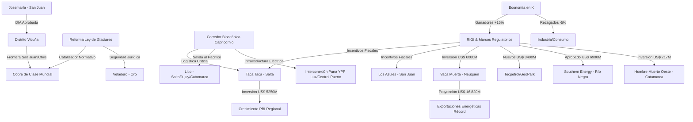

# Oportunidades de Negocio y Conexiones Ocultas - Abril 2026

## Oportunidades de Negocio Identificadas
1. **Infraestructura Logística y Energética**:
   - El proyecto de **electrificación de la Puna** (YPF Luz/Central Puerto) abre una ventana para subcontratistas en montaje de líneas de extra alta tensión.
   - **Oleoducto VMOS**: La finalización de tanques de almacenamiento y la operatividad prevista para 2027 demandará servicios de mantenimiento y logística de construcción en Río Negro y Neuquén.
2. **Servicios para el Distrito Vicuña y Alta Montaña**:
   - Con la aprobación de la DIA de **[[Josemaría]]** y la inminente reforma de la **[[Ley de Glaciares]]**, se espera una explosión en la demanda de servicios para proyectos de cobre en San Juan.
3. **Proveedores para Oro (San Juan)**:
   - **[[Veladero]]** concentrando el 96% de las exportaciones mineras de San Juan ofrece un mercado consolidado para proveedores de insumos químicos (cianuro, reactivos) y repuestos de maquinaria pesada.
4. **Puesta en Marcha de Litio**:
   - **[[Hombre Muerto Oeste]]** iniciando producción tracciona servicios de transporte hacia el **[[Corredor Bioceanico]]**.

## Conexiones Estratégicas y Ocultas
La economía argentina opera a **"dos velocidades"**. El éxito de los sectores transables (Minería, Energía, Agro) bajo el [[RIGI]] genera un desacople con el mercado interno. La reforma de la **[[Ley de Glaciares]]** es el eslabón perdido que permitirá al sector minero pasar de la exploración a la construcción masiva de minas de cobre.

### Visualización de Conexiones (Mermaid)

## Conclusiones
La "revolución del cobre" y el "boom de Vaca Muerta" están blindados por el RIGI y la Ley de Glaciares. Sin embargo, la brecha con el mercado interno plantea desafíos de sostenibilidad social a largo plazo. Los inversores deben priorizar proyectos con alta integración de proveedores locales para mitigar este riesgo.
