# Oportunidades de Negocio y Conexiones Ocultas - Abril 2026

## Oportunidades de Negocio Identificadas
1. **Infraestructura Logística y Tecnológica**:
   - **Paso de Jama y Corredor Bioceánico**: El incremento de 7.000 camiones anuales y el puente Porto Murtinho al 80% abren una ventana masiva para servicios de digitalización de fronteras y logística cross-border.
   - **Electrificación de la Puna**: El acuerdo YPF Luz / Central Puerto (US$ 250M-400M) tracciona subcontratistas en montaje de líneas de extra alta tensión.
   - **Oleoducto VMOS**: La finalización de tanques de almacenamiento y la operatividad prevista para 2027 demandará servicios de mantenimiento y logística de construcción en Río Negro y Neuquén.
2. **Servicios de Minería de Altura en el [[Distrito Vicuña]]**:
   - Con la aprobación de la actualización de la DIA de **[[Josemaría]]** (Abril 2026) y la inminente reforma de la **[[Ley de Glaciares]]**, se espera una explosión en la demanda de construcción civil y mantenimiento en condiciones extremas (>4.000 msnm). La inversión proyectada por la alianza BHP-Lundin de **US$ 790M para 2026** confirma la aceleración del clúster.
3. **Hub Químico en [[General Güemes]] y Proveedores para Oro**:
   - La coincidencia de inversiones de **TGS** (gas) y **Ganfeng** (litio) en el mismo nodo permite proyectar la producción local de reactivos químicos, reduciendo costos de importación.
   - **[[Veladero]]** concentrando el 96% de las exportaciones mineras de San Juan ofrece un mercado consolidado para proveedores de insumos químicos (cianuro, reactivos) y repuestos de maquinaria pesada.
4. **Puesta en Marcha de Litio**:
   - **[[Hombre Muerto Oeste]]** y **[[Rincón]]** traccionan servicios de transporte pesado hacia puertos y la demanda de tecnologías DLE (Extracción Directa). La aprobación RIGI para la expansión de **Fénix** (Rio Tinto) por US$ 251M asegura un flujo constante de demanda de servicios en Catamarca hasta fines de 2026.
5. **Apertura de Mercados Europeos (Mercosur-UE)**:
   - La ratificación del acuerdo comercial (Abril 2026) abre una ventana de oportunidad para proveedores de servicios con estándares europeos, especialmente en certificación de origen y huella de carbono para el litio y cobre.

## Conexiones Estratégicas y Ocultas
La economía argentina opera a **"dos velocidades"**. El éxito de los sectores transables (Minería, Energía, Agro) bajo el [[RIGI]] genera un desacople con el mercado interno. La reforma de la **[[Ley de Glaciares]]** es el eslabón perdido que permitirá al sector minero pasar de la exploración a la construcción masiva.

### Visualización de Conexiones (Mermaid)

```mermaid
graph TD
    RIGI[RIGI & Marcos Regulatorios] --> |Incentivos Fiscales| TacaTaca[Taca Taca - Salta]
    RIGI --> |Incentivos Fiscales| LosAzules[Los Azules - San Juan]
    RIGI --> |Inversión US$ 6000M| VacaMuerta[Vaca Muerta - Neuquén]
    RIGI --> |Nuevos US$ 3400M| VMNuevos[Tecpetrol/GeoPark]
    RIGI --> |Aprobado US$ 6900M| Southern[Southern Energy - Río Negro]
    RIGI --> |Inversión US$ 217M| HMW[Hombre Muerto Oeste - Catamarca]
    RIGI --> |Avalancha de Postulantes| PoscoGlencore[Posco/Glencore/AbraSilver]

    MUE[Acuerdo Mercosur-UE] --> |Seguridad Jurídica| RIGI
    MUE --> |Mercado GNL/Litio/Cobre| UE[Unión Europea]

    LG[Reforma Ley de Glaciares] --> |Catalizador Normativo| Cobre[Cobre de Clase Mundial]
    LG --> |Seguridad Jurídica| Veladero[Veladero - Oro]

    CBC[Corredor Bioceánico Capricornio] --> |Logística Crítica| TacaTaca
    CBC --> |Salida al Pacífico| Litio[Litio - Salta/Jujuy/Catamarca]
    CBC --> |Infraestructura Eléctrica| PunaEnergy[Interconexión Puna YPF Luz/Central Puerto]
    CBC --> |Hub Industrial| Guemes[General Güemes]

    Diablillos[Diablillos - Salta/Catamarca] --> |Inversión US$ 760M| RIGI
    ArgGNL[Argentina GNL - YPF/ENI/XRG] --> |Inversión US$ 12000M+| RIGI

    TacaTaca --> |Inversión US$ 5250M| PBI_Salta[Crecimiento PBI Regional]
    VacaMuerta --> |Exportaciones US$ 16.820M| ExportEnergy[Superávit Energético Récord]

    Josemaria[Josemaría - San Juan] --> |DIA Aprobada| Vicuña[Distrito Vicuña]
    Vicuña --> |Frontera San Juan/Chile| Cobre

    K_Econ[Economía en K] --> |Ganadores +15%| RIGI
    K_Econ --> |Rezagados -5%| MercadoInterno[Industria/Consumo]
```

## Conclusiones
La "revolución del cobre" y el "boom de Vaca Muerta" están blindados por el RIGI y la Ley de Glaciares. Sin embargo, el liderazgo exportador de **[[San Juan]]** (92,5% minero) demuestra una dependencia crítica que debe ser gestionada mediante el desarrollo de proveedores locales robustos, incentivados por el nuevo "Mini RIGI" de la Mesa del Litio.
