# Oportunidades de Negocio y Conexiones Ocultas - Junio 2026

## Oportunidades de Negocio Identificadas

1.  **Súper RIGI e Industrialización de Base (03/06/2026)**:
    - El proyecto del **"Súper RIGI"** ya fue enviado al Congreso para traccionar inversiones superiores a **US$ 1.000 millones** en alta tecnología, hidrógeno verde y baterías de litio.
    - *Beneficio clave:* La reducción de Ganancias al **15%** y la estabilidad a 30 años obligarán a estructurar sinergias de industrialización aguas abajo en las provincias mineras del NOA.

2.  **Megaproyectos de "Big Capital" y Saturación de Servicios**:
    - La formalización de la solicitud de Chevron para **[[Chevron|El Trapial Este]]** por **US$ 13.800 millones** y de YPF **[[Proyecto LLL Oil]]** (US$ 25.000M) consolida un Capex masivo en Vaca Muerta. Esto intensificará la demanda de frack crews (récord de **2.484 etapas de fractura** en mayo de 2026) y tratamiento de arenas.

3.  **Infraestructura Eléctrica y Unificación del Regulador (ENRGE)**:
    - La fusión de ENRE y ENARGAS en el **ENRGE** (01/06/2026) y el desarrollo de la audiencia del **3 de junio de 2026** (Res. 219/2026) por la línea de 500kV en San Juan (con 30 días para resolver oposiciones entre Los Azules y Josemaría) demuestran que el transporte eléctrico es el factor crítico de escala. Oportunidad para plantas solares *off-grid* y microrredes BESS industriales.

4.  **Cobre de Alta Ley y Oficialización de San Jorge**:
    - La aprobación del RIGI para **[[San Jorge]]** en Mendoza (Resolución 801/2026, **US$ 891M**) abre el primer play metalífero mendocino eludiendo las prohibiciones de la Ley 7722. Sumado a las leyes excepcionales en Lunahuasi, acelera las tesis de exportación directa al Pacífico.

5.  **Federalización del Shale y Competitividad Provincial**:
    - El veto del gobernador de Santa Cruz al alza de regalías mineras al 5% para proteger la competitividad provincial. Mientras tanto, Chubut crea la Dirección de Concesiones para agilizar proyectos no convencionales.

6.  **Galan Lithium (HMW) y la primera producción (28/05/2026)**:
    - La primera producción comercial de cloruro de litio de **[[Hombre Muerto Oeste|Galan Lithium]]** en Catamarca (10.000 t LCE acumuladas en pozas) confirma la transición de la Puna a escala comercial.

7.  **Ganfeng Lithium - Pozuelos-Pastos Grandes**:
    - La solicitud RIGI de Ganfeng para **[[Pozuelos - Pastos Grandes]]** en Salta con una proyección masiva de **150.000 t/año** representa la mayor apuesta de consolidación china en la región.

8.  **Logística del Litio y el Canal de Sico/Jama**:
    - Caso de éxito de Eramine exportando litio desde Salta vía Jama directo a puertos chilenos (Angamos), logrando un ahorro logístico de 10 días de navegación hacia Asia.

9.  **Tokenización de Contenido Local**:
    - Mercado de créditos y debida diligencia de cumplimiento (RIGI Compliance Ledger) para certificar el 20% obligatorio de compras locales exigido por el régimen.

10. **Geotermia en Pozos Maduros (Reuso Energético)**:
    - Reutilización de pozos convencionales abandonados en el Golfo San Jorge para proyectos de calor geotérmico de baja entalpía (heat-to-power) para campamentos mineros.

11. **Des-riesgo Multilateral (Patrón IFC/BID)**:
    - La ratificación de los acuerdos de Taca Taca y Rincón con la IFC y BID Invest consolidan las auditorías ASG como requerimiento *de facto* para la financiación por deuda corporativa.

12. **Cluster de Servicios y Apertura de Mendoza**:
    - La incorporación de Mendoza a la Mesa del Cobre y reformas regulatorias a la Ley de Glaciares habilitan la migración masiva de contratistas petroleros a minería.

13. **Gobernanza Hídrica Inmutable (HydroTrust - 25/05/2026)**:
    - Oportunidad SaaS de monitoreo hídrico IoT cifrado en origen (Blockchain) para des-riesgo legal y blindaje de licencia social en el NOA tras el fallo de Catamarca. Ver: [[HydroTrust_Puna_Hidrico]].

14. **SaaS Logístico y Conectividad Andina (AndesLogistics Puna - 26/05/2026)**:
    - Software telemático pasivo y despacho bimodal andino con Starlink integrado para coordinar tránsitos en altura sin generar fricción laboral. Ver: [[AndesLogistics_Puna_Logistica]].

15. **Alineación de Repuestos para Shale (ShaleFlow Añelo - 25/05/2026)**:
    - SaaS B2B de telemetría de fallas en bombas de fractura y ruteo automatizado con inventarios OEM de Añelo. Ver: [[ShaleFlow_Anelo_Supply]].

16. **Retorno de Austrade y Servicios de Consultoría (26/05/2026)**:
    - La reactivación de Austrade en Buenos Aires tras el récord de IED australiana de US$ 970M bajo el RIGI abre una ventana de servicios técnicos y estándares mineros globales.

17. **Efecto Multiplicador del "Mini RIGI" de Jujuy**:
    - El play de incentivos para inversiones a partir de US$ 5M atrae y formaliza pymes de servicios y mantenimiento para Exar y Sales de Jujuy.

18. **RIMI y el Fortalecimiento de la Cadena de Valor**:
    - La reglamentación del régimen RIMI para medianas inversiones brinda beneficios fiscales a proveedores estratégicos de escala media.

## Conexiones Estratégicas y Ocultas

### Visualización de Conexiones (Mermaid)

```mermaid
graph TD
    RIGI[RIGI: Motor de Inversión] --> |US$ 140.000M en Cartera| Eval[36 Proyectos en Pipeline]
    RIGI --> |Súper RIGI: Ganancias 15%| Ind[Industrialización: Cátodos/Baterías]
    RIGI --> |Aprobado Mayo 2026| LosAzules[Los Azules - San Juan]
    RIGI --> |Aprobado Mayo 2026| TGS[TGS Expansión Gasoductos]
    RIGI --> |Aprobado Mayo 2026| SanJorge[Minera San Jorge - Mendoza]
    RIGI --> |Aprobado Mayo 2026| Cauchari[Cauchari-Olaroz Expansión]
    RIGI --> |Solicitud Ganfeng| PPG[Pozuelos-Pastos Grandes]
    RIGI --> |Chevron US$ 13.800M| Chevron[Chevron El Trapial Este]
    RIGI --> |YPF US$ 25.000M| LLL[Proyecto LLL Oil Loma La Lata]
    RIGI --> |Pluspetrol US$ 12.000M| Plus[Bajo del Choique]
    RIGI --> |Res. 484/2026| Profit[Rentabilidad 35%]
    RIGI -.-> |Seguridad de Activos| SecRes[Res. 461/2026: Mesa de Seguridad]
    
    VM[Vaca Muerta] --> |Récord 2.484 Etapas Mayo| Fractura[Eficiencia Operativa]
    VM --> |Federalización| PA[Palermo Aike / D-129]
    VM --> |Oleoducto VMOS 60%| VMOS[VMOS Instalación Submarina]
    
    LG[Federalismo Ambiental] --> |Justicia Catamarca Río Los Patos| Catamarca[Hombre Muerto]
    Catamarca --> Posco[Posco - Sal de Oro / HMN]
    Catamarca --> Arc[Arcadium/Rio Tinto - Fénix]
    Catamarca --> Galan[Galan Lithium - HMW Primera Producción]
    
    Cobre[Cobre Hub] --> |Leyes Récord| Lunahuasi[Lunahuasi 18.9% Cu]
    Cobre --> |NI 43-101 IFC| TacaTaca[Taca Taca - Salta]
    
    ENRGE[ENRGE / Fusión ENRE-ENARGAS] --> |Audiencia 3-Junio Res 219| Vicuña[Distrito Vicuña / Josemaría]
    ENRGE --> |Oposiciones y 30 Días| LosAzules
    ENRGE -.-> |Bypass Energético| Microgrids[Microgrids Off-Grid]
    
    Logistics[Logística Puna] --> |RN 51 / Paso de Sico| Chile[Salida Pacífico / Chile]
    Logistics --> |RN 52 / Paso de Jama| Sico[Ahorro 10 Días Eramine]
```

## Conclusiones
La "economía a dos velocidades" se profundiza. Con una cartera RIGI que consolidó un pipeline de **US$ 140.000 millones**, la restricción crítica es de infraestructura física (línea de 500kV y unificación ENRGE, conectividad cordillerana). La Mesa del Litio y la Mesa del Cobre aceleran la integración de servicios, pero el éxito inmediato y el control de la renta dependen del bypass de los cuellos de botella burocráticos y la estabilidad en el territorio.
