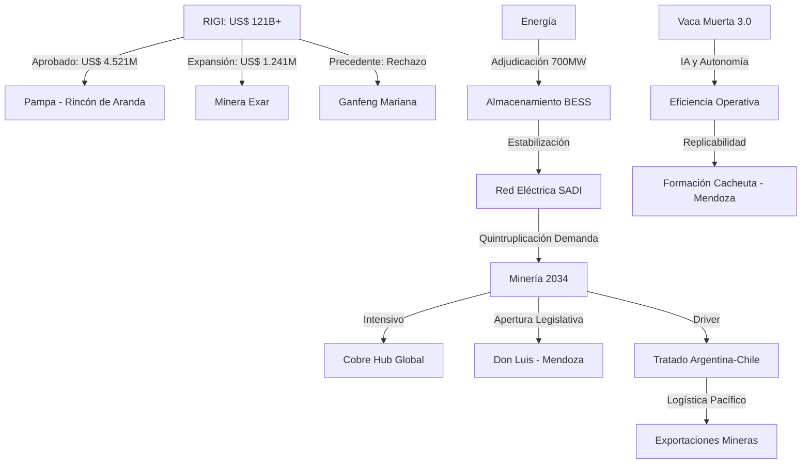

# Oportunidades de Negocio y Conexiones Ocultas - Julio 2026

## Oportunidades de Negocio Identificadas
1. **Infraestructura de Almacenamiento (BESS)**:
   - La adjudicación de **700 MW** en la licitación AlmaGBA (08/07/2026) abre un mercado masivo para integradores de sistemas de baterías y desarrolladores de software de gestión de red. Esta capacidad es crítica para estabilizar el SADI ante la intermitencia de las renovables.
2. **Vaca Muerta 3.0 - Servicios Tecnológicos**:
   - La transición hacia la **IA y operaciones autónomas** en Vaca Muerta (08/07/2026) genera una demanda insatisfecha por servicios de análisis de datos en tiempo real, sensores IoT para pozos y automatización de la logística de arenas de fractura.
3. **Eficiencia Energética para Minería**:
   - Con la proyección de que el consumo eléctrico minero se quintuplicará (OLACDE, 08/07/2026), existe una oportunidad crítica para el desarrollo de **líneas de extra alta tensión (500 kV)** y soluciones de autogeneración renovable *in-situ* para proyectos en la Puna y los Andes.
4. **Federalización del Shale: Cacheuta y Palermo Aike**:
   - El anuncio de Mendoza sobre la **Formación Cacheuta** (08/07/2026) y el avance en **Palermo Aike** abren una nueva frontera para proveedores de servicios petroleros que hoy están concentrados en Neuquén.
5. **Logística Transfronteriza (Tratado Argentina-Chile)**:
   - La reactivación del **Tratado de Integración Minera** (08/07/2026) facilitará el uso de puertos chilenos para la salida de cobre y litio argentino, abriendo oportunidades en servicios de transporte multimodal y hubs logísticos de frontera.
6. **Cumplimiento y Rigor RIGI**:
   - El rechazo del proyecto Mariana (05/07/2026) por no ser "inversión nueva" impone una oportunidad para consultoras especializadas en **due diligence normativo** y estructuración de proyectos bajo los criterios estrictos del Comité Evaluador.

## Conexiones Estratégicas y Ocultas
La convergencia entre la **minería intensiva en energía** y la necesidad de **estabilizar el sistema eléctrico** mediante BESS crea un círculo virtuoso: el litio extraído en el NOA alimenta las baterías que permiten que la minería de cobre sea sostenible y que la red nacional soporte el crecimiento industrial.

### Visualización de Conexiones (Mermaid)

## Conclusiones
Argentina entra en una fase de **disciplina operativa y regulatoria**. Mientras el RIGI alcanza cifras récord de proyectos, el sistema energético debe acelerar su expansión para no convertirse en el cuello de botella del auge minero. La Inteligencia Artificial en Vaca Muerta y los sistemas BESS en el AMBA son las dos caras de la misma moneda: la modernización tecnológica como garante del crecimiento de las exportaciones.
