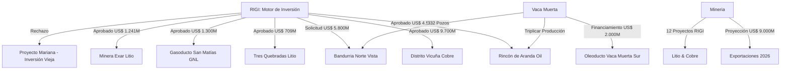

# Oportunidades de Negocio y Conexiones Ocultas - Agosto 2026

## Oportunidades de Negocio Identificadas
1. **Infraestructura de Exportación VMOS & Hubs Greenfield (Vista & Pampa)**:
   - Con el financiamiento de US$ 2.000M asegurado y un 59%-73% de avance en VMOS, la solicitud de Vista Energy por **US$ 5.800M** en Bandurria Norte (332 pozos) y la aprobación de Rincón de Aranda (Pampa, **US$ 4.521M**) abren demandas masivas de baterías de tratamiento (40.000 bpd), estaciones compresoras y servicios de perforación intensivos.
2. **Desafío Logístico de Arenas y Minería de Cercanía en Río Negro**:
   - Se proyecta que la demanda de arenas de fractura alcanzará los **8 millones de toneladas en 2027** para Vaca Muerta. Como el flete representa hasta el 80% del valor en pozo, surge una enorme oportunidad en minería de cercanía en Río Negro (ej. desarrollos de Phoenix Global) y en software de gestión logística multi-modal ("Ruta de las Arenas").
3. **Capacidad Ociosa en Frac Crews y Tensión en Cadena PyME**:
   - A pesar del récord de producción (914,900 bpd), los conjuntos de fractura reportan hasta un **30% de capacidad ociosa**. Esto ha derivado en intentos de compresión de costos por parte de grandes primarios (como Halliburton), generando un fuerte rechazo de las PyMEs locales (FECENE). Oportunidad para plataformas SaaS de optimización de uso de activos y mediación de SLAs entre operadoras y pymes.
4. **Infraestructura Eléctrica Descentralizada y Microredes BESS en la Puna**:
   - Con la severa brecha de transmisión eléctrica en la zona andina y el fallo del ENRE asignando capacidad de transporte al [[Distrito Vicuña]] por sobre [[Los Azules]], la Puna requiere acelerar la adopción de microredes híbridas fotovoltaicas con baterías BESS y almacenamiento local, abriendo espacio a integradores energéticos independientes.
4. **Tierras Raras y Minería Tecnológica**:
   - La iniciativa para incluir tierras raras en el [[RIGI]] abre un nicho virgen en Argentina. Oportunidades en exploración geofísica especializada y plantas de separación química de tierras raras.
5. **BESS AlmaGBA y Estabilidad del SADI**:
   - La adjudicación de 700 MW de almacenamiento en baterías (BESS) en el AMBA señala una tendencia irreversible. Empresas de integración de sistemas, software de gestión de energía (EMS) y fabricantes de baterías (con potencial integración con el litio local) tienen un mercado en expansión para estabilizar la red eléctrica.
6. **Extensión Geológica de Vaca Muerta hacia el Este**:
   - El pozo récord de Phoenix en Río Negro revaloriza áreas consideradas marginales. Oportunidad para adquisición de bloques y servicios de perforación en zonas de menor densidad actual pero alto potencial de shale oil.
7. **Cluster Minero Mendoza-Chile**:
   - Los acuerdos de integración binacional posicionan a Mendoza como un centro de servicios para proyectos chilenos y viceversa. Oportunidad en logística transfronteriza y servicios de ingeniería para el cluster de cobre de los Andes.
8. **Súper RIGI e Industria Pesada**:
   - El esquema de US$ 1.000 millones para industrias que "aún no existen" apunta a siderurgia verde, plantas de hidrógeno de gran escala e infraestructura de GNL masiva.
9. **Rechazo Mariana y Rigor de "Inversión Nueva"**:
   - El rechazo al proyecto Mariana por parte del Comité Evaluador del RIGI es una advertencia para inversores: el régimen no es un salvataje para inversiones hundidas, sino un incentivo para capital fresco. Consultoría en estructuración de proyectos RIGI para cumplir con la regla de "nueva inversión" es ahora crítica.

## Conexiones Estratégicas y Ocultas
Argentina está logrando desacoplar el riesgo soberano del riesgo de proyecto en los sectores de Energía y Minería mediante el blindaje del RIGI. La acumulación de **36 proyectos registrados (US$ 94.922M acumulados, 15 aprobados por US$ 19.557M)** consolida el motor exportador projected en **US$ 51.000 millones** en conjunto entre Vaca Muerta y Minería.

### Visualización de Conexiones (Mermaid)

```mermaid
graph TD
    RIGI[RIGI: Motor de Inversión] --> |Aprobado US$ 9.700M| Vicuña[Distrito Vicuña Cobre]
    RIGI --> |Aprobado US$ 4.521M| RinconAranda[Rincón de Aranda Oil]
    RIGI --> |Aprobado US$ 709M| 3Q[Tres Quebradas Litio]
    RIGI --> |Solicitud US$ 5.800M| BandurriaNorte[Bandurria Norte Vista]
    RIGI --> |Aprobado US$ 1.300M| SanMatias[Gasoducto San Matías GNL]
    RIGI --> |Aprobado US$ 1.241M| Exar[Minera Exar Litio]
    RIGI --> |Rechazo| Mariana[Proyecto Mariana - Inversión Vieja]

    VM[Vaca Muerta] --> |332 Pozos| BandurriaNorte
    VM --> |Triplicar Producción| RinconAranda
    VM --> |Financiamiento US$ 2.000M| VMOS[Oleoducto Vaca Muerta Sur]

    Mineria --> |Proyección US$ 9.000M| CAEM[Exportaciones 2026]
    Mineria --> |12 Proyectos RIGI| LitioCobre[Litio & Cobre]
```

## Conclusiones
La consolidación de Vaca Muerta como exportador neto y el ingreso masivo de proyectos cupríferos al RIGI están cambiando la matriz productiva. El principal riesgo a monitorear es el cuello de botella en la red eléctrica (prórroga de la emergencia), lo que refuerza la oportunidad para soluciones de autogeneración y almacenamiento (BESS) en sitios mineros y centros de demanda industrial.
