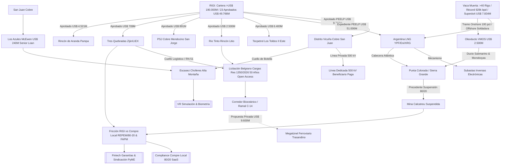

# Oportunidades de Negocio y Conexiones Estratégicas - Septiembre 2026

## 1. Oportunidades de Negocio Identificadas (High-Leverage Tech Plays)

1. **Plataformas de Subastas Inversas y Licitación Electrónica para Megaproyectos ([[RIGI]])**:
   - Tras la aplicación exitosa de subastas inversas por parte de YPF para los gasoductos de **Argentina LNG (US$ 51.000M)**, se abre una oportunidad crítica para plataformas B2B de compras complejas, calificación técnica automatizada y auditoría criptográfica de ofertas ciegas para proyectos PEELP.

2. **Certificación y Simulación VR para Choferes de Alta Montaña (San Juan / Cobre)**:
   - Ante la escasez crítica de conductores certificados para transportar maquinaria e insumos hacia [[Los Azules]], [[Josemaría]] y [[Distrito Vicuña]], surge una oportunidad masiva en plataformas de simulación inmersiva (VR) y certificación estandarizada de conducción en condiciones extremas de cordillera y ripio (ver [[VR_Simulacion_Choferes_Alta_Montana_SanJuan]]).

3. **Plataforma RegTech SaaS de Auditoría de Compre y Empleo Local (Regla 80/20 & REPEM)**:
   - Tras el precedente crítico de paralización de obras en [[Calcatreu]] (Río Negro) por incumplir la regla de empleo 80/20 y la tensión con el 70% exigido por el REPEM en el NOA, surge una oportunidad prioritaria para una suite RegTech que certifique en tiempo real nóminas de RRHH y facturación de contratistas Tier 2/3 (ver [[Compliance_Compre_Local_8020_SaaS]] y [[Esceptico_Calcatreu_Licencia_Social_REPEM]]).

4. **Software de Despacho y Trazabilidad Intermodal para el Belgrano Cargas (Litio NOA)**:
   - Con la inminente privatización/concesión del Belgrano Cargas y la urgencia de evacuar carbonato de litio e ingresar insumos a granel por el Ramal C-14, existe una oportunidad en plataformas de gestión logística intermodal (tren-camión), tracking satelital de vagones y optimización de patios de maniobras en Güemes y Olacapato.

5. **Logística Multimodal y Ruteo de Arenas de Cercanía en Río Negro y Neuquén**:
   - Con más de 40 rigs activos y 8 millones de toneladas de arena demandadas para 2027, el ruteo de bateas y hubs de transferencia en la "Ruta de las Arenas" de Río Negro resulta prioritario para comprimir costos en boca de pozo.

6. **Microredes Híbridas y Arbitraje BESS para Salares de la Puna**:
   - Con 8 proyectos de litio en producción continua y la resolución de almacenamiento BESS Alma SADI (Res. 155/2026 por 700.5 MW), la integración de bancos de baterías a escala industrial (~US$ 108/kWh) resuelve la saturación del sistema de transmisión andino.

7. **Fintech de Garantías y Sindicación de Capacidad para Proveedores Mineros ([[Fintech_Garantias_y_Sindicacion_Proveedores_Mineros]])**:
   - Motor B2B de scoring crediticio y emisión algorítmica de garantías/cauciones sindicadas para permitir a consorcios PyME locales de San Juan, Catamarca y Salta calificar para licitaciones multimillonarias en [[Distrito Vicuña]] (US$ 18.000M) y [[Los Azules]] (US$ 3.170M), canalizando la presión de la FAPM y blindando el compre local.

---

## 2. Conexiones Estratégicas y Grafo de Dependencias

```mermaid
graph TD
    RIGI[RIGI: Cartera >US$ 190.000M / 23 Aprobados US$ 49.766M] --> |Aprobado PEELP US$ 9.737M| Vicuña[Distrito Vicuña Cobre San Juan]
    RIGI --> |Expediente PEELP US$ 51.000M| ArgLNG[Argentina LNG YPF/Eni/XRG]
    RIGI --> |Aprobado US$ 6.400M| Tecpetrol[Tecpetrol Los Toldos II Este]
    RIGI --> |Aprobado US$ 2.500M| Rincon[Rio Tinto Rincón Litio]
    RIGI --> |Aprobado US$ 891M| SanJorge[PSJ Cobre Mendocino San Jorge]
    RIGI --> |Aprobado US$ 709M| 3Q[Tres Quebradas Zijin/LIEX]
    RIGI --> |Aprobado US$ 4.521M| RinconAranda[Rincón de Aranda Pampa]

    ArgLNG --> |Mecanismo| SubastaInversa[Subastas Inversas Electrónicas]
    ArgLNG --> |Cabecera Atlántica| RioNegro[Punta Colorada / Sierra Grande]

    VM[Vaca Muerta: >40 Rigs / Récord 929k bpd / Superávit US$ 7.834M] --> ArgLNG
    VM --> |Tramo Onshore 100 pct / Offshore Soldadura| VMOS[Oleoducto VMOS US$ 2.500M]
    VMOS --> |Ducto Submarino & Monoboyas| RioNegro

    Vicuña --> |Línea Privada 500 kV| Transmision[Línea Dedicada 500 kV Beneficiario Paga]
    Vicuña --> |Cuello de Botella| Choferes[Escasez Choferes Alta Montaña]
    SanJuan[San Juan Cobre] --> LosAzules[Los Azules McEwen US$ 240M Senior Loan]
    LosAzules --> Choferes
    Choferes --> VRSolution[[VR Simulación & Biometría]]

    3Q --> |Cuello Logístico / RN 51| BelgranoCargas[Licitación Belgrano Cargas Res 1350/2026 50 Años Open Access]
    Rincon --> BelgranoCargas
    BelgranoCargas --> Bioceanico[Corredor Bioceánico / Ramal C-14]
    Bioceanico -.-> |Propuesta Privada US$ 9.600M| Megatunel[Megatúnel Ferroviario Trasandino]

    RioNegro --> |Precedente Suspensión 80/20| Calcatreu[Mina Calcatreu Suspendida]
    Calcatreu --> FriccionLocal[Fricción RIGI vs Compre Local REPEM/80-20 & FAPM]
    3Q --> FriccionLocal
    FriccionLocal --> ComplianceSaaS[[Compliance Compre Local 80/20 SaaS]]
    FriccionLocal --> FintechGarantias[[Fintech Garantías & Sindicación PyME]]
```

---

## Conexiones
- [[Distrito Vicuña]]
- [[Vaca Muerta]]
- [[RIGI]]
- [[Litio]]
- [[Cobre]]
- [[VMOS]]
- [[San Jorge]]
- [[Tres Quebradas]]
- [[Los Azules]]
- [[Corredor Bioceanico]]
- [[VR_Simulacion_Choferes_Alta_Montana_SanJuan]]
- [[Compliance_Compre_Local_8020_SaaS]]
- [[Fintech_Garantias_y_Sindicacion_Proveedores_Mineros]]
- [[Esceptico_Calcatreu_Licencia_Social_REPEM]]
- [[Esceptico_Megatunel_Bioceanico_Belgrano_Cargas]]