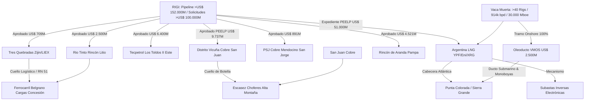

# Oportunidades de Negocio y Conexiones Estratégicas - Septiembre 2026

## 1. Oportunidades de Negocio Identificadas (High-Leverage Tech Plays)

1. **Plataformas de Subastas Inversas y Licitación Electrónica para Megaproyectos ([[RIGI]])**:
   - Tras la aplicación exitosa de subastas inversas por parte de YPF para los gasoductos de **Argentina LNG (US$ 51.000M)**, se abre una oportunidad crítica para plataformas B2B de compras complejas, calificación técnica automatizada y auditoría criptográfica de ofertas ciegas para proyectos PEELP.

2. **Certificación y Simulación VR para Choferes de Alta Montaña (San Juan / Cobre)**:
   - Ante la escasez crítica de conductores certificados para transportar maquinaria e insumos hacia [[Los Azules]], [[Josemaría]] y [[Distrito Vicuña]], surge una oportunidad masiva en plataformas de simulación inmersiva (VR) y certificación estandarizada de conducción en condiciones extremas de cordillera y ripio.

3. **Software de Despacho y Trazabilidad Intermodal para el Belgrano Cargas (Litio NOA)**:
   - Con la privatización/concesión del Belgrano Cargas y la demanda de evacuar carbonato de litio e ingresar insumos a granel (soda ash, cales) por el Ramal C-14, existe una oportunidad en plataformas de gestión logística intermodal (tren-camión), tracking satelital de vagones y optimización de patios de maniobras en Güemes y Olacapato.

4. **Middleware de Compliance Dual de Compre Local (RIGI Nacional 20% vs. REPEM Provincial 70%)**:
   - La creciente fricción legal en Catamarca, Salta y Jujuy entre los incentivos federales del RIGI y los requisitos de empleo y proveedores locales del REPEM crea demanda para soluciones SaaS de auditoría continua de compras y nóminas mineras para mitigar riesgos regulatorios.

5. **Logística Multimodal y Ruteo de Arenas de Cercanía en Río Negro y Neuquén**:
   - Con más de 40 rigs activos y 8 millones de toneladas de arena demandadas para 2027, el ruteo de bateas y hubs de transferencia en la "Ruta de las Arenas" de Río Negro resulta prioritario para comprimir costos en boca de pozo.

6. **Microredes Híbridas y Arbitraje BESS para Salares de la Puna**:
   - Con 8 proyectos de litio en producción continua y la resolución de almacenamiento BESS Alma SADI (Res. 155/2026 por 700.5 MW), la integración de bancos de baterías a escala industrial (~US$ 108/kWh) resuelve la saturación del sistema de transmisión andino.

---

## 2. Conexiones Estratégicas y Grafo de Dependencias

```mermaid
graph TD
    RIGI[RIGI: Pipeline >US$ 152.000M / Solicitudes >US$ 100.000M] --> |Aprobado PEELP US$ 9.737M| Vicuña[Distrito Vicuña Cobre San Juan]
    RIGI --> |Expediente PEELP US$ 51.000M| ArgLNG[Argentina LNG YPF/Eni/XRG]
    RIGI --> |Aprobado US$ 6.400M| Tecpetrol[Tecpetrol Los Toldos II Este]
    RIGI --> |Aprobado US$ 2.500M| Rincon[Rio Tinto Rincón Litio]
    RIGI --> |Aprobado US$ 891M| SanJorge[PSJ Cobre Mendocino San Jorge]
    RIGI --> |Aprobado US$ 709M| 3Q[Tres Quebradas Zijin/LIEX]
    RIGI --> |Aprobado US$ 4.521M| RinconAranda[Rincón de Aranda Pampa]

    ArgLNG --> |Mecanismo| SubastaInversa[Subastas Inversas Electrónicas]
    ArgLNG --> |Cabecera Atlántica| RioNegro[Punta Colorada / Sierra Grande]

    VM[Vaca Muerta: >40 Rigs / 914k bpd / 30.000 Mboe] --> ArgLNG
    VM --> |Tramo Onshore 100%| VMOS[Oleoducto VMOS US$ 2.500M]
    VMOS --> |Ducto Submarino & Monoboyas| RioNegro

    Vicuña --> |Cuello de Botella| Choferes[Escasez Choferes Alta Montaña]
    SanJuan[San Juan Cobre] --> Choferes

    3Q --> |Cuello Logístico / RN 51| BelgranoCargas[Ferrocarril Belgrano Cargas Concesión]
    Rincon --> BelgranoCargas
```

---

## Conexiones
- [[Distrito Vicuña]]
- [[Vaca Muerta]]
- [[RIGI]]
- [[Litio]]
- [[Cobre]]
- [[VMOS]]
- [[San Jorge]]
- [[Tres Quebradas]]
- [[Corredor Bioceanico]]