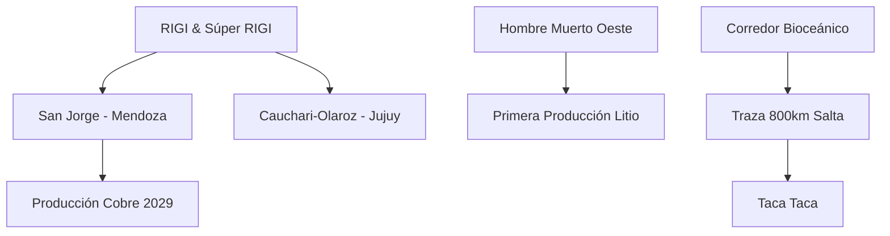

# Informe Diario: Minería y Energía en Argentina - 2026-05-29

## Resumen Ejecutivo
La jornada destaca por hitos regulatorios y operativos críticos. Mendoza oficializa su retorno a la gran minería metalífera con la aprobación del **[[RIGI]]** para el proyecto **[[San Jorge]]**. En el sector del litio, **[[Hombre Muerto Oeste]]** (Galan Lithium) alcanza su primera producción de cloruro de litio, consolidando la expansión de la capacidad instalada en Catamarca. El marco del [[RIGI]] se expande con el envío del "Súper RIGI" al Congreso y la confirmación de 16 proyectos aprobados por un total de USD 30.000 millones.

## Hitos por Sector

### Cobre
- **[[San Jorge]] (Mendoza):** Aprobación formal del [[RIGI]] (Res. 801/2026). Inversión de **USD 891 millones**. Se proyecta inicio de obras en 2027 y producción en 2029.
- **[[Taca Taca]] (Salta):** Consolidación del reporte NI 43-101 y preparación de la solicitud de adhesión al [[RIGI]]. Capacidad proyectada de 40-60 Mtpa.

### Litio
- **[[Hombre Muerto Oeste]] (Catamarca):** Hito de **primera producción** de cloruro de litio (28/05/2026). Escalamiento hacia producción comercial en el 2° semestre de 2026.
- **[[Jujuy|Cauchari-Olaroz]] (Jujuy):** Aprobación de expansión bajo [[RIGI]] para sumar 45.000 t/año con tecnología DLE.

### Infraestructura y Marco Regulatorio
- **[[Corredor Bioceanico]] de Capricornio:** Presentación del estudio de la CEPAL en Salta. Se destaca la importancia estratégica de los **800 km** de traza en territorio salteño y las gestiones de financiamiento para la RN 51.
- **Súper [[RIGI]]:** Proyecto enviado al Congreso para incentivar industrias de alto valor agregado (IA, refinado de cobre, baterías).
- **Tablero [[RIGI]]:** 16 proyectos aprobados; 20 en evaluación. Inversión confirmada de USD 30.000 millones.

## Análisis Energón
La aprobación de **[[San Jorge]]** es una señal política potente: el [[RIGI]] está logrando destrabar proyectos históricamente bloqueados por contextos provinciales complejos. Mendoza entra oficialmente a la carrera del cobre, lo que suma presión competitiva al NOA y San Juan. Por otro lado, la primera producción de Galan Lithium en **[[Hombre Muerto Oeste]]** ratifica que, a pesar de la volatilidad de precios, la ejecución técnica en los salares argentinos mantiene un ritmo firme de cara a 2027.

## Conexiones Estratégicas del Día

## Fuentes
- [[2026-05-29_news_mining_energy]]
