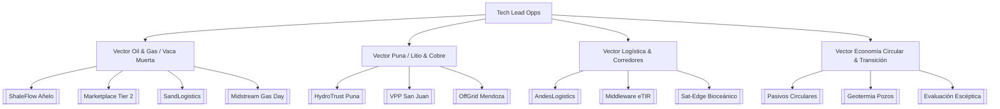

# Catálogo Integral de Oportunidades Tecnológicas (Tech Lead Opps)

Este documento centraliza y clasifica la totalidad de las tesis de inversión y oportunidades tecnológicas de alto apalancamiento (*high-leverage tech plays*) desarrolladas dentro de la Wiki. Las oportunidades están estructuradas para capturar valor frente a los cuellos de botella operativos, logísticos, energéticos y regulatorios derivados de la expansión bajo el régimen [[RIGI]] en Argentina.

---

## 1. Vector Oil & Gas / Vaca Muerta

### [[ShaleFlow_Anelo_Supply]] - SaaS de Mantenimiento Predictivo & APIs OEM
* **Resumen del Play:** Plataforma SaaS B2B que monitorea telemetría de vibración/temperatura en bombas de fractura para predecir fallas mecánicas con 72h de anticipación y rutea automáticamente compras de repuestos mediante APIs integradas con inventarios de los fabricantes originales (NOV, Halliburton, SLB) en Añelo.
* **Tech Stack:** Edge AI, Algoritmos de vibración armónica, Integración API/Scrapers ERP (SAP/Oracle).
* **Riesgo Crítico:** Soberanía de datos de telemetría (Ley 25.326) y resistencia de las grandes operadoras a compartir telemetría vehicular.
* **Apalancamiento RIGI:** Califica para Súper RIGI (software de alta tecnología) y computa como compre local (Decreto 105/2026).
* **Próximo Movimiento:** Piloto de telemetría de fallas en 10 trailers de YPF coordinado con laboratorios de Y-TEC.

### [[Marketplace_Tier2_VacaMuerta]] - Optimización & Sharing de Equipamiento Tier 2
* **Resumen del Play:** Marketplace algorítmico ("Uber Freight Industrial") para que las petroleras intercambien y arrienden horas de stand-by u ociosas en sets de fractura y torres de perforación ante la saturación de servicios Tier 2.
* **Tech Stack:** Motor de agendamiento estocástico, Smart Contracts / Micro-pólizas de seguro industrial dinámicas.
* **Riesgo Crítico:** Celos corporativos sobre secretos de cronograma de perforación y consolidación vertical por primarios.
* **Apalancamiento RIGI:** Optimiza el CAPEX computable de operadoras adheridas reduciendo tiempos muertos.
* **Próximo Movimiento:** Modelar el costo de hora ociosa y presentar piloto cerrado YPF-Vista Energy.

### [[SandLogistics_Ruta_Arenas_VacaMuerta]] - Trazabilidad & Despacho de Arenas de Fractura
* **Resumen del Play:** SaaS de despacho y reserva de slots de descarga *just-in-time* para camiones de arena de fractura (demanda de 8M tn para 2027), reduciendo los fletes que representan el 80% del costo en pozo y coordinando la "Ruta de las Arenas" en Río Negro.
* **Tech Stack:** Slot reservation algorithm, Geofencing IoT, Blockchain/Ledger de QA/QC de proppants.
* **Riesgo Crítico:** Fricción con cámaras de transporte y falta de conectividad continua en rutas provinciales.
* **Apalancamiento RIGI:** Reducción directa de OPEX logístico en proyectos masivos de shale (ej. Phoenix Global, Vista).
* **Próximo Movimiento:** Validar prototipo de agendamiento con canteras locales en Río Negro y de frack crews en Añelo.

### [[Midstream_Gas_Day_2026_Opps]] - Evaluación Tecnológica Midstream & Gas
* **Resumen del Play:** Análisis de oportunidades tecnológicas surgidas en el evento Midstream Gas Day 2026 (monitoreo de ductos, detección de fugas de metano y software de despacho de gas natural).
* **Tech Stack:** Detección óptica/satelital de metano, Twin Digitales de gasoductos.
* **Riesgo Crítico:** Regulación tarifaria y demoras en licitaciones de expansión.
* **Apalancamiento RIGI:** Encaja en megaproyectos de evacuación (VMOS, Perito Moreno, San Matías).
* **Próximo Movimiento:** Integrar métricas de fugas con certificaciones de exportación de GNL.

---

## 2. Vector Puna / Litio & Cobre

### [[HydroTrust_Puna_Hidrico]] - Auditoría Neutral & Agregación Piezométrica Profunda
* **Resumen del Play:** Auditoría independiente y agregación SaaS de datos hidrogeológicos profundos (50-200m) en salares de litio (Catamarca/Jujuy), validados legalmente con nodos de referencia calibrados por el INTI para blindar la licencia social post-cautelar.
* **Tech Stack:** SaaS Multi-Tenant, Nodos IoT rugerizados (MIL-STD-810H), Certificación IRAM 29012 / OAA.
* **Riesgo Crítico:** Descalce temporal de 12-18 meses en tiempos de contratación de organismos multilaterales (BID/IFC).
* **Apalancamiento RIGI:** Elegible para financiamiento verde multilateral ESG y cupo de proveedor local (20%).
* **Próximo Movimiento:** Formar consorcio de auditoría neutral con la Universidad Nacional de Catamarca (UNCA).

### [[VPP_Mineria_San_Juan]] - Virtual Power Plant & Orquestación de Microredes Cobre
* **Resumen del Play:** Plataforma de Energía Virtual (VPP) que coordina fuentes de generación *on-site* (solar, eólica, BESS, GNL) para megaproyectos de cobre en San Juan aislados o restringidos por la saturación de la red de 500kV.
* **Tech Stack:** Algoritmo de despacho óptimo en tiempo real, predicción meteorológica machine learning, EMS/SCADA industrial.
* **Riesgo Crítico:** Decisiones políticas o judicialización del ENRE sobre prioridad de despacho en la red interconectada.
* **Apalancamiento RIGI:** Importación de BESS y paneles a arancel 0% bajo proyectos de infraestructura compartida.
* **Próximo Movimiento:** Presentar simulación de VPP a McEwen ([[Los Azules]]) y Lundin/BHP ([[Distrito Vicuña]]).

### [[2026-04-10_Arbitraje_OffGrid_y_Servicios_Mendoza]] - Orquestación Off-Grid & Transition Management
* **Resumen del Play:** Software de arbitraje y respaldo off-grid ("Seguridad de Despacho") para mineras de San Juan/Mendoza más consultoría de reconversión para proveedores petroleros de Malargüe hacia el cobre.
* **Tech Stack:** Software de gestión de switches off-grid transparentes, Matriz de competencias industriales.
* **Riesgo Crítico:** Volatilidad de licencia social y política minera en Mendoza.
* **Apalancamiento RIGI:** Encauzamiento de PyMEs locales en el esquema de compre local de proyectos mineros.
* **Próximo Movimiento:** Mapear oferta industrial reconvertible en el parque industrial de Malargüe.

---

## 3. Vector Logística & Corredores Bioceánicos

### [[AndesLogistics_Puna_Logistica]] - Telemetría & Rutas bimodales en Alta Montaña
* **Resumen del Play:** SaaS B2B de telemetría pasiva y conectividad híbrida (Starlink/Iridium) para flotas de carga pesada andina (RN 51, Paso de Jama), enfocado en la prevención de fallas mecánicas y eliminación de retornos vacíos.
* **Tech Stack:** Módulos CAN-bus/OBD-II Edge, Routers Satelitales Híbridos, Motor de Optimización Bimodal.
* **Riesgo Crítico:** Resistencia de sindicatos de transporte ante el monitoreo estricto de telemetría de manejo.
* **Apalancamiento RIGI:** Reducción de costos logísticos en corredores mineros clave aprobados por RIGI.
* **Próximo Movimiento:** Desplegar prueba piloto de 5 camiones en el trayecto Salta - Paso de Sico.

### [[Middleware_eTIR_Bioceanico]] - Middleware "TIR-Connect" para Aduanas
* **Resumen del Play:** Middleware B2B SaaS que traduce manifiestos de carga minera al estándar internacional eTIR y realiza el *pre-clearance* automático con APIs/scrapers de aduanas de Argentina, Chile y Paraguay.
* **Tech Stack:** API Gateway eTIR (IRU), Scrapers/Middleware para SIM (AFIP), Formato JSON/XML e-CMR.
* **Riesgo Crítico:** Inestabilidad de las APIs de la AFIP/Aduana y bloqueos sindicales en pasos fronterizos.
* **Apalancamiento RIGI:** Agiliza exportaciones de megaproyectos PEELP sin cuellos de botella burocráticos.
* **Próximo Movimiento:** Conseguir homologación de prueba con la Organización Internacional del Transporte a Dedo (IRU).

### [[Sat-Edge_Bioceanico]] - Edge Computing & Conectividad Satelital en Zonas Ciegas
* **Resumen del Play:** Arquitectura de hardware Edge y comunicaciones satelitales rugerizadas para asegurar la continuidad de datos logísticos en quebradas sin cobertura celular en los Andes.
* **Tech Stack:** Nodos Edge Linux rugerizados, Conectividad Starlink / Iridium Short Burst Data.
* **Riesgo Crítico:** Costo de tráfico de datos satelitales sin compresión adecuada en Edge.
* **Apalancamiento RIGI:** Garantiza la seguridad e integridad del flujo de exportación RIGI.
* **Próximo Movimiento:** Validar tasa de compresión de datos Edge en cruces andinos.

---

## 4. Vector Economía Circular & Transición Energética

### [[Marketplace_y_Trazabilidad_de_Pasivos_Circulares]] - Marketplace B2B & ESG Passport
* **Resumen del Play:** Plataforma de trazabilidad ESG y Marketplace B2B para comercializar y auditar la reutilización de pasivos minero-energéticos (salmueras residuales, relaves, efluentes, agua tratada y calor residual).
* **Tech Stack:** Trazabilidad basada en DLT/Blockchain, API de integración con EU Battery Passport y CBAM.
* **Riesgo Crítico:** Falta de regulación clara sobre responsabilidad de pasivos ambientales transferidos.
* **Apalancamiento RIGI:** Certificación de cumplimiento ESG para financiamiento de menor tasa.
* **Próximo Movimiento:** Lanzar piloto de trazabilidad de agua de producción en la Cuenca Neuquina.

### [[Reconversión Pozos Petroleros a Geotermia]] - Geotermia Coproducida (R-GEO_semi)
* **Resumen del Play:** Aprovechamiento de la salmuera caliente coproducida en pozos petroleros maduros con alto corte de agua (~95%) para generar electricidad geotérmica en *island grids* mediante ciclos ORC sin costo de perforación.
* **Tech Stack:** Ciclos Orgánicos Rankine (ORC), Intercambiadores de calor marinos/rugerizados.
* **Riesgo Crítico:** Declinación acelerada de caudal térmico en pozos maduros.
* **Apalancamiento RIGI:** Generación limpia computada en los objetivos de descarbonización upstream.
* **Próximo Movimiento:** Evaluar pozos con corte de agua >90% en yacimientos maduros del Golfo San Jorge / Neuquén.

### [[2026-04-05_Evaluacion_Oportunidades_Tech]] - Evaluación Escéptica Transversal
* **Resumen del Play:** Análisis Red Team comparativo entre la Plataforma Logística Cross-Border (Paso de Jama) y el Software de Orquestación de Microredes DLE para salares.
* **Tech Stack:** Análisis de Trade-offs y Matriz de Riesgo de Economía Política.
* **Riesgo Crítico:** Aversión al riesgo de empresas Tier 1 a comprar software boutique en lugar de suites cerradas de Siemens/ABB.
* **Apalancamiento RIGI:** Marco de evaluación escéptica previo a la inversión de capital.
* **Próximo Movimiento:** Pivotar a venta de consultoría de arquitectura backend a grandes generadores (YPF Luz/Central Puerto).

---

## Resumen de Cobertura y Matriz de Impacto

---
**Backlinks:** [[GEMINI.md]], [[Oportunidades y Conexiones]], [[Vaca Muerta]], [[RIGI]], [[Litio]], [[Cobre]].
