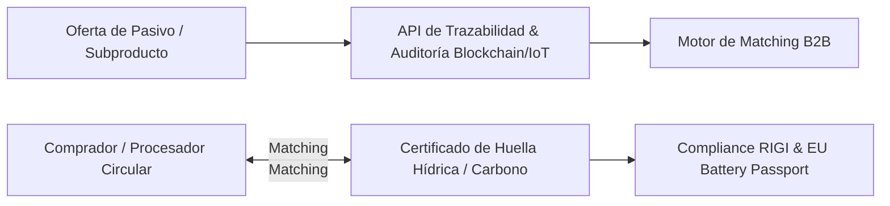

# Tech Lead Opp: Marketplace y Trazabilidad Digital de Pasivos Circulares

## 1. La Oportunidad (Thesis)

Construir un **Marketplace B2B + Plataforma de Trazabilidad ESG** para la oferta y demanda de pasivos, subproductos industriales, efluentes y capacidad geotérmica/residual en los polos minero-energéticos de Argentina (Puna, San Juan, Vaca Muerta).

La presión del **EU Battery Passport**, la normativa **CBAM** y las restricciones de agua en el NOA obligan a las operadoras a certificar la circularidad de sus insumos y efluentes. Hoy no existe un registro unificado que permita intercambiar subproductos entre empresas colindantes ni auditar digitalmente la reinyección o reutilización de salmueras/relaves.

---

## 2. Arquitectura de Producto (MVP)

### Módulos Clave:
1. **Telemetry & Hydro-Trace:** Sensores IoT y conexión a SCADA para monitorear volúmenes de reinyección de salmuera agotada y balance de evaporación en plantas DLE.
2. **Waste-to-Resource Matching Engine:** Algoritmo que identifica sinergias entre proyectos vecinos (ej. suministro de calor residual de compresoras de gas para acelerar procesos térmicos DLE en litio).
3. **Passport Passport / ESG Auditor:** Generación de reportes inmutables para aduanas e inversores internacionales sobre el % de contenido circular recuperado en baterías o concentrados de cobre.

---

## 3. Modelo de Negocio y Unit Economics

* **SaaS Subscription:** Cobro recurrente a mineras y petroleras por módulo de trazabilidad y auditoría de efluentes ($5,000–$25,000 USD/mes por sitio).
* **Take-rate por Transacción en Marketplace:** Comisión del 1.5% al 3% sobre contratos de compraventa de subproductos (sales industriales, agregados de relaves, aguas de producción tratadas).

---

## 4. Matriz de Riesgos y Mitigación (Pre-Mortem)

* **Riesgo:** Confidencialidad industrial sobre la composición química de salmueras o relaves.
  * *Mitigación:* Criptografía Zero-Knowledge (ZKP) para demostrar volumen y pureza sin revelar la fórmula exacta de aditivos.
* **Riesgo:** Baja liquidez inicial en el marketplace por falta de oferentes.
  * *Mitigación:* Apalancarse primero en el módulo de regulación obligatoria (trazabilidad hídrica DLE) antes de monetizar las transacciones.

---

## Enlaces Relacionados
- [[Economía Circular]]
- [[Circularidad y Valorización de Pasivos Minero-Energéticos.md]]
- [[HydroTrust_Puna_Hidrico.md]]
- [[RIGI.md]]
